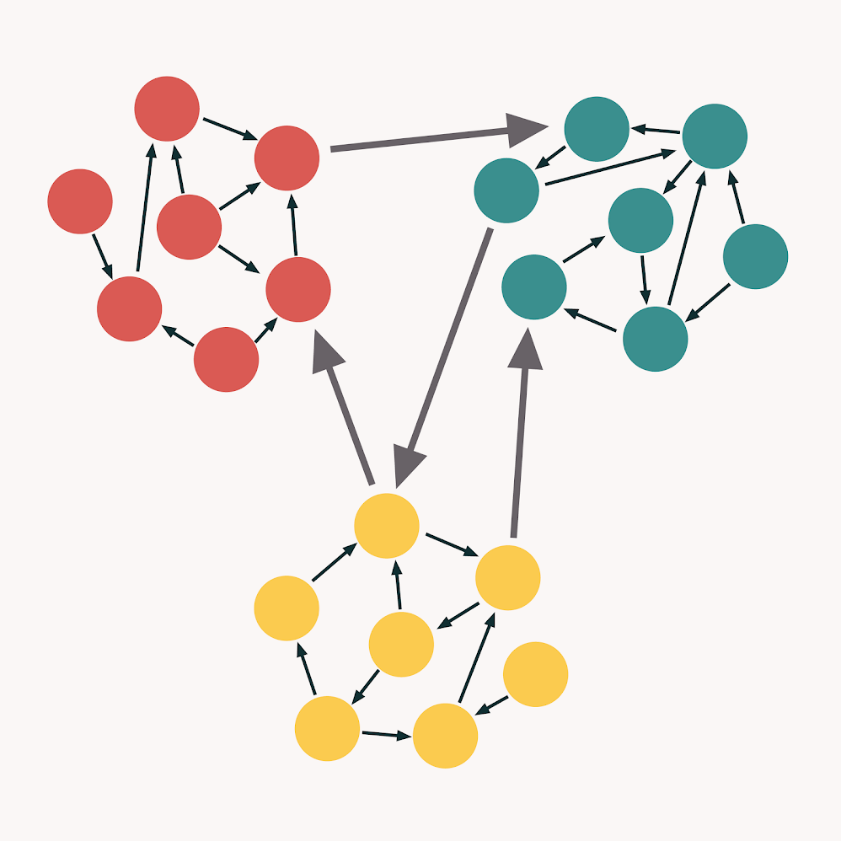
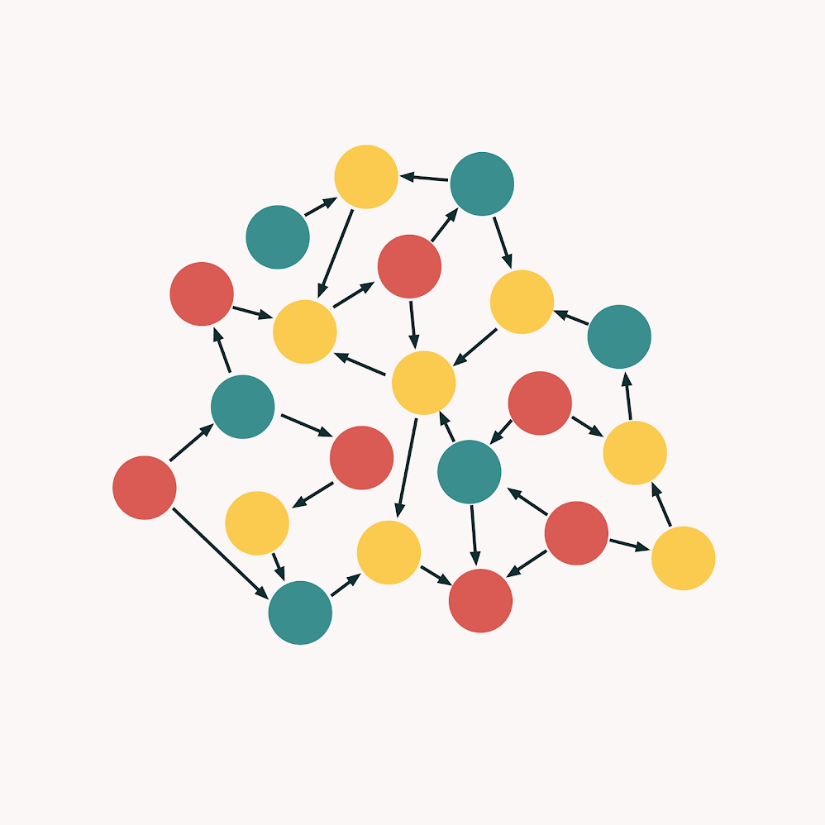
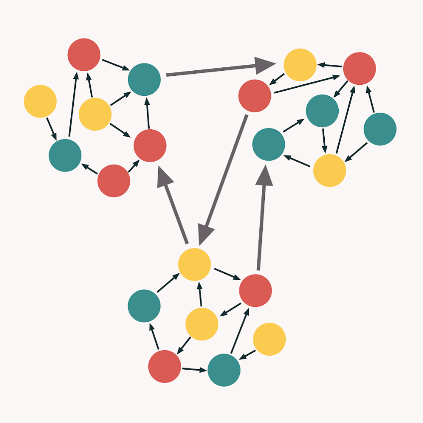
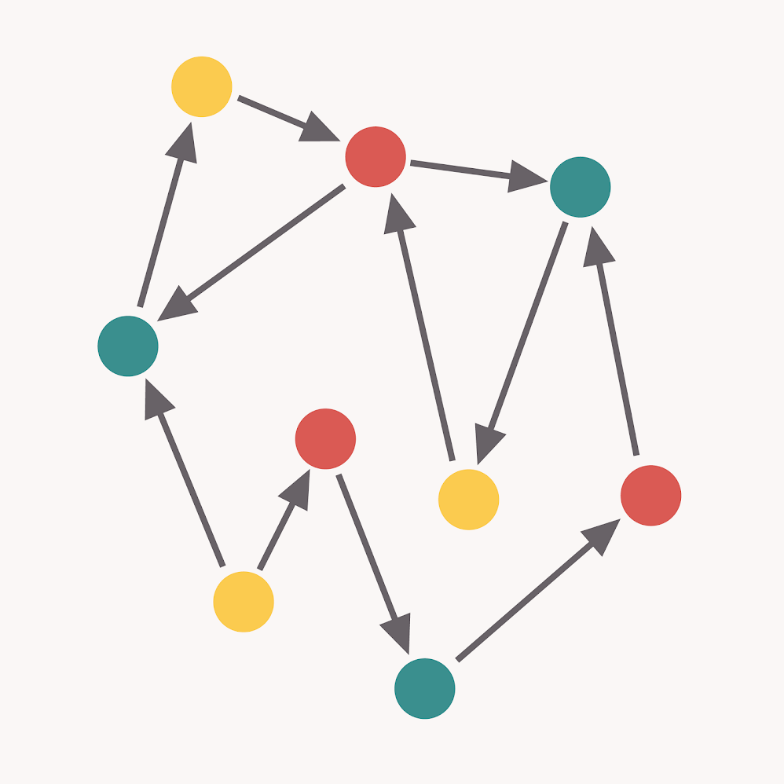

# Cohesion и Coupling

-   Coupling - связанность
-   Cohesion - сцепление

!!! Info

    Cohesion и Coupling применяются не только к классам. Это может быть метод, класс, группа классов или даже модуль.

**Cohesion** представляет собой степень, в которой часть кодовой базы образует логически единую атомарную единицу (юнит). Cohesion указывает на количество связей внутри кодовой единицы. Если число мало, то код внутри блока логически не связан.

**Coupling** представляет собой степень взаимосвязи между блоками. Количество соединений между двумя или более блоками. Чем меньше число, тем ниже coupling.

Высокий cohesion означает хранение связанных друг с другом частей кода в одном месте. В то же время низкий coupling заключается в максимально возможном разделении несвязанных частей кодовой базы.

Типы кода с точки зрения *Cohesion и Coupling*:

1. *Идеальный код* - у него слабый coupling и высокий cohesive:

    

2. *God Object* является результатом введения высокого cohesion и высокого coupling. Это анти-паттерн в основном означает один фрагмент кода, который выполняет всю работу сразу:

    

3. *Плохо выбранные границы*. Такой код нарушает принцип единой ответственности:

    

4. *Деструктивная развязка* происходит, когда программист пытается так сильно развязать кодовую базу, что код полностью теряет фокус:

    
