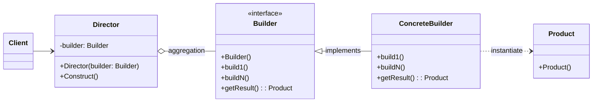

# Строитель (Builder)

## Назначение

Отделяет конструирование сложного объекта от его представления, так что в результате одного и того же процесса конструирования может получиться другое представление.

## Пример

Пример из реальной жизни:

<blockquote>
Представьте себе строительство дома. В случае, если вы хотите вручную выбирать архитектурный стиль, материалы, цвета и распределение помещений, процесс строительства превращается в шаговую процедуру, завершаясь, когда все выбранные элементы готовы.
</blockquote>

Другими словами:

<blockquote>
Позволяет создавать различные варианты объекта, избегая при этом загрязнения конструктора. Полезный
когда требуется много шагов на создание объекта.
</blockquote>

## Применение

-   Алгоритм создания сложного объекта не должен зависеть от того, из каких частей состоит объект и как они стыкуются между собой;
-   Процесс конструирования должен обеспечить различные представления конструируемого объекта.

## UML диаграмма



Описание сущностей:

-   _Builder_ - интерфейс, описывающий этапы создания объекта;
-   _ConcreteBuilder_ - реализует интерфейс _Builder_;
-   _Director_ - конструирует объект, используя интерфейс _Builder_;
-   _Product_ - представляет сложный конструируемый объект;

!!! Note

    * *Client* создает объект *Director* и настраивает его нужным объектом, реализующий интерфейс *Builder*;
    * *Director* уведомляет *Builder*, что нужно построить новую часть *Product*;
    * *Builder* обрабатывает запрос *Director* и добавляет новые части к *Product*;
    * *Client* получает продукт у *Builder*

## Результат

-   Позволяет изменять внутреннее представление продукта:

    Т.к. продукт конструируется через абстрактный интерфейс, то для изменения внутреннего представления достаточно определить новый вид строителя.

-   Изолирует код, реализующий конструирование и представление:

    Улучшается модульность, инкапсулируя способ конструирования и представления сложного объекта.

-   Предоставляет более точный контроль над процессом конструирования:

    Конструирование объекта выполняется шаг за шагом

## Пример кода

=== "Python"

    ```python
    from abc import ABC, abstractclassmethod
    from typing import Optional


    class Pizza:
        """ПИЦЦА"""

        def __init__(self) -> None:
            """Конструктор"""
            self._dough: Optional[str] = None
            self._sauce: Optional[str] = None
            self._toping: Optional[str] = None

        # Сеттеры и геттеры
        @property
        def dough(self) -> Optional[str]:
            return self._dough

        @dough.setter
        def dough(self, value: str) -> None:
            self._dough = value

        @property
        def sauce(self) -> Optional[str]:
            return self._sauce

        @sauce.setter
        def sauce(self, value: str) -> None:
            self._sauce = value

        @property
        def toping(self) -> Optional[str]:
            return self._toping

        @toping.setter
        def toping(self, value: str) -> None:
            self._toping = value

        def __str__(self) -> str:
            attr: str = '\n\t'.join(f'{k}={v}' for k, v in self.__dict__.items())
            return f"[{self.__class__.__name__}]:\n\t{attr}"


    class PizzaBuilder(ABC):
        """Абстрактный класс для строителя пиццы"""

        def __init__(self):
            """Конструктор"""
            self._pizza: Pizza = Pizza()

        @abstractclassmethod
        def build_dough(self) -> None:
            """Приготовить тесто"""
            pass

        @abstractclassmethod
        def build_sauce(self) -> None:
            """Приготовить соус"""
            pass

        @abstractclassmethod
        def build_toping(self) -> None:
            """Приготовить начинку"""
            pass

        @property
        def pizza(self) -> Pizza:
            """Получить готовую пиццу"""
            return self._pizza


    class PeperoniPizzaBuilder(PizzaBuilder):
        """Приготовление пиццы пепперони"""
        def build_dough(self) -> None:
            self._pizza.dough = "pan backed"

        def build_sauce(self) -> None:
            self._pizza.sauce = "hot"

        def build_toping(self) -> None:
            self._pizza.toping = "peperoni+cheese"


    class Cook:
        """Повар"""
        def __init__(self, builder: PizzaBuilder) -> None:
            self._builder = builder

        def cook_pizza(self):
            """Приготовить пиццу"""
            self._builder.build_dough()
            self._builder.build_sauce()
            self._builder.build_toping()

        def get_pizza(self) -> Pizza:
            """Получить пиццу"""
            return self._builder.pizza


    if __name__ == "__main__":
        pizza_builder: PizzaBuilder = PeperoniPizzaBuilder()
        cook: Cook = Cook(builder=pizza_builder)
        cook.cook_pizza()
        print(cook.get_pizza())
    ```
