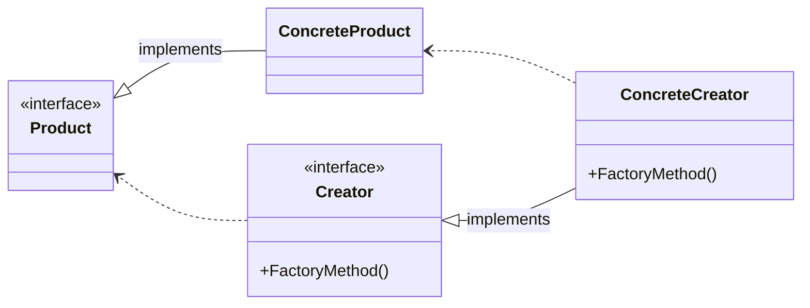

# Фабричный метод (Factory Method)

## Назначение

Определяет интерфейс для создания объекта, но позволяет подклассам самостоятельно решать, экземпляр какого класса должен быть создан. Фабричный метод позволяет классу делегировать создание экземпляров.

## Пример

Пример из реальной жизни:

<blockquote>
Кузнец производит оружие. Эльфам требуется эльфийское оружие, а оркам — орочье.
В зависимости от клиента вызывается нужный тип кузнеца.
</blockquote>

Другими словами:

<blockquote>
Позволяет делегировать логику создания экземпляров дочерним классам.
</blockquote>

## Применение

-   Классу заранее не известно, какие объекты классов нужно создать;
-   Класс спроектирован так, что объекты определяются подклассами;
-   Класс делегирует обязанности другому вспомогательному классу.

## UML диаграмма



Описание сущностей:

-   _Product_ - интерфейс объекта;
-   _ConcreteProduct_ - реализует интерфейс;
-   _Creator_ - объявляет фабричный метод;
-   _ConcreteCreator_ - замещает фабричный метод, возвращающий _ConcreteProduct_;

!!! Note

    _Creator_ полагается на свои подклассы в определении фабричного метода, который будет возвращать экземпляр _ConcreteProduct_

## Результат

-   Фабричные методы избавляют нас от необходимости встраивать в код зависящие классы.
-   Подклассам предоставляются операции-зацепки(hooks):
-   Создание параллельных иерархий

## Пример кода

=== "Python"

    ```python
    from abc import ABC, abstractclassmethod


    class Product(ABC):
        """Интерфейс продукта"""
        @abstractclassmethod
        def product(self):
            ...

    class ConcreteProduct(Product):
        """Конкретный продукт"""
        def product(self):
            return self.__class__.__name__

    class Creator(ABC):
        """Создатель"""
        @abstractclassmethod
        def factory(self) -> Product: pass

    class ConcreteCreator(Creator):
        """Реализация создателя"""
        def factory(self) -> Product:
            return ConcreteProduct()

    if __name__ == "__main__":
        creator: Creator = ConcreteCreator()

        product: Product = creator.factory()

        print(product.product())
    ```
