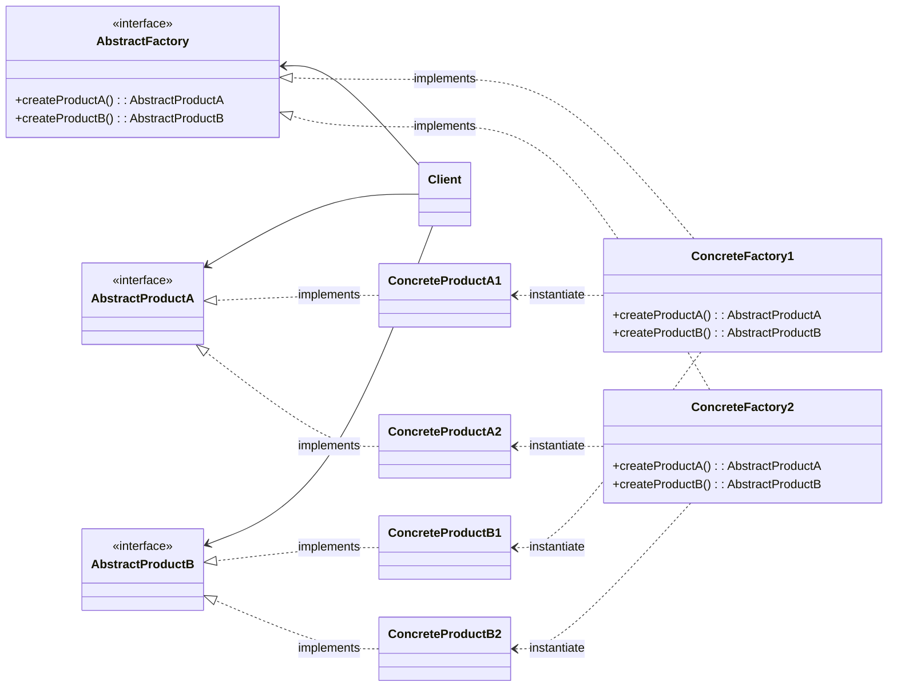

# Абстрактная фабрика (Abstract Factory)

## Назначение

Предоставляет интерфейс для создания семейства взаимосвязанных или взаимозависимых объектов, не специфицируя их конкретных классов.

## Применение

-   Система не должна зависеть от того, как компонуются и представляются входящии в нее объекты;
-   Система должна настраиваться одним из семейств объектов;
-   Входящие в семейство взаимосвязанные объекты должны быть спроектированы для совместной работы;
-   Хотим раскрыть только интерфейс, а не их реализацию.

## UML диаграмма



Описание сущностей:

-   _AbstractFactory_ - абстрактная фабрика, объявляет интерфейс для операций создания абстрактных классов;
-   _ConcreteFactory_ - конкретная фабрика, реализующая операции;
-   _AbstractProduct_ - интерфейс для объектов-продуктов;
-   _ConcreteProduct_ - конкретный объект-продукт;
-   _Client_ - использует только интерфейсы _AbstractFactory_ и _AbstractProduct_.

!!! Note

    * Во время выполнения создается единственный экземпляр фабрики, которая в свою очередь создает объекты, имеющие определенную реализацию;
    * *AbstractFactory* доверяет создание объектов своему подклассу *ConcreteFactory*.

## Результат

Абстрактная фабрика:

-   Изолирует конкретные классы:

    Помогает контролировать классы, создаваемых объектов. Клиент манипулирует экземплярами, через их интерфейсы.

-   Упрощает замену семейства продуктов:

    Класс конкретной фабрики появляется в приложении только единожды: при создании экземпляра, что облегчает замену используемой приложением конкретной фабрики.

-   Гарантирует сочетаемость продуктов:

    Позволяет соблюсти ограничение единого семейства классов, если они спроектированы для совместной работы.

-   Не упрощает задачу поддержки нового вида продуктов:

    Для поддержки новых продуктов требуется расширить _AbstractFactory_ и все его подклассы.

## Пример кода

=== "Python"

    ```python
    from abc import ABC, abstractclassmethod


    class WineInterface(ABC):
        """Интерфейс вина"""
        @abstractclassmethod
        def pour(self) -> None:
            """Налить вино"""


    class MealInterface(ABC):
        """Интерфейс блюда"""
        @abstractclassmethod
        def give(self) -> None:
            """Подать блюдо"""


    class LightWhiteWine(WineInterface):
        """Легкое белое вино"""
        def pour(self) -> None:
            print("Наливает легкое белое вино")


    class RedWine(WineInterface):
        """Красное вино"""
        def pour(self) -> None:
            print("Наливает красное вино")


    class Meat(MealInterface):
        """Мясо"""
        def give(self) -> None:
            print("Подает мясо")


    class Fish(MealInterface):
        """Рыба"""
        def give(self) -> None:
            print("Подает рыбу")


    class DinnerFactory(ABC):
        """Абстрактная фабрика"""
        @abstractclassmethod
        def createWine(self) -> WineInterface:
            ...

        @abstractclassmethod
        def createMeal(self) -> MealInterface:
            ...


    class MRDinnerFactory(DinnerFactory):
        """Подача красного вина с мясом"""
        def createWine(self) -> WineInterface:
            return RedWine()

        def createMeal(self) -> MealInterface:
            return Meat()


    class FLWDinnerFactory(DinnerFactory):
        """Подача легкого белого вина с рыбой"""
        def createWine(self) -> WineInterface:
            return LightWhiteWine()

        def createMeal(self) -> MealInterface:
            return Fish()


    if __name__ == "__main__":
        # Если мы хотим использовать другую фабрику, то просто заменяем ее на новую
        # dinner: DinnerFactory = MRDinnerFactory()
        dinner: DinnerFactory = FLWDinnerFactory()

        meal: MealInterface = dinner.createMeal()
        wine: WineInterface = dinner.createWine()

        meal.give()
        wine.pour()
    ```
