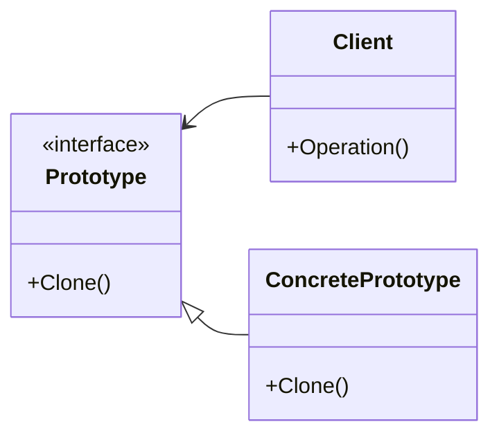

# Паттерн прототип (Prototype)

## Назначение

Задает виды создаваемого объекта с помощью экземпляра-прототипа и создает новые объекты путем копирования данного прототипа.

## Применение

-   Когда конкретный тип создаваемого объекта должен определяться динамически во время выполнения;
-   Для того чтобы избежать построения иерархии классов или фабрик, параллельных иерархии классов продуктов;
-   Когда клонирование объекта является более предпочтительным вариантом нежели его создание и инициализация с помощью конструктора.

## UML диаграмма



Описание сущностей:

- _Prototype_ - интерфейс для клонирования;
- _ConcretePrototype_ - реализует операцию клонирования;

!!! Note

    Клиент обращается к методу прототипа, для создания копии экземпляра


!!! Note "Для тупого меня"

    Иерархия классов - классы одной группы

    ??? Пример

        ```python
         Иерархия 1
        class Shape:
            def draw(self):
                pass

        class Circle(Shape):
            def draw(self):
                 рисование круга

        class Rectangle(Shape):
            def draw(self):
                 рисование прямоугольника

        class Triangle(Shape):
            def draw(self):
                 рисование треугольника

         Иерархия 2
        class Color:
            def fill(self):
                pass

        class Red(Color):
            def fill(self):
                 установка красного цвета

        class Blue(Color):
            def fill(self):
                 установка синего цвета

        class Green(Color):
            def fill(self):
                 установка зеленого цвета

         Взаимодействие двух иерархий
        class RedCircle(Circle, Red):
            pass

        class BlueTriangle(Triangle, Blue):
            pass
        ```

## Результат

- Скрывает конкретные классы от от пользователя;
- Позволяет включать новый конкретный класс в систему, просто зарегистрировав новый экземпляр-прототип на стороне клиента;
- Определение новых объектов путем изменения значений, структуры;

## Пример кода

=== "Python"

    ```python
    from abc import ABC, abstractclassmethod


    class Figure(ABC):
        @abstractclassmethod
        def square(self):
            ...

        @abstractclassmethod
        def clone(self):
            ...


    class Rectangle(Figure):
        def __init__(self, a: int, b: int) -> None:
            self._a = a
            self._b = b

        def square(self):
            return self._a * self._b

        def clone(self) -> 'Rectangle':
            return Rectangle(a=self._a, b=self._b)

    if __name__ == "__main__":
        rectangle: Figure = Rectangle(1, 1)

        print(rectangle.square())

        rectangle_2: Figure = rectangle.clone()

        print(rectangle_2.square())
    ```
