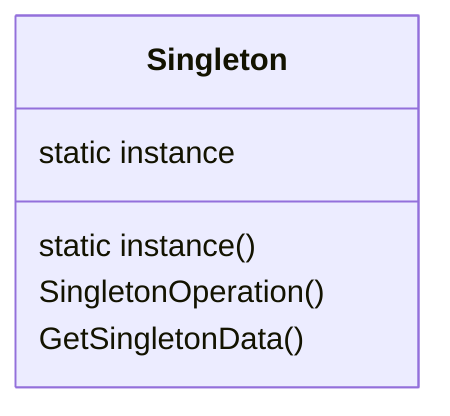

# Синглтон (Singleton)

## Назначение

Гарантирует, что у класса может быть только один экземпляр, и предоставляет глобальную точку доступа.

## Применение

-   Должен существовать только один экземпляр некоторого класса, к которому может обратиться клиент через известную точку доступа;
-   Единственный экземпляр должен расширяться путем порождения подклассов.

## UML диаграмма



Описание сущностей:

-   _Singleton_ - Одиночка:

    -   Определяет операцию `Instance (метод класса)`, дающая доступ к единственному экземпляру;
    -   Несет ответственность за создание собственного экземпляра.

!!! Note

    Доступ к экземпляру осуществляется только через операцию `Instance`

## Результат

Одиночка:

-   Контролирует доступ к единственному экземпляру;
-   Сокращает пространство имен, позволяя избежать засорения пространства имен глобальными переменными;
-   Возможность уточнения операции и представления;
-   Возможность использование переменного числа экземпляров.

## Пример кода

=== "Python"

    ```python
    from __future__ import annotations


    class Singleton:
        """Реализация Singleton"""

        _instances: Singleton | None = None

        def __new__(cls, *args, **kwargs):
            if cls._instances is None:
                cls._instances = super().__new__(cls, *args, **kwargs)

            return cls._instances


    s1 = Singleton()
    s2 = Singleton()

    print(s1 is s2)
    ```
