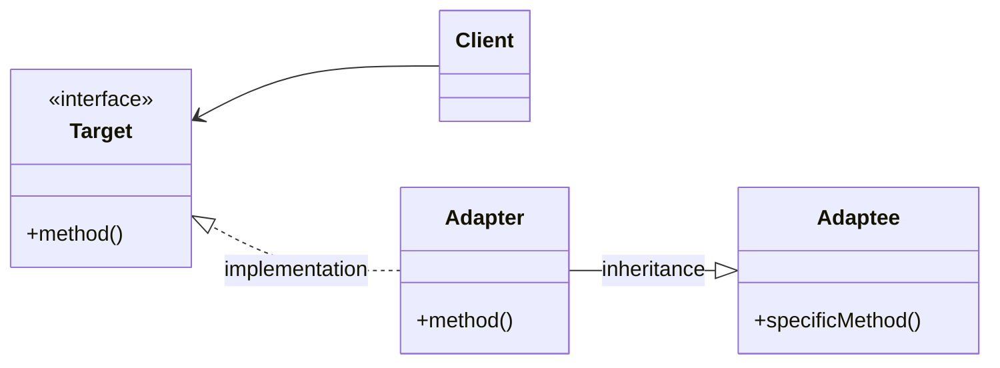
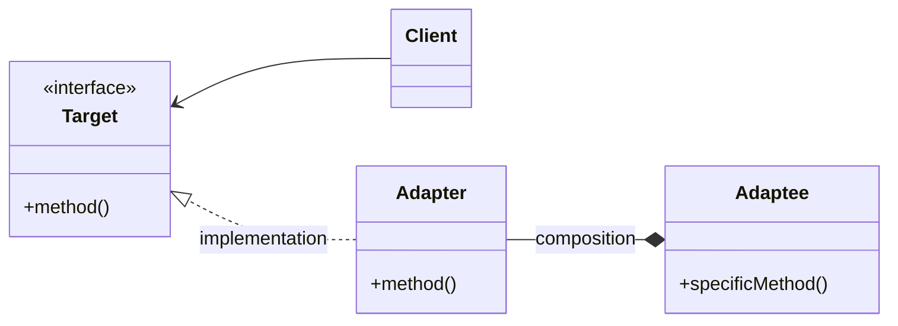

# Адаптер (Adapter)

## Назначение

Преобразует интерфейс одного класса в другой интерфейс, которым пользуется клиент.

## Пример

Пример из реальной жизни:

<blockquote>
    <p>
    Трехконтактную вилку нельзя подключить к двухконтактной розетке, для нее необходимо использовать адаптер питания, совместимый с двухконтактной розеткой. </p>

    <p>
    Еще одним примером может служить переводчик, переводящий слова, сказанные одним человеком другому.
    </p>

</blockquote>

Другими словами:

<blockquote>
    Адаптер обеспечивает совместную работу классов с несовместными интерфейсами.
</blockquote>

## Применение

-   Нужно использовать класс, но его интерфейс не удовлетворяет нашим потребностям;
-   Требуется создать повторно используемый класс, который взаимодействует с не связанными с ним классами, имеющие несовместимые интерфейсы;
-   Нужно использовать несколько существующих классов, но адаптировать их интерфейсы путем порождения подклассов непрактично. В этом случае адаптер может приспособить интерфейс родительского класса.

## UML диаграмма

Реализация адаптера через множественное наследование:



Реализация адаптера через композицию:



Описание сущностей:

-   _Target_ - зависящий интерфейс, которым пользуется клиент;
-   _Adaptee_ - существующий интерфейс, нуждающийся в адаптации;
-   _Adapter_ - адаптирует интерфейс _Adaptee_ к _Target_

!!! Note

    Клиенты вызывают операции экземпляра адаптера. Адаптер, в свою очередь, вызывает операции адаптируемого объекта, который и выполняет запрос.

## Результат

Адаптер класса:

-   Адаптирует _Adaptee_ к _Target_, перепоручая действий конкретному классу _Adaptee_. Поэтому данный паттерн не будет работать с подклассами класса;
-   Позволяет адаптеру _Adapter_ заместить некоторые операции адаптируемого класса _Adaptee_, т.к. _Adapter_ является подклассом _Adaptee_;
-   Добавляет только один новый объект.

Адаптер объекта:

-   Позволяет одному адаптеру _Adapter_ работать со многими объектами _Adaptee_ (т.е. с его подклассами);
-   Затрудняет переопределение _Adaptee_. Для этого потребуется породить от _Adaptee_ подкласс и заставить _Adapter_ ссылаться на этот подкласс, а не на сам _Adaptee_.

## Пример кода

Реализация через композицию

=== "Python"

    ```python
    from __future__ import annotations

    from abc import ABC, abstractmethod


    class USB(ABC):
        """Интерфейс подключение usb"""

        @abstractmethod
        def connect(self):
            """Подключение"""


    class MemoryCard:
        """Карта памяти"""

        def insert(self):
            """Вставить карту памяти"""

        def copy_date(self):
            """Копировать данные"""


    class CardReader(USB):
        """Адаптер"""

        def __init__(self, card: MemoryCard) -> None:
            self._card = card

        def connect(self):
            self._card.insert()

    card_reader: USB = CardReader(card=MemoryCard())
    card_reader.connect()
    ```

Реализация через наследование

=== "Python"

    ```python
    from __future__ import annotations

    from abc import ABC, abstractmethod


    class USB(ABC):
        """Интерфейс подключение usb"""

        @abstractmethod
        def connect(self):
            """Подключение"""


    class MemoryCard:
        """Карта памяти"""

        def insert(self):
            """Вставить карту памяти"""

        def copy_date(self):
            """Копировать данные"""


    class CardReader(MemoryCard, USB):
        """Адаптер"""

        def connect(self):
            self.insert()


    card_reader: USB = CardReader()
    card_reader.connect()
    ```
