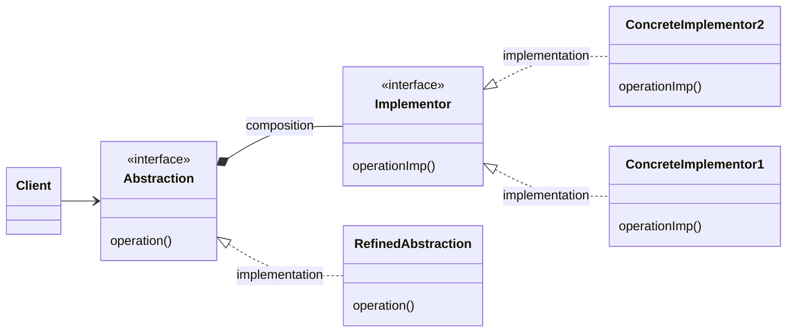

# Мост (Bridge)

## Назначение

Отделить реализацию и абстракцию друг от друга, для независимого изменения

## Пример

Пример из реальной жизни:

<blockquote>
Например, у нас есть оружие с разными чарами, и мы должны разрешить смешивание разного оружия с разными чарами.

Паттерн "Мост" позволяет создать отдельные чары и установить их для оружия сколь угодно раз.

</blockquote>

Другими словами:

<blockquote>
Шаблон моста предпочитает композицию наследованию. Детали реализации выдвигаются
из иерархии в другой объект с отдельной иерархией.
</blockquote>

## Применение

- Требуется избежать постоянной привязки абстракции к реализации;
- Абстракция и реализация должны расширяться подклассами;
- Изменения в реализации абстракции не должны влиять на клиента;
- Число классов стремительно разрастается, это признак, что пора разделить иерархию на два класса;
- Реализация должна совместно использоваться несколькими классами.

## UML диаграмма



Описание сущностей:

- _Abstraction_ - Абстракция, определяющая интерфейс абстракции и хранящая ссылку на объект _Implementor_;
- _Implementor_ - Реализатор, определяющий интерфейс для классов реализации;
- _RefinedAbstraction_ - Уточненная абстракция, расширяет интерфейс _Abstraction_;
- _ConcreteImplementor_ - Конкретный реализатор, реализует интерфейс _Implementor_.

!!! Note

    _Abstraction_ и _Implementor_ могут иметь совершенно разные интерфейсы. Обычно интерфейс _Implementor_ предоставляет примитивные операции, а интерфейс _Abstraction_ определяет более высокоуровневые операции  

!!! Note

    Объект _Abstraction_ перенаправляет запросы своему объекту _Implementor_ 
    
## Результат

Мост:

- Отделяет реализацию от интерфейса;
- Повышает степень расширяемости;
- Скрывает реализацию от клиентов.

## Пример кода

=== "Python"

    ```python
    from abc import ABC, abstractmethod
    
    
    class IColor(ABC):
        @abstractmethod
        def fill_color(self): ...
    
    
    class BlackColor(IColor):
        def fill_color(self): ...
    
    
    class GreenColor(IColor):
        def fill_color(self): ...
    
    
    class RedColor(IColor):
        def fill_color(self): ...
    
    
    class Shape(ABC):
        def __init__(self, color: IColor):
            self._color = color  # В данном случае является мостом
    
        @abstractmethod
        def draw(self) -> None:
            ...
    
    
    class Rectangle(Shape):
        def draw(self) -> None:
            ...
    
    
    class Triangle(Shape):
        def draw(self) -> None:
            ...
    ```
