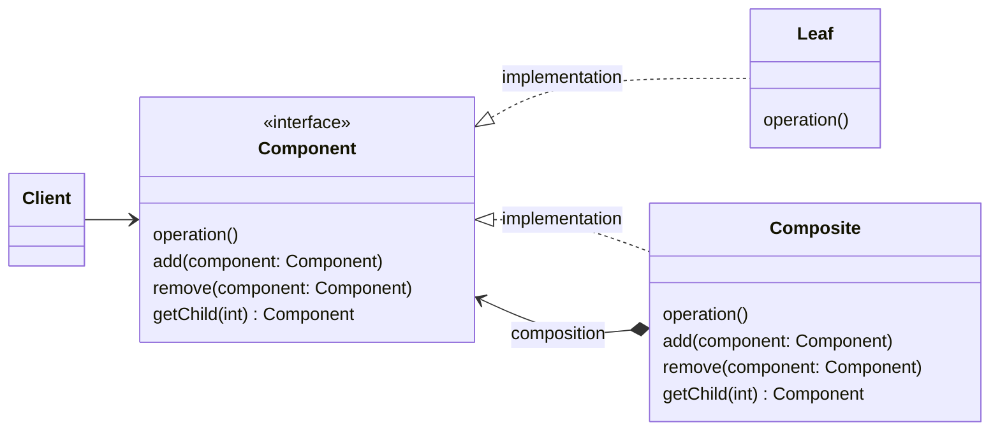

# Компоновщик (Composite)

## Назначение

Компонует объекты в древовидные структуры для представления иерархии "часть-целое". Позволяет клиенту трактовать
индивидуальные и составные объекты.

## Пример

Пример из реальной жизни:

<blockquote>
Каждое предложение состоит из слов, которые, в свою очередь, состоят из символов. Каждый из объектов можно распечатать,
и что-то может быть напечатано до или после них, например предложение всегда заканчивается точкой, и перед словом всегда
есть пробел.
</blockquote>

Другими словами:

<blockquote>
Позволяет клиентам единообразно обрабатывать отдельные объекты.
</blockquote>

## Применение

* требуется представить иерархию объектов вида "часть-целое";
* клиенты должны работать с составными и индивидуальными объектами по одинаковым правилам.

## UML диаграмма



Описание сущностей:

* _Component_ - Объявляет интерфейс для компонуемых объектов;
* _Leaf_ - Листовой узел компонента;
* _Composite_ - Составной объект компонента;

## Результат

Компоновщик:

* Определяет иерархии классов, состоящие из примитивных и составных объектов;
* Упрощает архитектуру клиента;
* Облегчает добавление новых видов компонентов;
* Способствует созданию общего дизайна

## Пример кода

=== "Python"

    ```python
    from __future__ import annotations

    from abc import ABCMeta, abstractmethod
    
    
    class Unit(metaclass=ABCMeta):
        """
        Абстрактный компонент, в данном случае это - отряд (отряд может
        состоять из одного солдата или более)
        """
    
        @abstractmethod
        def print(self) -> None:
            """
            Вывод данных о компоненте
            """
            pass
    
        def add(self, unit: Unit) -> None:
            """
            Добавление нового компонента в иерархию
    
            :param unit: Компонент
            """
            raise NotImplementedError
    
        def remove(self, unit: Unit) -> None:
            """
            Удаление компонента из иерархию
    
            :param unit: Компонент
            """
            raise NotImplementedError
    
        def get_children(self) -> list[Unit]:
            """
            Вернуть список дочерних элементов
            """
            raise NotImplementedError
    
        def __repr__(self):
            return f"{self.__class__.__name__}"
    
    
    class Archer(Unit):
        """Лучник"""
    
        def print(self) -> None:
            print(self)
    
    
    class Knight(Unit):
        """Рыцарь"""
    
        def print(self) -> None:
            print(self)
    
    
    class Swordsman(Unit):
        """Мечник"""
    
        def print(self) -> None:
            print(self)
    
    
    class Squad(Unit):
        """
        Компоновщик - отряд, состоящий более чем из одного человека. Также
        может включать в себя другие отряды-компоновщики.
        """
    
        def __init__(self):
            self._units = []
    
        def print(self) -> None:
            print(f"Отряд {self.__hash__()}:", end="\n")
            for u in self._units:
                print(f"\t {u}")
    
        def add(self, unit: Unit) -> None:
            """
            Добавление нового отряда
    
            :param unit: отряд (может быть как базовым, так и компоновщиком)
            """
            self._units.append(unit)
            print(f"{unit} присоединился к отряду {self.__hash__()}")
    
        def remove(self, unit: Unit) -> None:
            """
            Удаление отряда из текущего компоновщика
    
            :param unit: объект отряда
            """
            for u in self._units:
                if u == unit:
                    self._units.remove(u)
                    print(f"{u} покинул отряд {self.__hash__()}")
                    break
            else:
                print(f"{unit} в отряде {self.__hash__()} не найден")
    
        def get_children(self) -> list[Unit]:
            return self._units
    ```
