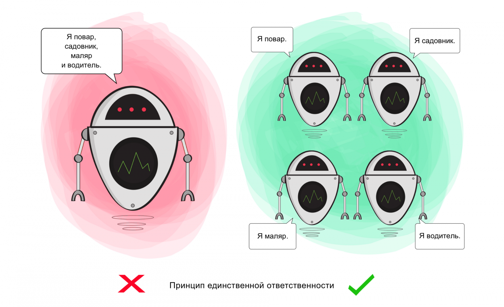
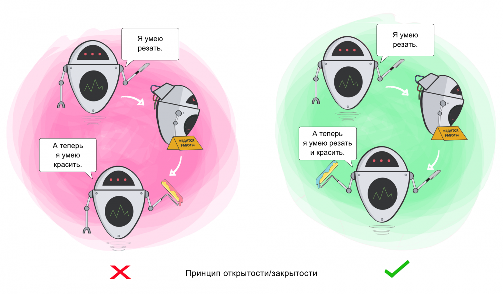
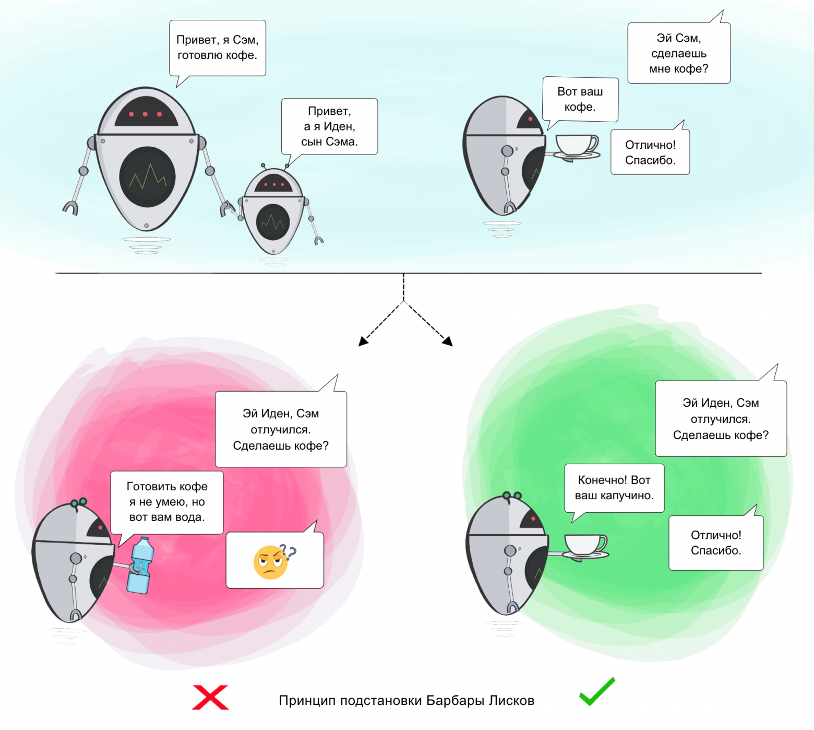
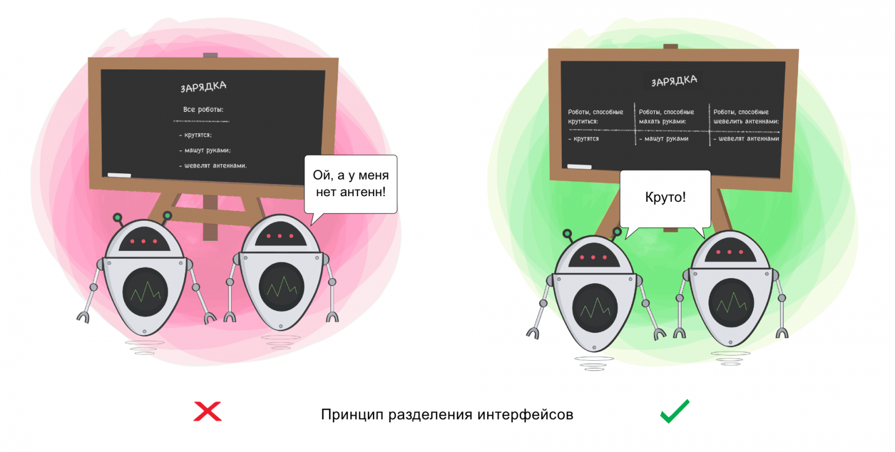
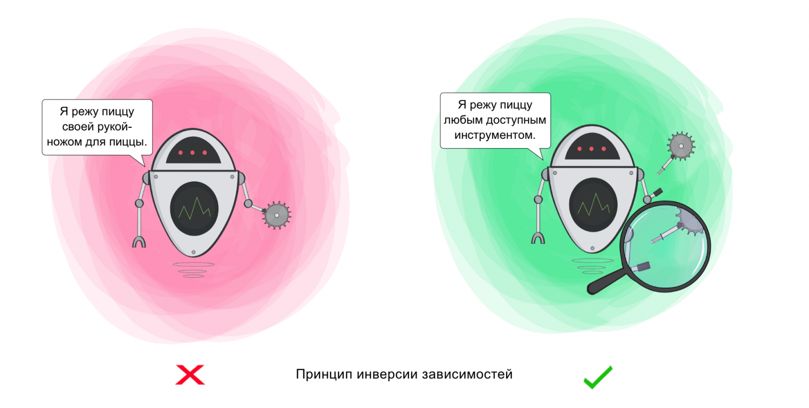

# Принцип SOLID

!!! info

    Принцип применим не только к классам, но и к методам, функциям, модулям.

-   Single Responsibility Principle (SRP) — принцип единственной ответственности.
-   Open-Closed Principle (OCP) — принцип открытости/закрытости.
-   Liskov Substitution Principle (LSP) — принцип подстановки Барбары Лисков.
-   Interface Segregation Principle (ISP) — принцип разделения интерфейса.
-   Dependency Inversion Principle (DIP) — принцип инверсии зависимостей

## SRP

Принцип единой ответственности гласит, что для внесения изменений в класс требуется только одна причина. Каждый модуль или класс должен нести ответственность за одну какую-либо часть функционала, и такая ответственность должна быть инкапсулирована в класс.

Если класс отвечает за несколько операций сразу, вероятность возникновения багов возрастает - внося изменения, касающиеся одной из операций вы, сами того не подозревая, можете затронуть и другие.

Принцип служит для разделения типов поведения, благодаря которому ошибки, вызванные модификациями в одном поведении, не распространялись на прочие, не связанные с ним типы.

## OCP

Классы должны быть открыты для расширения, но закрыты для модификации. Принцип открытости/закрытости заключается в том, что следует расширять код с помощью подклассов так, чтобы изначальный класс не требовал правок.

Принцип служит для того, чтобы делать поведение класса более разнообразным, не вмешиваясь в текущие операции, которые он выполняет. Благодаря этому вы избегаете ошибок в тех фрагментах кода, где задействован этот класс.

## LSP

Этот принцип гласит, что проектирование должно предусматривать возможность замены любого экземпляра родительского класса любым экземпляром дочернего. Таким образом, все что умеет делать родительский класс, должен уметь делать дочерний класс.

В случаях, когда класс-потомок не способен выполнять те же действия, что и класс-родитель, возникает риск появления ошибок.

Принцип служит для того, чтобы обеспечить постоянство: класс-родитель и класс-потомок могут использоваться одинаковым образом без нарушения работы программы.

## ISP

Принцип гласит, что лучше создавать много маленьких интерфейсов, чем несколько больших.

Класс должен производить только те операции, которые необходимы для осуществления его функций. Все другие действия следует либо удалить совсем, либо переместить, если есть вероятность, что они понадобятся другому классу в будущем.

Принцип служит для того, чтобы раздробить единый набор действий на ряд наборов поменьше - таким образом, каждый класс делает то, что от него действительно требуется, и ничего больше.

## DIP

Модули верхнего уровня не должны зависеть от модулей нижнего уровня. И те, и другие должны зависеть от абстракции. Абстракции не должны зависеть от деталей. Детали должны зависеть от абстракций.

Этот принцип служит для того, чтобы устранить зависимость классов верхнего уровня от классов нижнего уровня за счёт введения интерфейсов.

