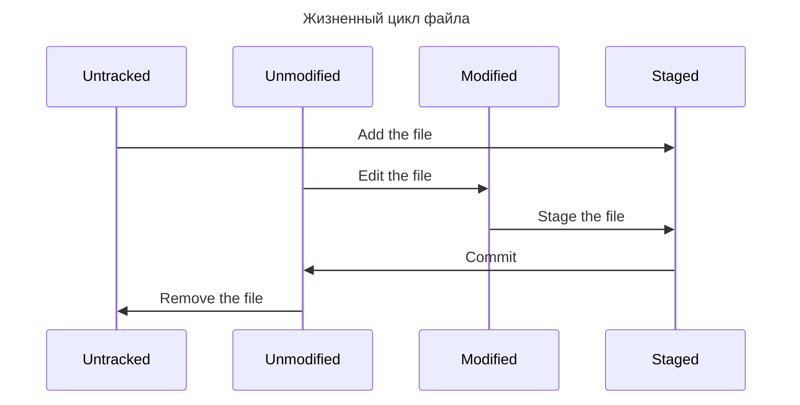

# Основы Git

## Создание Git репозитория

Получить git репозиторий можно двумя способами:

-   Инициализировать версионный контроль Git в локальном каталоге проекта. Для этого достаточно выполнить команду [`git init`](https://git-scm.com/docs/git-init){:target="\_blank"} в текущем каталоге проекта.

-   Клонировать существующий репозиторий Git. Для клонирования репозитория используется команда [`git clone <remote_repo_url>`](https://git-scm.com/docs/git-clone){:target="\_blank"}. В этом случае если серверный диск выйдет из
    строя, то можно восстановить данные с помощью любого клиента, на котором проводилось клонирование

## Запись изменений

Каждый файл в проекте может находиться в двух состояниях:

-   Отслеживаемый - файлы, о которых знает Git. Они в свою очередь могут быть.

    -   Неизмененными;
    -   Измененными;
    -   Подготовленные к коммиту.

-   Не отслеживаемые - все остальные файлы в рабочем каталоге, которые не подготовлены к коммиту и не входили в
    последний [снимок](what_is_git.md#snapshot).



### Добавление файлов в индекс

Для просмотра в каком состоянии находится файл нужно выполнить команду [`git status`](https://git-scm.com/docs/git-status){:target="\_blank"}

Новые файлы будут находиться в разделе _Untracked Files_ вывода команды `git status`. Данный статус означает, что файла
не было в предыдущем коммите, и Git не будет его добавлять, пока мы явно об этом не попросим.

<!-- termynal -->

```bash
$ git status
On branch master
Your branch is up to date with 'origin/master'.

Untracked files:
  (use "git add <file>..." to include in what will be committed)
        README
```

Чтобы начать отслеживать файл, нужно выполнить команду [`git add <filename or pattern>`](https://git-scm.com/docs/git-add){:target="\_blank"}. Текущая команда переместит файл в раздел _Changes to be committed_.

<!-- termynal -->

```bash
$ git add README
$ git status
On branch master
Your branch is up to date with 'origin/master'.

Changes to be committed:
  (use "git restore --staged <file>..." to unstage)
    new file:   README
```

Если изменить файл, находящийся под версионным контролем, то он попадет в раздел _Changes not staged for commit_. Это
означает, что файл изменен, но не проиндексирован. Чтобы его проиндексировать нужно выполнить команды `git add`

<!-- termynal -->

```bash
$ git status
On branch master
Your branch is up to date with 'origin/master'.

Changes to be committed:
  (use "git restore --staged <file>..." to unstage)
    new file:   README

Changes not staged for commit:
  (use "git add <file>..." to update what will be committed)
  (use "git restore <file>..." to discard changes in working directory)
    modified:   CONTRIBUTING.md
```

Если мы изменим файл, который проиндексирован, то заметим следующую картину

<!-- termynal -->

```bash
$ git status
On branch master
Your branch is up to date with 'origin/master'.

Changes to be committed:
  (use "git restore --staged <file>..." to unstage)
    new file:   README
    modified:   CONTRIBUTING.md

Changes not staged for commit:
  (use "git add <file>..." to update what will be committed)
  (use "git restore <file>..." to discard changes in working directory)
    modified:   CONTRIBUTING.md
```

Это происходит потому что, Git индексирует файл в точности в том состоянии, в котором выполнялась команда `git add`.
Поэтому, чтобы зафиксировать новые изменения, нужно снова выполнить команду `git add`.

Опция `-i` в команде `git add` позволяет выполнять интерактивное индексирование.

Файл _.gitignore_ служит для игнорирования файлов, которые не должны быть отслеживаемыми. Название файлов указываются с
помощью GLOB-шаблонов.

Правила Glob-шаблонов:

-   \* - 0 или более символов;
-   [abc] - любой из указанных символов;
-   ? - один символ;
-   [0-9] - любой символ из интервала;
-   a/\*\*/z - указывает на вложенность.

Правила, применяемые к шаблонам:

-   Пусты строки и строки, начинающиеся с символа _#_, игнорируются;
-   Стандартные шаблоны применяются рекурсивно ко всем файлам в каталоге;
-   Для избегания рекурсии используется / в начале шаблона;
-   Для исключения каталога используется / в конце шаблона;
-   ! - инвертирует шаблон.

Пример файла .gitignore:

```bash
# Исключить все файлы с расширением .a
*.a

# Но отслеживать файл lib.a даже если он подпадает под исключение выше
!lib.a

# Исключить файл TODO в корневом каталоге, но не файл в subdir/TODO
/TODO

# Игнорировать все файлы в каталоге build/
build/

# Игнорировать файл doc/notes.txt, но не файл doc/server/arch.txt
doc/*.txt

# Игнорировать все .txt файлы в каталоге doc/
doc/**/*.txt
```

!!! Note

    GitHub поддерживает довольно полный список примеров .gitignore файлов для множества проектов и языков https://github.com/github/gitignore.

### Просмотр изменения в файлах

Чтобы посмотреть какие строки были изменены в файлах можно использовать команду [`git diff`](https://git-scm.com/docs/git-diff){:target="\_blank"}.

Следующий пример сравнивает рабочий каталог с индексом:

<!-- termynal -->

```bash
$ git diff
diff --git a/docs/compendium/base/git/command.md b/docs/compendium/base/git/command.md
index a89f93a..f27ef4a 100644
--- a/docs/compendium/base/git/command.md
+++ b/docs/compendium/base/git/command.md
@@ -2,15 +2,15 @@

- ## Получение проекта
+ ## Получение и создание проекта
```

Сама команда сравнивает только не проиндексированные изменения. Чтобы посмотреть, какие изменения есть в
проиндексированных файлах, нужно выполнить команду с опцией _--staged_

### Фиксирование изменений

После того как мы подготовили все изменения их нужно сохранить с помощью команды [`git commit`](https://git-scm.com/docs/git-commit){:target="\_blank"}.
При использовании данной команды откроется окна выбранного нами редактора.

```bash
# Please enter the commit message for your changes. Lines starting
# with '#' will be ignored, and an empty message aborts the commit.
# On branch master
# Your branch is up-to-date with 'origin/master'.
#
# Changes to be committed:
#	new file:   README
#	modified:   CONTRIBUTING.md
#
~
~
~
".git/COMMIT_EDITMSG" 9L, 283C
```

### Удаление файла

Для удаления файла нужно сначала удалить файл из отслеживаемых (индекса), а затем сделать коммит. Это можно сделать с
помощью команды [`git rm`](https://git-scm.com/docs/git-rm){:target="\_blank"}. Опция _--cached_ позволяет удалить файл только из индекса.

<!-- termynal -->

```bash
$ git rm PROJECTS.md
rm 'PROJECTS.md'
$ git status
On branch master
Your branch is up-to-date with 'origin/master'.
Changes to be committed:
  (use "git reset HEAD <file>..." to unstage)

    deleted:    PROJECTS.md
```

### Перемещение файлов

В отличие от многих других систем контроля версий, Git не отслеживает перемещение файлов явно. Когда вы переименовываете
файл в Git, в нём не сохраняется никаких метаданных, говорящих о том, что файл был переименован. Для этого служит
команда [`git mv`](https://git-scm.com/docs/git-mv){:target="\_blank"}

<!-- termynal -->

```bash
$ git mv README.md README
$ git status
On branch master
Your branch is up-to-date with 'origin/master'.
Changes to be committed:
  (use "git reset HEAD <file>..." to unstage)

    renamed:    README.md -> README
```

## Просмотр истории коммитов

Для просмотра истории коммитов можно воспользоваться командой [`git log`](https://git-scm.com/docs/git-log){:target="\_blank"}

<!-- termynal -->

```bash
$ git log
commit f74e1e92dec361cbfec3cf50f7ebe10266041371 (HEAD -> master, origin/master, origin/HEAD)
Merge: a369b40 b8ca454
Author: Nikita Afanasyev <143065504+NetoGeek@users.noreply.github.com>
Date:   Thu Nov 23 16:59:50 2023 +0300

    Merge remote-tracking branch 'origin/master'

commit a369b40b6ef8c22e9b3f45fdf2b0f3a9ffdf58f7
Author: Nikita Afanasyev <143065504+NetoGeek@users.noreply.github.com>
Date:   Thu Nov 23 16:59:44 2023 +0300

    Добавление конспекта по основам Git. Обновление зависимостей

commit b8ca45416ed83736f328748a5631de484c0eb96b
Author: Nikita Afanasyev <143065504+NetoGeek@users.noreply.github.com>
Date:   Thu Nov 23 14:35:38 2023 +0300

    Добавлен новый проект
```

По умолчанию текущая команда выводит коммиты в обратном к хронологическом порядке - более старые коммиты снизу.

Команда для просмотра истории имеет множество параметров, перечислим некоторые из них:

-   _-p | --patch_ - показывает изменения в файлах

<!-- termynal -->

```bash
$ git log -p
commit a369b40b6ef8c22e9b3f45fdf2b0f3a9ffdf58f7
Author: Nikita Afanasyev <143065504+NetoGeek@users.noreply.github.com>
Date:   Thu Nov 23 16:59:44 2023 +0300

    Добавление конспекта по основам Git. Обновление зависимостей

diff --git a/docs/compendium/base/git//base.md b/docs/compendium/base/git//base.md
index a45c086..855e37d 100644
--- a/docs/compendium/base/git//base.md
+++ b/docs/compendium/base/git//base.md
@@ -115,3 +115,47 @@ Changes not staged for commit:

 Это происходит потому что, Git индексирует файл в точности в том состоянии, в котором выполнялась команда `git add`.
 Поэтому, чтобы зафиксировать новые изменения, нужно снова выполнить команду `git add`.
+
+Файл *.gitignore* служит для игнорирования файлов, которые не должны быть отслеживаемыми. Название файлов указываются с
+помощью GLOB-шаблонов.
+
```

-   _--stat_ - показывает статистику измененных файлов для каждого коммита;

<!-- termynal -->

```bash
$ git log --stat
commit f74e1e92dec361cbfec3cf50f7ebe10266041371
Merge: a369b40 b8ca454
Author: Nikita Afanasyev <143065504+NetoGeek@users.noreply.github.com>
Date:   Thu Nov 23 16:59:50 2023 +0300

    Merge remote-tracking branch 'origin/master'

commit a369b40b6ef8c22e9b3f45fdf2b0f3a9ffdf58f7
Author: n-afanacev <n-afanacev@it-serv.ru>
Date:   Thu Nov 23 16:59:44 2023 +0300

    Добавление конспекта по основам Git. Обновление зависимостей

 docs/compendium/base/git//base.md | 44 +++++++++++++++++++++++++++
 docs/compendium/base/git/command.md        | 17 ++++++-----
 mkdocs.yml                                 |  1 +
 poetry.lock                                | 48 +++++++++++++++++++-----------
 pyproject.toml                             |  4 ++-
 5 files changed, 87 insertions(+), 27 deletions(-)
```

-   _--pretty_ - позволяет настроить формат вывода;
-   _--graph_ - Отображает ASCII граф с ветвлениями и историей слияний;
-   _--no-merge_ - исключить коммиты слияния.

Также существуют опции для ограничения и фильтрации:

-   _-n_ - количество выводимых коммитов;
-   _--since | --after_ - Коммиты, сделанные после указанной даты;
-   _--until | --before_ - Коммиты, сделанные до указанной даты;
-   _--grep_ - Коммиты, в сообщениях которых есть указанная строка;
-   _--author_ - Коммиты, автор которых совпадает с указанной строкой;
-   _--grep_ - Коммиты, в сообщениях которых есть указанная строка;
-   _-S_ - Коммиты, в которых добавлена/изменена/удалена указанная строка;

## Операции отмены

!!! Warning

    Не все операции отмены можно отменить

<!-- * будет ли тут смотреться мем с Галя, отмена -->

Иногда может возникнуть необходимость отменить предыдущие изменения.

Отмена может возникнуть, например, если забыли зафиксировать какие-то изменения. Для этого достаточно добавить изменения
в индекс и выполнить команду `git commit --amend`. Также эту команду можно использовать для изменения сообщения коммита.

!!! Info

    Очень важно понимать, что когда вносятся правки в последний коммит, он не столько исправляется, сколько заменяется новым, который полностью его перезаписывает.

Если же требуется отменить добавление изменений в индекс, достаточно воспользоваться
командой [`git reset HEAD <filename>`](https://git-scm.com/docs/git-reset){:target="\_blank"}.

!!! Danger

    Команда *git reset* может быть опасна с опцией --hard

Для той же цели можно использовать команду [`git restore`](https://git-scm.com/docs/git-restore){:target="\_blank"}. С помощью этой команды можно также
отменять локальные изменения в файле

!!! Danger

    git restore <file> опасная команда. Любые локальные изменения, внесённые в этот файл, исчезнут

## Работа с удаленными репозиториями

Удаленные репозитории представляют версии проекта, сохраненные где-то в сети. Взаимодействие с другими пользователями
подразумевает управление удаленным репозиторием, отправку и получение данных из них.

!!! Info

    Слово "удаленный" подразумевает, что репозиторий может находить где угодно, даже на локальном ПК.

Для просмотра доступных удаленных репозиториев используется команда [`git remote`](https://git-scm.com/docs/git-remote){:target="\_blank"}.

<!-- termynal -->

```bash
$ git remote
origin
```

Опция _-v_ также покажет адреса для чтения и записи.

<!-- termynal -->

```bash
$ git remote -v
origin	https://github.com/xxx/xxx (fetch)
origin	https://github.com/xxx/xxx (push)
```

Для того чтобы добавить удаленный репозиторий и добавить ему имя (shortname) нужно выполнить
команду `git remote add <shortname> <url>`.

<!-- termynal -->

```bash
$ git remote
origin
$ git remote add pb https://github.com/xxx/ticgit
$ git remote -v
origin	https://github.com/schacon/ticgit (fetch)
origin	https://github.com/schacon/ticgit (push)
pb	https://github.com/xxx/ticgit (fetch)
pb	https://github.com/xxx/ticgit (push)
```

Для получения данных из другого репозитория выполняем команду [`git fetch`](https://git-scm.com/docs/git-fetch){:target="\_blank"}.

!!! Info

    Команда забирает изменения, но не сливает с нашими наработками

<!-- termynal -->

```bash
$ git fetch pb
remote: Counting objects: 43, done.
remote: Compressing objects: 100% (36/36), done.
remote: Total 43 (delta 10), reused 31 (delta 5)
Unpacking objects: 100% (43/43), done.
From https://github.com/paulboone/ticgit
 * [new branch]      master     -> pb/master
 * [new branch]      ticgit     -> pb/ticgit
```

Чтобы поделиться своими наработками, их нужно отправить в удаленный репозиторий. Это можно сделать
командой [`git push`](https://git-scm.com/docs/git-push){:target="\_blank"}.

Эта команда срабатывает только в случае, если вы клонировали с сервера, на котором у вас есть права на запись, и если
никто другой с тех пор не выполнял команду push. Если вы и кто-то ещё одновременно клонируете, затем он выполняет
команду push, а после него выполнить команду push попытаетесь вы, то ваш push точно будет отклонён. Вам придётся сначала
получить изменения и объединить их с вашими и только после этого вам будет позволено выполнить push.

Получить больше информации об удаленном репозитории можно командой `git remote show <remote>`.

<!-- termynal -->

```bash
$ git remote show origin
* remote origin
  Fetch URL: https://github.com/schacon/ticgit
  Push  URL: https://github.com/schacon/ticgit
  HEAD branch: master
  Remote branches:
    master                               tracked
    dev-branch                           tracked
  Local branch configured for 'git pull':
    master merges with remote master
  Local ref configured for 'git push':
    master pushes to master (up to date)
```

## Работа с тегами

Теги используется для отметки определенных момент в истории. Для работы с тегами используется
команда [`git tag`](https://git-scm.com/docs/git-tag){:target="\_blank"}.

Просмотр тегов

```bash
$ git tag
v1.0
v2.0
```

Просмотр тегов по шаблону

```bash
$ git tag -l "v1.8.5*"
v1.8.5
v1.8.5-rc0
v1.8.5-rc1
v1.8.5-rc2
v1.8.5-rc3
v1.8.5.1
v1.8.5.2
v1.8.5.3
v1.8.5.4
v1.8.5.5
```

!!! note

    Для поиска тегов по шаблону обязателен параметр -l или --list

Git использует два основных типа тегов:

-   Легковесные - указатель на определенный коммит;
-   Аннотированные - полноценные объекты, которые имею контрольную сумму, содержат имя автора, его e-mail и дату создания,
    имеют комментарий и могут быть подписаны и проверены с помощью GNU Privacy Guard (GPG).

Создание аннотированного тега достаточно легко

<!-- termynal -->

```bash
$ git tag -a v1.4 -m "my version 1.4"
$ git tag
v0.1
v1.3
v1.4
```

Создание легковесного тега

<!-- termynal -->

```bash
$ git tag v1.4-lw
$ git tag
v0.1
v1.3
v1.4
v1.4-lw
v1.5
```

Команда `git push` не отправляет теги на удаленный репозиторий. Для этого нужно явно указать тег или добавить опцию
_--tags_

<!-- termynal -->

```bash
$ git push origin v1.5
Counting objects: 14, done.
Delta compression using up to 8 threads.
Compressing objects: 100% (12/12), done.
Writing objects: 100% (14/14), 2.05 KiB | 0 bytes/s, done.
Total 14 (delta 3), reused 0 (delta 0)
To git@github.com:schacon/simplegit.git
 * [new tag]         v1.5 -> v1.5

$ git push origin --tags
Counting objects: 1, done.
Writing objects: 100% (1/1), 160 bytes | 0 bytes/s, done.
Total 1 (delta 0), reused 0 (delta 0)
To git@github.com:schacon/simplegit.git
 * [new tag]         v1.4 -> v1.4
 * [new tag]         v1.4-lw -> v1.4-lw
```

Удаление тега выполняется с помощью опции _-d_ и указание имени тега.
