# Ветвление Git

## Ветвление

Ветвление в Git очень легковесно: операции создание ветки и перемещение между ними выполняются почти мгновенно.

Когда мы создаем коммит, он сохраняется виде объекта, который содержит указатель на снимок подготовленных данных. Этот объект содержит имя автора, email, сообщение и указатель на коммиты предыдущие новому.

Во время индексации вычисляется контрольная сумма каждого файла, затем каждый файл сохраняется в репозиторий. Такие файлы называют большой бинарный файл (блоб).

Когда мы создаем коммит, вычисляются суммы всех подкаталогов и сохраняет его в репозиторий как объект дерева каталогов.

Затем создается объект коммита с метаданными и указателем на дерево проекта.

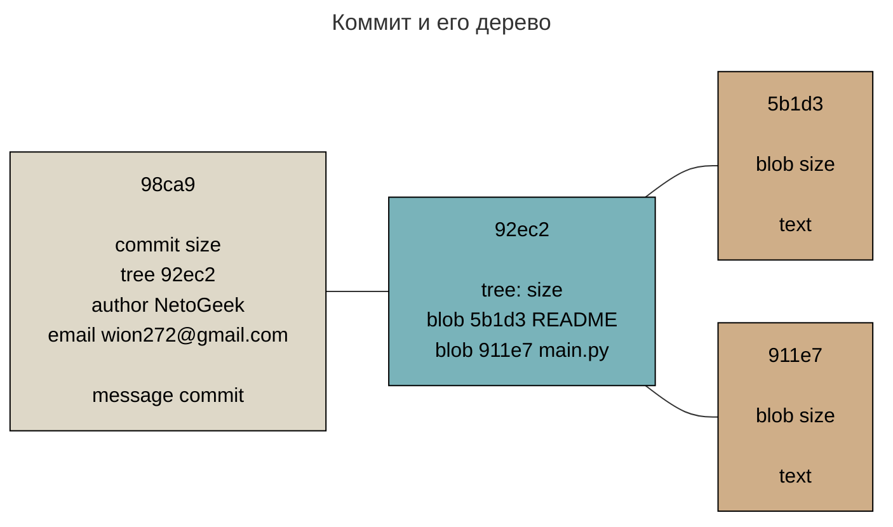

Теперь если мы создадим новый коммит, он будет содержать сумму предыдущего коммита

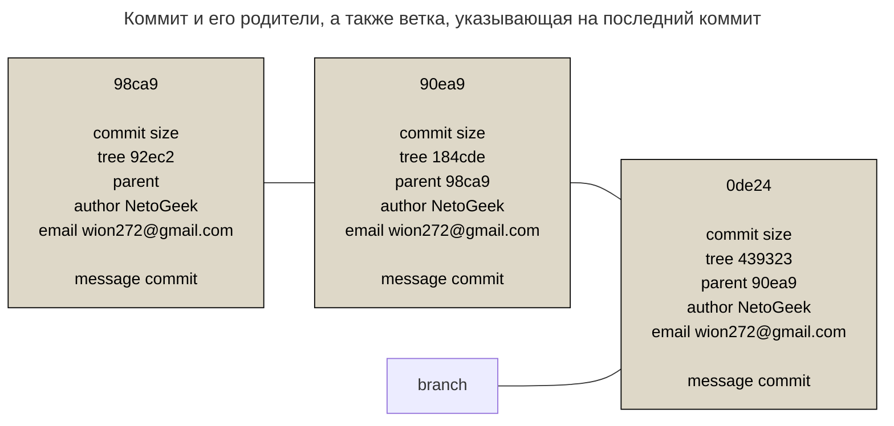

### Основы ветвления

Ветка в Git - перемещаемый указатель на один из коммитов.

!!! info

    По-умолчанию используется ветка "master". Она создается с помощью команды `git init` и может иметь любое название.

Чтобы создать новую ветку достаточно воспользоваться командой [`git branch <name>`](https://git-scm.com/docs/git-branch){:target="_blank"}.

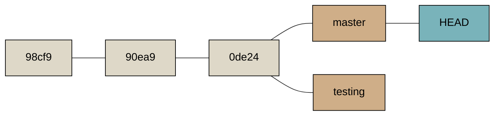

HEAD - указатель на текущую локальную ветку. В нашем случае мы еще находимся на ветке _master_, т.к. мы только создали ветку, а не переключились на нее. Чтобы переключиться на другую ветку нужно воспользоваться командой [`git checkout <branch>`](https://git-scm.com/docs/git-checkout){:target="_blank"}.

!!! note

    Чтобы создать и одновременно переключиться на ветку, можно воспользоваться командой `git checkout -b <name>`

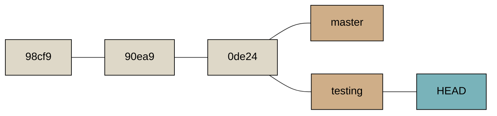

Теперь если мы сделаем коммит, то указатель на ветку _testing_ переместится вперед, а _master_ останется там же.

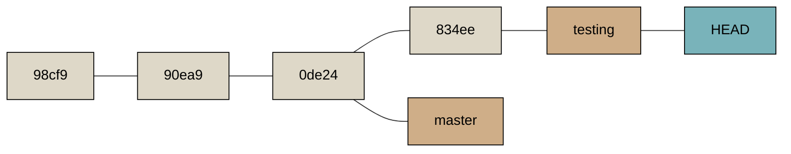

Если мы теперь обратно переключимся на ветку _master_, то наш проект будет соответствовать коммиту, на который указывает ветка.

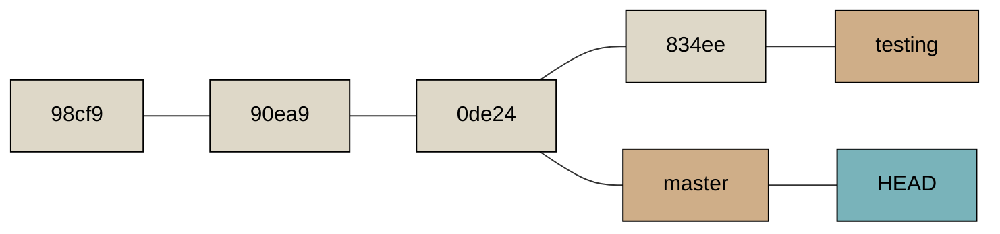

!!! info

    Переключение веток меняет файлы в рабочей директории

!!! note

    Начиная с Git версии 2.23, вы можете использовать [`git switch`](https://git-scm.com/docs/git-switch){:target="_blank"} вместо `git checkout`, чтобы:

    Переключиться на существующую ветку: `git switch testing-branch`.

    Создать новую ветку и переключиться на неё: `git switch -c new-branch`. Флаг -c означает создание, но также можно использовать полный формат:` --create`.

    Вернуться к предыдущей извлечённой ветке: `git switch -`.

Если рабочий каталог или индекс содержит незафиксированные изменения, конфликтующие с веткой на которую хотим переключиться, то Git не позволит этого сделать. Лучше всего переключаться из чистого рабочего состояния проекта: для этого нужно добавить изменения в индекс и создать коммит.

### Управление ветками

Команда [`git branch`](https://git-scm.com/docs/git-branch){:target="_blank"} имеет большую функциональность, кроме создание и удаления веток. При вызове без параметров, можно получить список всех имеющихся веток.

<!-- termynal -->

```bash
$ git branch
  iss53
* master
  testing
```

Где, символ \* указывает на текущую ветку.

Опция `-v` покажет последний коммит на имеющихся ветках.

<!-- termynal -->

```bash
$ git branch -v
  iss53   93b412c Fix javascript issue
* master  7a98805 Merge branch 'iss53'
  testing 782fd34 Add scott to the author list in the readme
```

Опция `--merge` и `--no-merge` позволяет фильтровать ветки, на которые слиты и не слиты в текущую ветку.

!!! Info

    Можно указать дополнительный аргумент для вывода той же информации, но относительно указанной ветки предварительно не извлекая и не переходя на неё.

    ```bash
    $ git checkout testing
    $ git branch --no-merged master
    topicA
    featureB
    ```

Опция `--move` позволяет переименовать ветку.

<!-- termynal -->

```bash
$ git branch --move bad-branch-name corrected-branch-name
```

### Удаленные ветки

Удаленные ссылки - указатели на объекты в удаленных репозиториях.

Ветки слежения - указатели на определенное состояние удаленных веток, который нельзя изменять, Git делает это автоматически при коммуникации с удаленным репозиторием. Имена веток слежения имеют вид _<remote>/<branch>_.

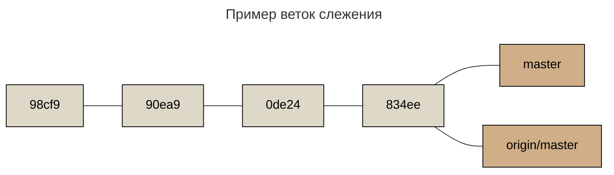

Теперь если мы зафиксируем новые изменения на ветке мастер, указатель _master_ сдвинется вперед, а указатель _origin/master_ останется на том же месте.

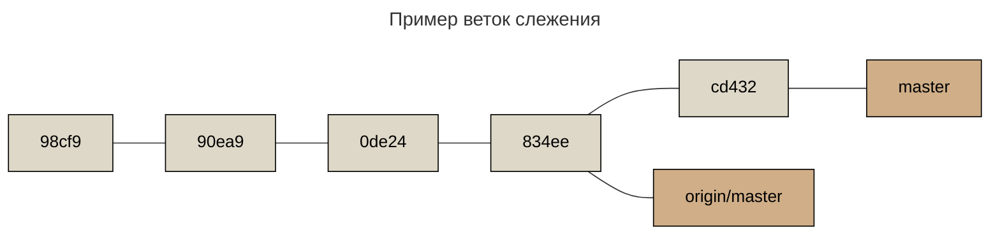

Теперь нам нужно синхронизировать локальную ветку _master_ с удаленной веткой _origin/master_. Для этого достаточно выполнить команду [`git push <remote> <origin>`](https://git-scm.com/docs/git-push){:target="_blank"}.

<!-- termynal -->

```bash
$ git push origin master
Counting objects: 24, done.
Delta compression using up to 8 threads.
Compressing objects: 100% (15/15), done.
Writing objects: 100% (24/24), 1.91 KiB | 0 bytes/s, done.
Total 24 (delta 2), reused 0 (delta 0)
To https://github.com/schacon/simplegit
 * [new branch]      master -> master
```

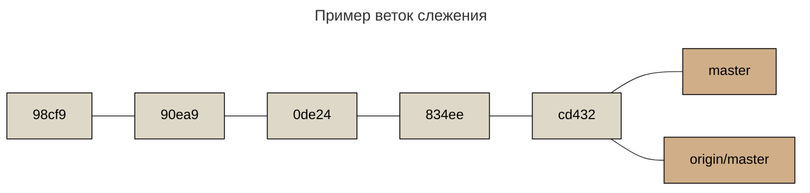

Текущая команда говорит Git: "Возьми локальную ветку _master_ и обнови удаленную ветку _master_". Удаленное имя ветки, автоматически разворачивается до _refs/heads/master:refs/heads/master_.

Если же удаленная ветка должна иметь отличающееся название в удаленном репозитории, нужно указать локальное название ветки и новое удаленное название: _master:main_.

При получении ветки слежения, мы не получаем ее локальную копию. Для этого нужно выполнить команду [`git checkout -b <branch> <remote/branch>`](https://git-scm.com/docs/git-checkout){:target="_blank"}.

Если у нас есть локальная ветка, которую мы хотим настроить за слежением за удаленной веткой, которую мы получили, то нужно выполнить команду [`git branch -u <remote>/<branch>`](https://git-scm.com/docs/git-branch){:target="_blank"}.

Чтобы удалить ветку на сервере, выполняем команду [`git push <remote> --delete <branch>`](https://git-scm.com/docs/git-push){:target="_blank"}.

## Слияние и перебазирование

В Git существует два способа вносить изменения из одной ветки в другую:

-   Слияние;
-   Перебазирование

### Слияние

Когда у нас имеются изменения в нескольких ветках и нам нужно объединить их в одну, можно воспользоваться командой [`git merge`](https://git-scm.com/docs/git-merge){:target="_blank"}.


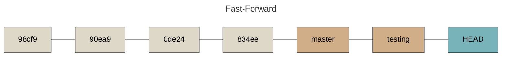

<!-- termynal -->

```bash
$ git checkout master
$ git merge hotfix
Updating f42c576..3a0874c
Fast-forward
 index.html | 2 ++
 1 file changed, 2 insertions(+)
```

_Fast-forward_ означает, что Git просто переместил указатель ветки вперед. Это произошло потому что коммит **834ee** является прямым потомком **0de24**. Git упрощает слияние, просто перенося указатель ветки вперед, потому что нет никаких разноплановых изменений.

Но бывают моменты, когда Git не может сделать слиянием переносом указателя ветки, для этого используется трехслойное слияние. При трехслойном слиянии Git использует последние коммиты каждой ветке и общий родитель каждой ветки.

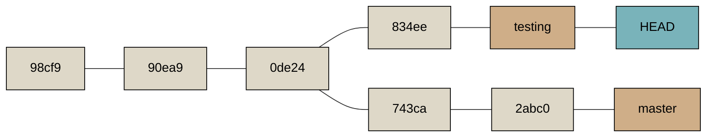

Где:

-   **2abc0** - последний коммит в ветке _master;_
-   **834ee** - последний коммит в ветке _testing_;
-   **0de24** - общий родительский коммит.

Теперь Git создаст новый результирующий снимок трехслойного слияния и автоматически сделает коммит, который называется коммитом слияния.

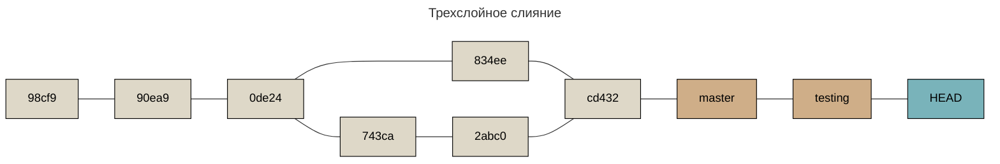

Коммит **cd432** является коммитом слияния.

Иногда слияние не проходит гладко. Если изменить один и тот же файл в разных ветках, Git не сможет их объединить. Во время конфликтов, Git остановит слияние до разрешение конфликта. Посмотреть какие файлы вызвали конфликты можно с помощью команды [`git status`](https://git-scm.com/docs/git-status){:target="_blank"}.

<!-- termynal -->

```bash
$ git status
On branch master
You have unmerged paths.
  (fix conflicts and run "git commit")

Unmerged paths:
  (use "git add <file>..." to mark resolution)

    both modified:      index.html

no changes added to commit (use "git add" and/or "git commit -a")
```

В конфликтных файлах Git добавляет специальные маркеры конфликтов, чтобы можно их было исправить. Чтобы его разрешить нужно выбрать один из предложенных вариантов.

```text
<<<<<<< HEAD:index.html
<div id="footer">contact : email.support@github.com</div>
=======
<div id="footer">
 please contact us at support@github.com
</div>
>>>>>>> iss53:index.html
```

После исправление конфликтов нужно добавить файл в индекс, чтобы отметить его как решенный. Когда мы уверены, что все конфликты решены, нужно создать коммит.

Пример сообщения коммита слияния:

```bash
Merge branch 'iss53'

Conflicts:
    index.html
#
# It looks like you may be committing a merge.
# If this is not correct, please remove the file
#	.git/MERGE_HEAD
# and try again.


# Please enter the commit message for your changes. Lines starting
# with '#' will be ignored, and an empty message aborts the commit.
# On branch master
# All conflicts fixed but you are still merging.
#
# Changes to be committed:
#	modified:   index.html
#
```

### Перебазирование

Команда [`git rebase`](https://git-scm.com/docs/git-rebase){:target="_blank"} позволяет применить коммиты из одной ветке в том же порядке к другой.

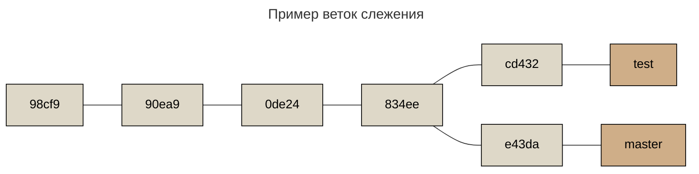

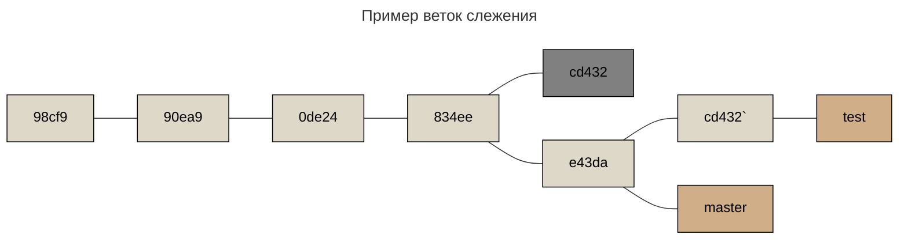

Как это работает: берется общий родительский снимок, определяется дельта каждого коммита текущей ветки и сохраняется во временный файл, текущая ветка устанавливается на последний коммит ветки, поверх которой выполняется перебазирование, а затем применяются дельты из временных файлов

Затем мы переключаемся на ветку *master* и выполняем перемотку слиянием:

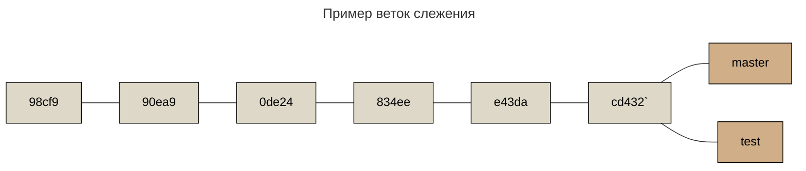

Не важно является ли последний снимок снимком слияние или снимком перебазирования, в обоих случаях это один и тот же снимок. Перебазирование повторяет изменения из одной ветки поверх другой в том порядке, в котором эти изменения были сделаны, в то время как слияние берет две конечные точки и сливает их вместе.

!!! warning

    Не перемещайте коммиты, уже отправленные в публичный репозиторий

Когда что-то перемещается, отменяются существующие коммиты и создаются новые похожие на старые.

Разберем пример

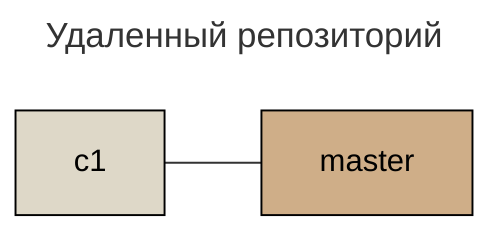

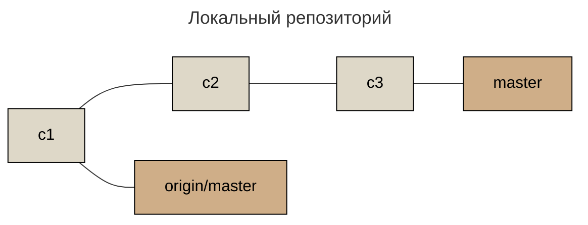

Теперь, кто-то изменил удаленный репозиторий, мы стягиваем изменения с удаленного репозитория, наша история изменится следующим образом:

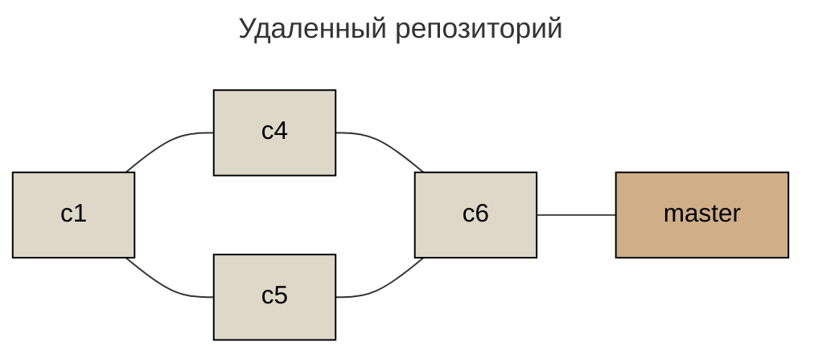

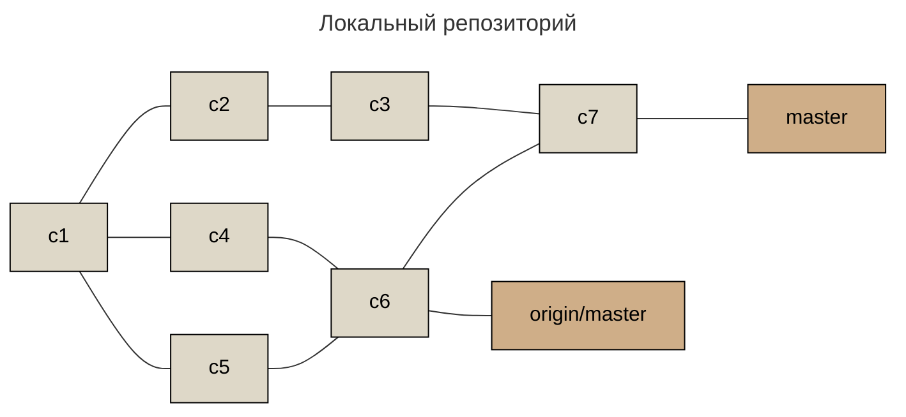

Затем автор коммита решил вернуться назад и выполнить перебазирование, перезаписав историю коммитов:

```mermaid
---
title: Удаленный репозиторий
---
flowchart LR
    c1:::commit --- c4:::rebase --- c6:::rebase
    c6:::commit --- c5:::commit
    c1:::commit --- c5:::commit --- c4`:::commit

    c4`:::commit --- master:::branch

    classDef commit fill:#ded8c8, color: #000, stroke: #000
    classDef branch fill:#cfae88, color: #000, stroke: #000
    classDef rebase fill:grey, color: #000, stroke: #000
```

```mermaid
---
title: Локальный репозиторий
---
flowchart LR
    c1:::commit --- c4:::rebase --- c6:::rebase
    c6:::commit --- c5:::commit
    c1:::commit --- c5:::commit --- c4`:::commit

    c1:::commit --- c2:::commit --- c3:::commit --- c7:::commit

    c6:::commit --- c7:::commit

    c4`:::commit --- origin/master:::branch
    c7:::commit --- master:::branch

    classDef commit fill:#ded8c8, color: #000, stroke: #000
    classDef branch fill:#cfae88, color: #000, stroke: #000
    classDef rebase fill:grey, color: #000, stroke: #000
```

Теперь мы находимся в неловком положении, если мы выполним слияние, включающих обе линии истории

```mermaid
---
title: Локальный репозиторий
---
flowchart LR
    c1:::commit --- c4:::rebase --- c6:::rebase
    c6:::commit --- c5:::commit
    c1:::commit --- c5:::commit --- c4`:::commit

    c1:::commit --- c2:::commit --- c3:::commit --- c7:::commit --- c8:::commit

    c6:::commit --- c7:::commit
    c8:::commit --- c4`:::commit

    c4`:::commit --- origin/master:::branch
    c8:::commit --- master:::branch

    classDef commit fill:#ded8c8, color: #000, stroke: #000
    classDef branch fill:#cfae88, color: #000, stroke: #000
    classDef rebase fill:grey, color: #000, stroke: #000
```

Чтобы решить эту проблему Git обладает особой магией. Наша задача будет состоять, в определении что наше, а что нет.

Помимо контрольной сумму, Git вычисляет контрольную сумму отдельного патча, входящего в этот коммит.

Если вы скачаете перезаписанную историю и перебазируете её поверх новых коммитов вашего коллеги, в большинстве случаев Git успешно определит, какие именно изменения были внесены вами, и применит их поверх новой ветки.


Для этого выполним команду `git rebase <origin>/<branch>`. Git будет:

* Определять, какие коммиты уникальны для нашей ветки (c2, c3, c4, c6, c7);
* Определять, какие коммиты не были коммитами слияния (c2, c3, c4);
* Определять, что не было перезаписано в основной ветке (c2, c3, c4 имеет тот же патч, что и c4`);
* Применять эти комииты к ветке `<remote>/<branch>`

```mermaid
---
title: Удаленный репозиторий
---
flowchart LR
    c1:::commit --- c4:::rebase --- c6:::rebase
    c6:::commit --- c5:::commit
    c1:::commit --- c5:::commit --- c4`:::commit

    c4`:::commit --- master:::branch

    classDef commit fill:#ded8c8, color: #000, stroke: #000
    classDef branch fill:#cfae88, color: #000, stroke: #000
    classDef rebase fill:grey, color: #000, stroke: #000
```

```mermaid
---
title: Локальный репозиторий
---
flowchart LR
    c1:::commit --- c5:::commit --- c4`:::commit --- c2`:::commit --- c3`:::commit

    c4`:::commit --- origin/master:::branch
    c3`:::commit --- master:::branch

    classDef commit fill:#ded8c8, color: #000, stroke: #000
    classDef branch fill:#cfae88, color: #000, stroke: #000
    classDef rebase fill:grey, color: #000, stroke: #000
```

Это возможно, если *c4* и *c4\`* являются одним и тем же патчем, иначе `rebase` не определит их как дубликат и создаст ещё один патч, подобный C4 (который с большой вероятностью не удастся применить чисто, поскольку в нём уже присутствуют некоторые изменения).

Самый лучший вариант использовать перебазирование для наведения порядка в истории ваших локальных изменений, но никогда не применять его для уже отправленных куда-нибудь изменений.
