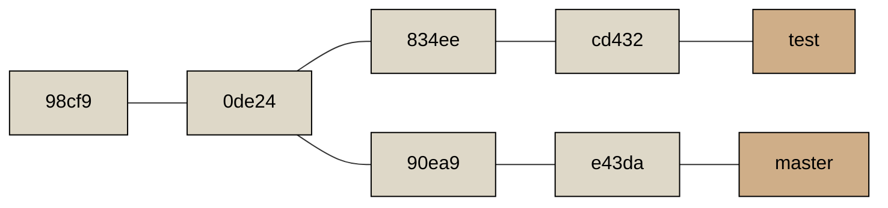
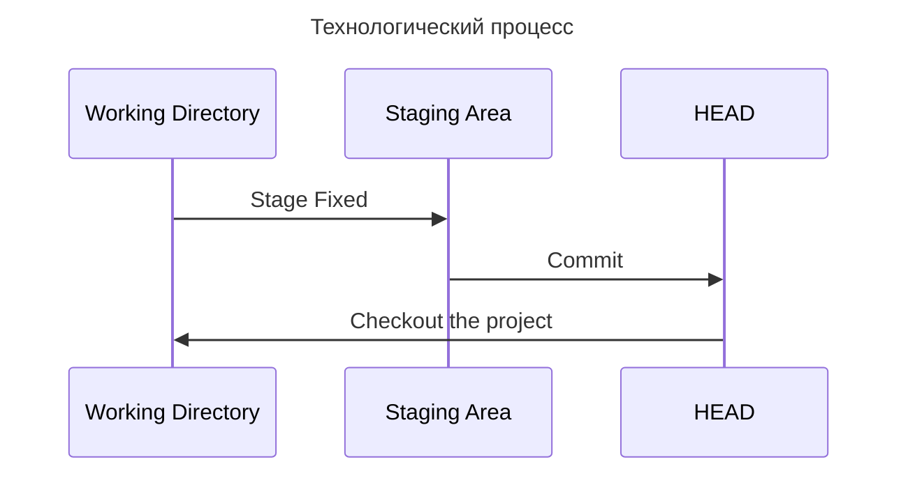
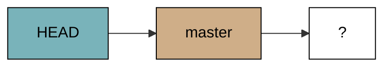
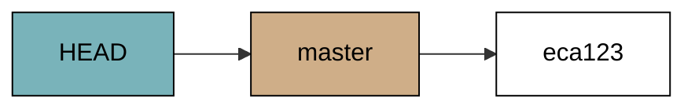
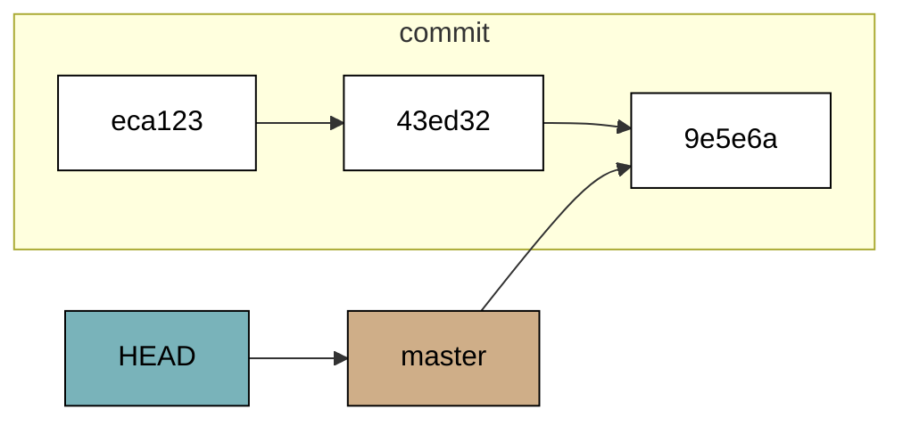
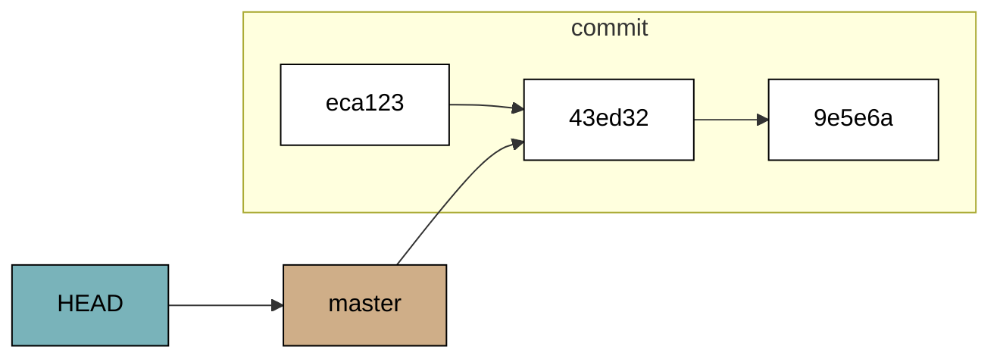
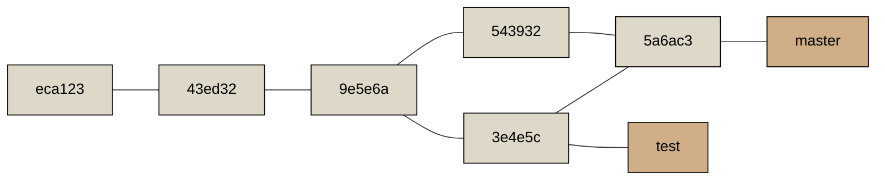
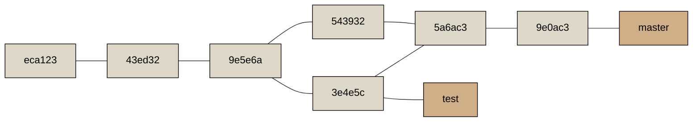
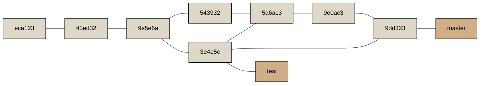

# Инструменты Git

## Выбор ревизии

Git дает возможность выбирать коммиты или диапазоны коммитов.

### Одиночные ревизии

На коммит можно ссылаться по его хешу (SHA-1). Git достаточно умен, чтобы понять на какой коммит следует ссылаться по первым символам хеша.

В данном случае эти команду эквивалентны

<!-- termynal -->

```bash
$ git show 1c002dd4b536e7479fe34593e72e6c6c1819e53b
$ git show 1c002dd4b536e7479f
$ git show 1c002d
```

Также можно указывать ветку, указывающей на этот коммит

<!-- termynal -->

```bash
$ git show ca82a6dff817ec66f44342007202690a93763949
$ git show topic1
```

### Reflog-сокращения

Git в фоновом режиме ведет журнал ссылок, сохраняя последние места куда указывал _HEAD_ и ветки за последние несколько месяцев.

Для просмотра этого журнала используется команда [`git reflog`](https://git-scm.com/docs/git-reflog):

<!-- termynal -->

```bash
$ git reflog
734713b HEAD@{0}: commit: Fix refs handling, add gc auto, update tests
d921970 HEAD@{1}: merge phedders/rdocs: Merge made by the 'recursive' strategy.
1c002dd HEAD@{2}: commit: Add some blame and merge stuff
1c36188 HEAD@{3}: rebase -i (squash): updating HEAD
95df984 HEAD@{4}: commit: # This is a combination of two commits.
1c36188 HEAD@{5}: rebase -i (squash): updating HEAD
7e05da5 HEAD@{6}: rebase -i (pick): updating HEAD
```

Где, _HEAD@{5}_ означает, куда указывал _HEAD_ 5 шагов назад.

Также можно посмотреть, в каком состоянии пребывала ветка в определенный промежуток времени.

<!-- termynal -->

```bash
$ git show master@{yesterday}
```

!!! Note

    История Reflog является локальной. В других репозиториях история будет другой

### Ссылка на предков

Также указать на коммит можно с помощью его родословной. Символ _^_ указывает на родителя текущего коммита. Если указать число после символа _^_, то это будет означать взять второго родителя текущего коммита. Это полезно для коммитов слияния.

Также можно использовать символ _~_ для указания предков коммита. Он также указывает на первого родителя коммита, разница заметна при указании числа после символа _~_. Например _HEAD~2_ говорит нам "первый родитель первого коммита".

Текущая история коммитов:

<!-- termynal -->

```bash
$ git log --pretty=format:'%h %s' --graph
* 734713b Fix refs handling, add gc auto, update tests
*   d921970 Merge commit 'phedders/rdocs'
|\
| * 35cfb2b Some rdoc changes
* | 1c002dd Add some blame and merge stuff
|/
* 1c36188 Ignore *.gem
* 9b29157 Add open3_detach to gemspec file list
```

Использование символа _^_:

<!-- termynal -->

```bash
$ git show d921970^
commit 1c002dd4b536e7479fe34593e72e6c6c1819e53b
Author: Scott Chacon <schacon@gmail.com>
Date:   Thu Dec 11 14:58:32 2008 -0800

    Add some blame and merge stuff

$ git show d921970^2
commit 35cfb2b795a55793d7cc56a6cc2060b4bb732548
Author: Paul Hedderly <paul+git@mjr.org>
Date:   Wed Dec 10 22:22:03 2008 +0000

    Some rdoc changes
```

Использование символа _~_:

<!-- termynal -->

```bash
$ git show HEAD~3
commit 1c3618887afb5fbcbea25b7c013f4e2114448b8d
Author: Tom Preston-Werner <tom@mojombo.com>
Date:   Fri Nov 7 13:47:59 2008 -0500

    Ignore *.gem
```

### Диапазоны коммитов

#### Две точки

Синтаксис с двумя точками говорит Git включить в диапазон коммитов только те, которые достижимы из одной, но не достижимы из другой.



Все коммиты которые доступны из ветки _test_, но не доступны из ветки _master_:

<!-- termynal -->

```bash
$ git log master..test
cd432
834ee
```

Если поменять ветки местами, то мы выведем коммиты доступные в ветке _master_, но не доступные в ветке _test_:

<!-- termynal -->

```bash
$ git log test..master
e43da
90ea9
```

#### Множественный выбор

Также есть более удобный способ выбора коммитов, позволяющий указывать более двух веток:

<!-- termynal -->

```bash
$ git log refA refB ^refC
$ git log refA refB --not refC
```

Покажет команды доступные из _refA_ и _refB_, но не доступные в _refC_

#### Три точки

Синтаксис с тремя точками позволяет выбирать коммиты доступные хотя бы в одной из ссылок, но не в обеих сразу.

<!-- termynal -->

```bash
git log master...test
e43da
90ea9
cd432
834ee
```

Опция _--left-right_ показывает сторону диапазону, с которой был сделан коммит.

## Припрятывание и отчистка

### Припрятывание

Операция [`git stash`](https://git-scm.com/docs/git-stash) берет изменённое состояние рабочего каталога, то есть изменённые отслеживаемые файлы и проиндексированные изменения, и сохраняет их в хранилище незавершённых изменений, которые вы можете в любое время применить обратно.

Например, мы имеем следующий индекс файлов:

<!-- termynal -->

```bash
$ git status
On branch main
Your branch is up to date with 'origin/main'.

Changes not staged for commit:
  (use "git add <file>..." to update what will be committed)
  (use "git restore <file>..." to discard changes in working directory)
        modified:   docs/compendium/base/git//base.md
        modified:   mkdocs.yml

Untracked files:
  (use "git add <file>..." to include in what will be committed)
        docs/compendium/base/git//tools.md

no changes added to commit (use "git add" and/or "git commit -a")
```

Теперь мы хотим сменить ветку, но не хотим фиксировать текущие изменения. Для этого мы выполняем команду `git stash`, чтобы спрятать наши изменения.

<!-- termynal -->

```bash
$ git stash
Saved working directory and index state WIP on main: b3037c2 Рефакторинг
```

Теперь можно заменить, что рабочая копия не содержит отслеживаемых изменений

<!-- termynal -->

```bash
$ git status
On branch main
Your branch is up to date with 'origin/main'.

Untracked files:
  (use "git add <file>..." to include in what will be committed)
        docs/compendium/base/git//tools.md

nothing added to commit but untracked files present (use "git add" to track)
```

Посмотреть список припрятанных изменений, можно с помощью:

<!-- termynal -->

```bash
$ git stash list
stash@{0}: WIP on main: b3037c2 Рефакторинг
```

Восстановить изменения можно с помощью команды `git stash apply`. Эта команда применяет изменения, но не удаляет их. Чтобы выполнить удаление изменений `git stash drop`.

Команда `git stash pop` можно сказать объединяет обе этих команд.

Если указать опцию _--include-untracked_ или _-u_, Git также припрячет все неотслеживаемые файлы, которые вы создали.

А опция _--all_ спрячет все файлы, в том числе игнорируемые.

Опция _--patch_ спросит, какие изменения припрятать, а какие оставить в рабочем каталоге.

Команда `git stash branch` позволяет создать ветку из припрятанных изменений. Это полезно, если после припрятывания были внесены изменения, то возникнут конфликты слияния.

## Перезапись истории

### Изменение последнего коммита

Команда `git commit --amend` позволяет изменить:

-   Сообщение коммита;
-   Изменить, удалить или добавить файл в только что сделанный коммит.

### Изменение сообщения нескольких коммитов

С помощью интерактивного режима команды `git rebase` можно останавливаться после каждого нужного коммита и изменять, сообщение, добавлять, удалять или изменять файлы.

!!! Warning

    Не включайте в такой диапазон коммит, который уже был отправлен на центральный сервер: сделав это, вы можете запутать других разработчиков, предоставив вторую версию одних и тех же изменений.

Изменение последних двух коммитов:

<!-- termynal -->

```bash
$ git rebase -i HEAD~2
pick 6ee2173 Закончил главу ветвление
pick b3037c2 Рефакторинг

# Rebase 135f8c9..b3037c2 onto 135f8c9 (2 commands)
#
# Commands:
# p, pick <commit> = use commit
# r, reword <commit> = use commit, but edit the commit message
# e, edit <commit> = use commit, but stop for amending
# s, squash <commit> = use commit, but meld into previous commit
# f, fixup [-C | -c] <commit> = like "squash" but keep only the previous
#                    commit's log message, unless -C is used, in which case
#                    keep only this commit's message; -c is same as -C but
#                    opens the editor
# x, exec <command> = run command (the rest of the line) using shell
# b, break = stop here (continue rebase later with 'git rebase --continue')
# d, drop <commit> = remove commit
# l, label <label> = label current HEAD with a name
# t, reset <label> = reset HEAD to a label
# m, merge [-C <commit> | -c <commit>] <label> [# <oneline>]
# .       create a merge commit using the original merge commit's
# .       message (or the oneline, if no original merge commit was
# .       specified); use -c <commit> to reword the commit message
#
# These lines can be re-ordered; they are executed from top to bottom.
#
# If you remove a line here THAT COMMIT WILL BE LOST.
#
# However, if you remove everything, the rebase will be aborted.
```

## Раскрытие тайны reset и checkout

Git управляет тремя различными деревьями:

-   HEAD - снимок последнего коммита, родитель следующего;
-   Индекс - снимок следующего коммита;
-   Рабочая директория - песочница.



Разберем весь цикл.

Когда мы инициализируем Git репозиторий, где ссылка HEAD будет указывать на не существующую ветку. И рабочий каталог содержит данные.



| HEAD | Index | Working Directory |
| :--: | :---: | :---------------: |
|      |       |   file.txt (v1)   |

После того как мы выполняем команду `git add` файл сохраняется в индекс:


| HEAD |     Index     | Working Directory |
| :--: | :-----------: | :---------------: |
|      | file.txt (v1) |   file.txt (v1)   |

Затем мы выполняем команду `git commit`, которая сохраняет содержимое индекса в объект коммита:



|          HEAD           |     Index     | Working Directory |
| :---------------------: | :-----------: | :---------------: |
| eca123<br>file.txt (v1) | file.txt (v1) |   file.txt (v1)   |

Теперь если мы изменим наш файл, дерево будет выглядеть следующим образом:


|          HEAD           |     Index     | Working Directory |
| :---------------------: | :-----------: | :---------------: |
| eca123<br>file.txt (v1) | file.txt (v1) |   file.txt (v2)   |

После выполнения всех предыдущих шагов, картина будет следующей:



|          HEAD           |     Index     | Working Directory |
| :---------------------: | :-----------: | :---------------: |
| 9e5e6a<br>file.txt (v2) | file.txt (v2) |   file.txt (v2)   |

### Назначение команды reset

Разберемся, что делает команда `git reset`:


|          HEAD           |     Index     | Working Directory |
| :---------------------: | :-----------: | :---------------: |
| 9e5e6a<br>file.txt (v3) | file.txt (v3) |   file.txt (v3)   |

#### Шаг 1. Перемещает указатель HEAD

Первое, что сделает эта команда - переместит то, на что указывает HEAD.



|          HEAD           |     Index     | Working Directory |
| :---------------------: | :-----------: | :---------------: |
| 43ed32<br>file.txt (v2) | file.txt (v3) |   file.txt (v3)   |

Команда `git reset --soft HEAD~` остановит выполнение на этом этапе.

Получается, что это команда выполняет отмену операции `git commit`.

#### Шаг 2. Обновление индекса

Следующий шаг, обновление индекса содержимым того снимка, на который указывает _HEAD_.


|          HEAD           |     Index     | Working Directory |
| :---------------------: | :-----------: | :---------------: |
| 43ed32<br>file.txt (v2) | file.txt (v2) |   file.txt (v3)   |

Команда `git reset [--mixed] HEAD~` (опция --mixed не обязательна) остановит выполнение на данном шаге. Эта операция отменяют операцию добавления файлов в индекс.

#### Шаг 3. Обновление рабочего каталога

Теперь команда `reset` приведет рабочий каталог к тому же виду, что и индекс.


|          HEAD           |     Index     | Working Directory |
| :---------------------: | :-----------: | :---------------: |
| 43ed32<br>file.txt (v2) | file.txt (v2) |   file.txt (v2)   |

Команда `git reset --hard HEAD~` остановится на этом шаге. Сейчас мы отменили все изменения, внесенные в рабочий каталог.

#### Резюме

Команда reset в заранее определённом порядке перезаписывает три дерева Git, останавливаясь тогда, когда вы ей скажете:

-   Перемещает ветку, на которую указывает HEAD (останавливается на этом, если указана опция --soft);
-   Делает Индекс таким же как и HEAD (останавливается на этом, если не указана опция --hard);
-   Делает Рабочий Каталог таким же как и Индекс.

### Команда reset с указанием пути

Команда `reset` может применять путь к файлу, которым будет оперировать команда. Первый шаг выполнения будет пропущен, т.к. указатель _HEAD_ не может частично ссылаться на один коммит, а частично на другой. Но индекс и каталог могут.

Мы можем указать команде `reset` брать версию не из HEAD, а из указанного коммита: `git reset 4444 file.txt`

### Команда checkout

Команда `checkout` выполняет те же самые функции, что и команда `reset`. Но есть несколько отличий:

-   Команда `checkout` бережно относится к рабочему каталогу, проверяя, что она не трогает файлы, в которых есть изменения;
-   Команда `checkout` перемещает сам _HEAD_, а не ветку на которую указывает _HEAD_.

### Резюме

|                          | HEAD  | Индекс | Рабочий каталог | Сохранность рабочего каталога? |
| :----------------------- | :---: | :----: | :-------------: | :----------------------------: |
| На уровне коммитов       |       |        |                 |                                |
| reset --soft [коммит]    | Ветка |  Нет   |       Нет       |               Да               |
| reset [коммит]           | Ветка |   Да   |       Нет       |               Да               |
| reset --hard [коммит]    | Ветка |   Да   |       Да        |               Да               |
| checkout [коммит]        | HEAD  |   Да   |       Да        |               Да               |
| На уровне файлов         |       |        |                 |                                |
| reset (коммит) [путь]    |  Нет  |   Да   |       Нет       |               Да               |
| checkout (коммит) [путь] |  Нет  |   Да   |       Да        |              Нет               |

## Отмена коммита слияния

Git предоставляет возможность создать новый коммит, который откатывает все изменения. Такой коммит называется коммитом восстановления. Выполняется он командой:



<!-- termynal -->

```bash
$ git revert -m 1 HEAD
```

Где опция `-m 1` указывает какой родитель является "основной веткой".



Новый коммит **9e0ac3** имеет точно такое же содержимое как и **543932**. Теперь история выглядит так, как будто слияние никогда не выполнялось, за одним исключением, "не слитые" коммиты присутствуют в истории. Если мы снова попытаемся смерджить изменения, то добавятся только изменения которых не было раньше.

Лучшим решением данной проблемы является откат коммита отмены слияния, так как теперь вы хотите внести изменения, которые были отменены, а затем создание нового коммита слияния:


