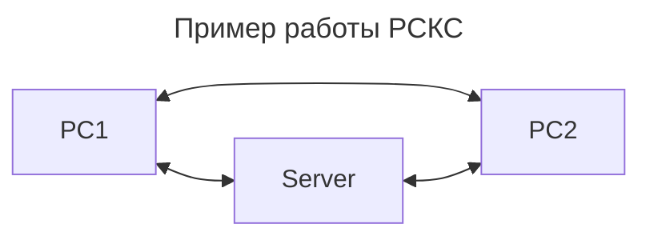
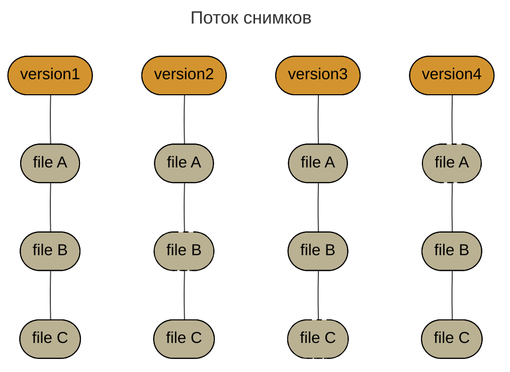
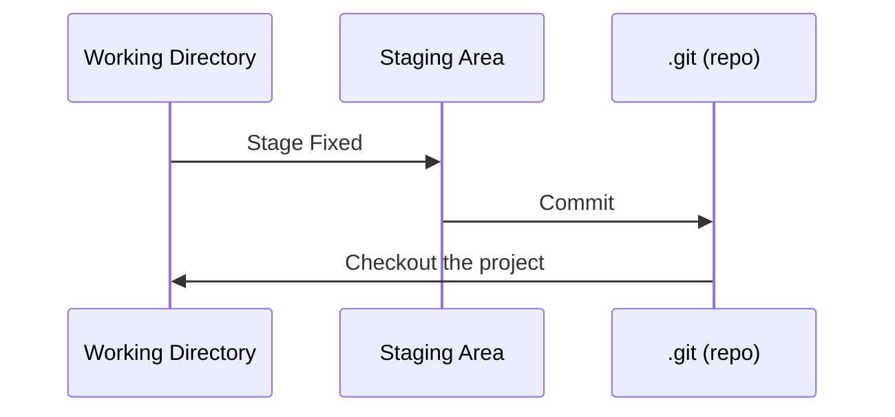

# Что такое система контроля версий и Git

Система контроля версий(СКС) — это система, записывающая изменения в файл или набор файлов в течение времени и
позволяющая вернуться позже к определённой версии.

Существуют следующие СКС:

* Локальные;
* Централизованные;
* Распределенные.

Git является распределенной СКС. В распределенных СКС каждый участник имеет свою полную копию репозитория. Тем самым,
если какой-то из серверов сломается, у каждого будет своя копия, что позволит без проблем восстановить проект.

Git не хранит изменения в виде набора файлов, он хранит изменения в виде потока снимков.

При сохранении состояния, Git сохраняет новые изменения, а на файлы, которые не были затронуты изменениями, создает
ссылку.

Перед сохранением Git сначала вычисляет хеш-сумму, а только потом производит сохранение. Это означает, что нельзя
изменить файл или директорию, чтобы Git об этом не узнал.

У Git есть три основных состояния:

* Измененный (modified) - файл был изменен;
* Индексированный (staged) - файл готов к сохранению;
* Зафиксированный (committed) - файл сохранен в локальной БД.

Рабочая директория - это снимок определенной версии проекта.

Индекс - файл, содержащий информацию об изменениях для следующего коммита.

Каталог Git - хранит метаинформацию и базу объектов проекта.
