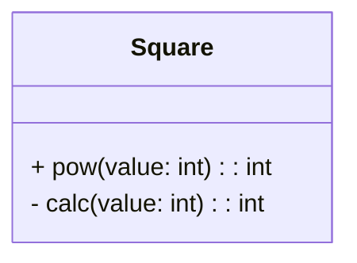
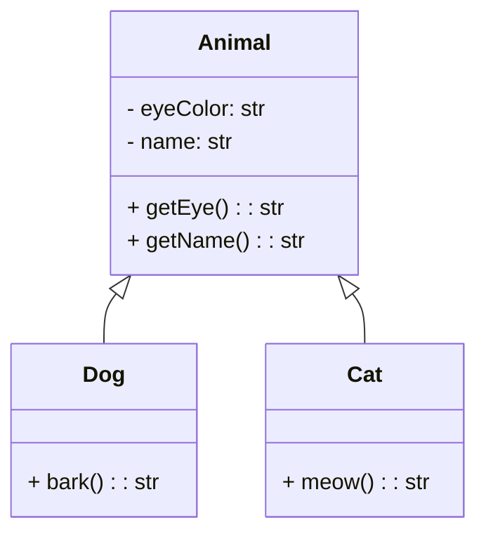
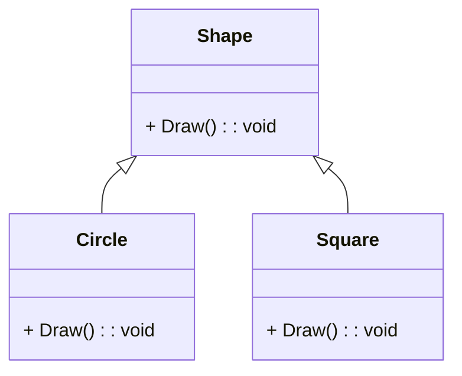
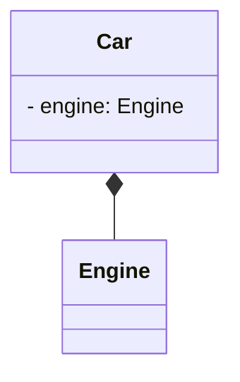

# Введение в ООП

Объектно-ориентированное программирование определяется следующими концепциями:

-   Инкапсуляция;
-   Наследование;
-   Полиморфизм;
-   Абстракция.

??? info "Разница между ООП и структурным программированием"

    При ООП атрибуты и поведения размещаются в рамках одного объекта, а при процедурном или структурном проектировании атрибуты и поведение обычно разделяют.

## Класс и объект

Класс - набор данных и методов, имеющих общую, целостною, хорошо определенную сферу ответственности. Данные необязательный компонент класса.

Класс - шаблон, на основе которого создается объект.

Объект - сущность, одновременно обладающая данными и поведением (методами).

Пример: Конкретный велосипед - объект, чертеж, по которому был собран велосипед - класс.

!!! info "Примечание"

    В ООП данные - атрибуты, поведение - методы. Ограничение доступа к определенным атрибутам/методам - сокрытие данных.

Класс определяет атрибуты и методы доступные всем объектам.

### Данные объекта

Атрибуты хранят информацию, которая отличается от объекта к объекту.

Например у объекта _Сотрудник_ могут быть следующие атрибуты: имя, фамилия, возраст и т.д.

??? note "Примеры кода"

    === "Псевдокод"

        ```
        Сотрудник:
            имя
            фамилия
            возраст
        ```

    === "Python"

        ```python
        class Employee:
            def __init__(test):
                self.name = "test" # атрибут объекта
                self.surname = "test" # атрибут объекта
                self.age = 32 # атрибут объекта
        ```

### Методы

Методы - говорят, что объект может делать.

??? note "Примеры кода"

    === "Псевдокод"

        ```
        Сотрудник:
            атрибуты:
                имя
                фамилия
                возраст
            методы:
                ПолучитьУровеньЗарплаты()
                ПолучитьВремяРаботы()
        ```

    === "Python"

        ```python
        class Employee:
            def __init__(test):
                self.name = "test" # атрибут объекта
                self.surname = "test" # атрибут объекта
                self.age = 32 # атрибут объекта

            def get_amount(): pass
            def get_time_work(): pass
        ```

Геттеры и сеттеры поддерживают концепцию сокрытие данных, т.к. другие объекты не должны иметь прямой доступ для манипулирования атрибутами объекта.

## Инкапсуляция и сокрытие данных

Инкапсуляция означает объединение данных и методов внутри класса, чтобы скрыть их от внешнего доступа.

Инкапсуляция не только представляет сложную концепцию в более простой форме, но и не позволяет взглянуть на какие-либо детали сложной концепции.

Класс долен скрывать информацию и защищать свою "личную жизнь".

Сокрытие же — это процесс ограничения доступа к данным класса извне, путем объявления этих данных как приватных или защищенных.

При хорошем проектирование объект должен содержать только интерфейс взаимодействия с ним. Все что не относится к применению должно быть скрыто, согласно принципу необходимого знания.

Интерфейс - определяет основные средства коммуникации между объектами. Интерфейс должен предусматривать полное описание взаимодействие с этим классом.

Модификаторы доступа:

-   _public_ - открытый атрибут/метод;
-   _private_ - закрытый атрибут/метод;
-   _protected_ - защищенный атрибут/метод.

Открытые атрибуты и методы являются частью интерфейса. Пользователи класса не должны видеть внутренней реализации, взаимодействие осуществляется с помощью открытых данных.

Интерфейс должен содержать только то, что нужно пользователю. Реализация же должна быть скрыта от пользователей. При этом изменения реализация не должны нести изменения в интерфейс. Важно понимать, что изменения в реализации, которые будут заметны, также будут изменять интерфейс.

Двигатель является частью реализации, а руль — частью интерфейса.

Пример:



??? note "Примеры кода"

    === "Псевдокод"

        ```
        класс Square
            public int pow(int value) {
                return calc(value)
            }

            private int calc(int value) {
                return value^2
            }
        ```

    === "Python"

        ```python
        class Square:
            def pow(self, value: int) -> int:
                return self._calc(value)

            def _calc(self, value: int) -> int:
                return value ** 2
        ```

В данном случае пользователю доступен только один метод _pow_. Теперь если у нас изменится логика вычисления, нам достаточно исправить только внутреннюю реализацию метода _\_calc_.

!!! Warning "Минимальный интерфейс"

    При проектировании класса нужно обеспечивать пользователя минимальной информацией о классе. Т.е. предоставлять пользователям только то, что им действительно потребуется.

## Наследование

Наследование позволяет получить атрибуты и методы другого класса. Это позволяет создавать классы абстрагированием общих атрибутов и методов.



??? note "Примеры кода"

    === "Псевдокод"

        ```
        class Animal
            private str eyeColor
            private str name

            public str getEye() {
                return eyeColor
            }

            public str getName() {
                return name
            }

        class Dog: Animal
            public str bark () {}

        class Cat: Animal
            public str meow () {}
        ```

    === "Python"

        ```python
        class Animal:
            def __init__(self, name: str, eye_color: str) -> str:
                self._name = name
                self._eye_color = eye_color

            @property
            def name(self) -> str:
                return self._name

            @property
            def eye(self) -> str:
                return self._eye_color

        class Dog(Animal):
            def bark() -> str: pass

        class Cat(Animal):
            def meow() -> str: pass
        ```

В данном примере общие свойства (имя и цвет глаз) вынесены в общий класс _Animal_. Теперь классы _Dog_ и _Cat_ будут содержать кроме своих свойств, также и свойства родительского класса.

При наследовании используются следующие понятия:

-   Суперкласс (Родительский класс) - класс, содержащий общие атрибуты и методы;
-   Подкласс (Дочерний класс) - класс, расширяющий суперкласс.

Наследование описывается отношение "является". В нашем случае класс _Dog_ является классом _Animal_.

!!! Warning "Наследование может нарушить инкапсуляцию"

    Проблема в том, что если от суперкласса будет созданы другие классы, которые изменяют реализацию, то такие изменения
    могут распространиться по иерархии класса.

Наследуемые методы могут относиться к одной из трех категорий:

- *Абстрактный переопределяемый метод* - производный класс наследует интерфейс метода, но не его реализацию;
- *Переопределяемый метод* - производный класс наследует интерфейс метода и его реализацию по умолчанию и может переопределить его реализацию;
- *Непереопределяемый метод* - производный класс наследует интерфейс метода и его реализацию по умолчанию, но не переопределить ее не может.

Не наследуйте реализацию метода только потому, что вы наследуете интерфейс, и не наследуйте интерфейс только для того, чтобы унаследовать реализацию. Если нужна реализация, а не интерфейс, используйте композицию.

## Полиморфизм

Полиморфизм - означает множественность форм. Он применяется, когда метод должен возвращать отличающиеся результаты.

Пример:



??? note "Примеры кода"

    === "Псевдокод"

        ```
        class Shape
            public void Draw() {}

        class Circle: Shape
            public void Draw() {}

        class Square: Shape
            public void Draw() {}
        ```

    === "Python"

        ```python
        class Shape:
            def draw(): pass

        class Circle(Shape):
            def draw(): # рисуем круг

        class Square(Shape):
            def draw(): # рисуем квадрат
        ```

В данном примере метод _draw_ будет возвращать отличающийся результат, взависимости от используемого класса.

!!! note "Примечание"

    Метод *Draw* класса *Shape* не имеет реализации

## Ассоциация

Ассоциация - когда один объект может для своей работы использовать другие объекты

Композиция - объект может содержать другие объекты. При композиции объекты, которые содержатся в другом объекте, не могут существовать в не этого объекта.

Агрегация - сложный объект состоит из других объектов. Объект создается в другом месте, при этом передается в объект через конструктор.

Композиция описывается отношением "содержит" или "включает". Например: Автомобиль содержит двигатель.



??? note "Примеры кода"

    === "Псевдокод"

        ```
        class Engine
            ...

        class Car
            private Engine engine
        ```

    === "Python"

        ```python
        class Engine:
            pass

        class Car:
            def __init__(self):
                self._engine = Engine()
        ```

## Перегрузка операторов

Некоторые ЯП позволяют выполнять перегрузку операторов. Перегрузка операторов позволяет изменять их смысл. Например, знак _+_ для чисел будет выполнять сложение, а для строк конкатенацию.

## Абстракция и контракты в ООП

Контракт - механизм, требующий соблюдения правил API.

Абстракция позволяет задействовать концепцию, игнорируя ее детали и работая с разными деталями на разных уровнях. Другими словами абстракция позволяет представить сложную концепцию в более простой форме.

Базовые классы представляют собой абстракцию, которая позволяет обратить внимание на общие атрибуты производных классов и игнорировать детали конкретных классов, работая с базовым классом. Удачный интерфейс класса - абстракция, позволяющая сосредоточиться на интерфейсе, не беспокоясь о внутренней работе класса.

Главное достоинство абстракции - игнорирование незначимых деталей.

Абстрактный класс - класс, содержащий один или несколько методов, которые не имеют какой-либо реализации. От абстрактного класса нельзя создать объект.

??? note "Примеры кода"

    === "Псевдокод"

        ```
        class Car
            public abstract getName() {}
        ```

    === "Python"

        ```python
        class Car(ABC):
            @abstractmethod
            def get_name():
                pass
        ```

Интерфейс - абстрактный класс, у которого ни один метод не имеет реализации. Интерфейс должен представлять хорошую абстракцию, скрывающую детали реализации.

Интерфейс класса должен представлять четко согласующиеся методы.

??? note "Примеры кода"

    === "Псевдокод"

        ```
        interface ICar
            public getName() {}
        ```

    === "Python"

        ```python
        class ICar(ABC):
            def get_name(): ...
        ```


## Анатомия класса

### Имя класса

Имя важно так как идентифицирует класс как таковой, поэтому имя должно быть описательным. Выбор имени важен, он обеспечивает информацию о том, что класс делает и как он взаимодействует в рамках всей системы.

??? note "Примеры кода"

    === "Псевдокод"

        ```
        class Driver
        ```

    === "Python"

        ```python
        class Driver:
            pass
        ```

### Комментарии

Комментарии используются для документирования функционала класса

??? note "Примеры кода"

    === "Псевдокод"

        ```
        class Driver
            /*
            Класс Driver описывает водителя
            */
            private str name
        ```

    === "Python"

        ```python
        class Driver:
            """Класс Driver описывает водителя"""
            def __init__(self, name):
                self._name = name
        ```

### Атрибуты

Атрибуты представляют состояние объекта, поскольку в них содержится вся информация об этом объекте.

В классах существуют атрибуты трех типов:

-   Локальные;
-   Атрибуты объектов;
-   Атрибуты классов.

#### Локальные атрибуты

Локальные атрибуты принадлежат определенному методу.

??? note "Примеры кода"

    === "Псевдокод"

        ```
        class Driver
            public main() {
                int count
            }
        ```

    === "Python"

        ```python
        class Driver:
            def main():
                count: int
        ```

#### Атрибуты объектов

Атрибуты объектов совместно используются несколькими методами в одном и том же объекте. При этом атрибут объект отличается во всех объектах. Для обращения к этим атрибутам из методов используется ключевое слово _this_ (в Python _self_)

??? note "Примеры кода"

    === "Псевдокод"

        ```
        class Driver
            public int count
        ```

    === "Python"

        ```python
        class Driver:
            def __init__(self):
                self.count: int
        ```

#### Атрибуты классов

Атрибуты классов совместно используются несколькими классами. Для этого атрибут нужно сделать статическим. Для такого атрибута используется один блок памяти.

??? note "Примеры кода"

    === "Псевдокод"

        ```
        class Driver
            static int count
        ```

    === "Python"

        ```python
        class Driver:
            count: int
        ```

### Конструкторы

Конструктор - специальный метод, который используется для конструирования объектов. В некоторых ЯП конструктором выступает метод имеющий идентичное название с классом, в других используются ключевые слова.

??? note "Примеры кода"

    === "Псевдокод"

        ```
        class Driver
            public Driver() {}
        ```

    === "Python"

        ```python
        class Driver:
            def __init__(self): # Конструктор
                pass
        ```

Конструктор вызывается при создании нового объекта. В некоторых ЯП ключевое слово _new_ обеспечивает создание класса и вызовет конструктор.

??? note "Примеры кода"

    === "Псевдокод"

        ```
        class Driver
            public Driver() {}

        Driver driver = new Driver();
        ```

    === "Python"

        ```python
        class Driver:
            def __init__(self): # Конструктор
                pass

        driver = Driver()
        ```

Перегрузка методов - позволяет использовать один и тот же метод, если его подпись отличается. Подпись состоит из имени методов и его параметров.

### Методы открытого интерфейса

Методы доступа объявляются с _public_ и являются открытым интерфейсом. Реальная же работа выполняется в других методах. Методы открытых интерфейсов являются абстрактными, а реализация склонна быть более конкретными.

??? note "Примеры кода"

    === "Псевдокод"

        ```
        class Driver
            /*
            Класс Driver описывает водителя
            */
            private str name

            public giveDestination() {}
        ```

    === "Python"

        ```python
        class Driver:
            """Класс Driver описывает водителя"""
            def __init__(self, name):
                self._name = name

            def give_destination(self): pass
        ```

### Методы закрытых реализаций

Методы, имеющий модификатор доступа _private_, скрыты от других классов и являются внутренней реализацией.

??? note "Примеры кода"

    === "Псевдокод"

        ```
        class Driver
            /*
            Класс Driver описывает водителя
            */
            private str name

            public giveDestination() {}

            private void turnRight() {}
            private void turnLeft() {}
        ```

    === "Python"

        ```python
        class Driver:
            """Класс Driver описывает водителя"""
            def __init__(self, name):
                self._name = name

            def give_destination(self): pass

            def _turn_right(self): pass
            def _turn_left(self): pass
        ```
