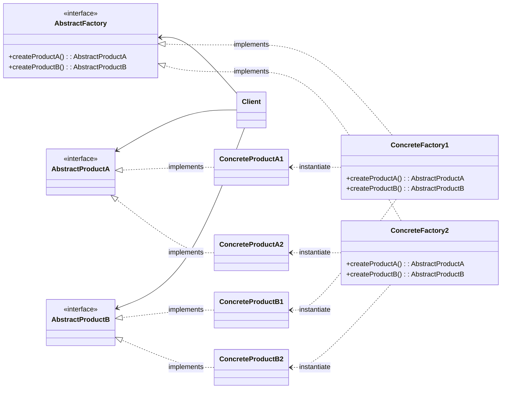
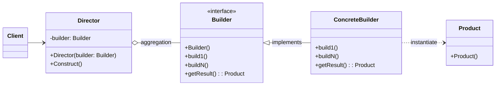
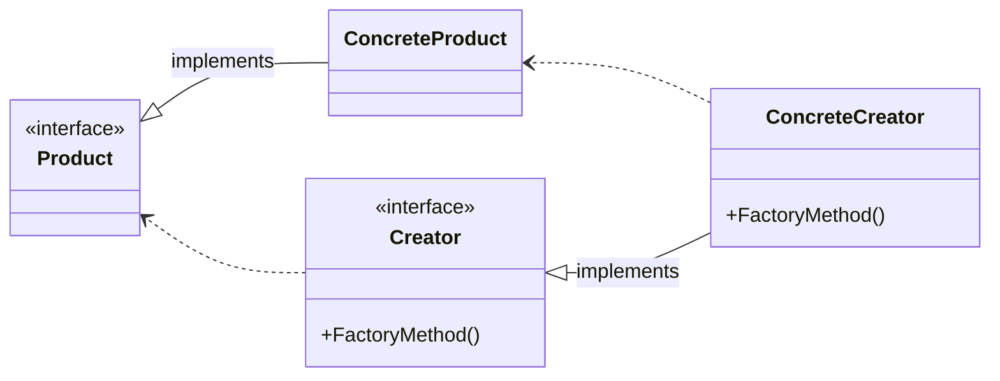
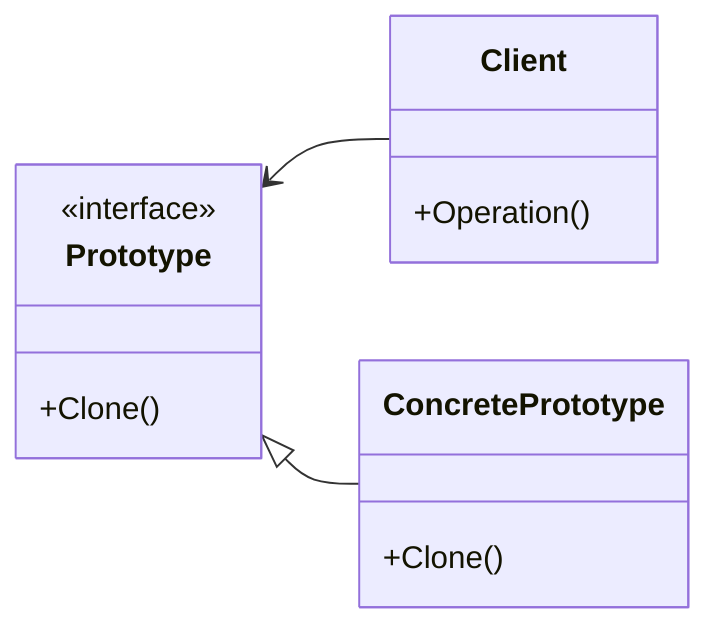

# Порождающие паттерны

## Введение

Паттерны этой категории абстрагируют процесс создания экземпляров.

Паттерн, порождающий классы, использует наследование, чтобы варьировать класс создаваемого экземпляра.

Паттерн, порождающий объекты, делегирует создание экземпляров другому объекту.

Для таких паттернов характерны два аспекта:

-   Они инкапсулируют знания о конкретных классах, которые применяются в системе;
-   Они скрывают подробности создания и компоновки экземпляров этих классов. Единственное что известно - интерфейсы этих классов.

Отсюда можно сделать вывод, порождающие паттерны обеспечивают большую гибкость в отношении того, что создается, кто создает, как и когда.

## Абстрактная фабрика (Abstract Factory)

### Назначение:

Предоставляет интерфейс для создания семейства взаимосвязанных или взаимозависимых объектов, не специфицируя их конкретных классов.

### Применение

-   Система не должна зависеть от того, как компонуются и представляются входящии в нее объекты;
-   Система должна настраиваться одним из семейств объектов;
-   Входящие в семейство взаимосвязанные объекты должны быть спроектированы для совместной работы;
-   Хотим раскрыть только интерфейс, а не их реализацию.

### UML диаграмма



Описание сущностей:

-   _AbstractFactory_ - абстрактная фабрика, объявляет интерфейс для операций создания абстрактных классов;
-   _ConcreteFactory_ - конкретная фабрика, реализующая операции;
-   _AbstractProduct_ - интерфейс для объектов-продуктов;
-   _ConcreteProduct_ - конкретный объект-продукт;
-   _Client_ - использует только интерфейсы _AbstractFactory_ и _AbstractProduct_.

!!! Note

    * Во время выполнения создается единственный экземпляр фабрики, которая в свою очередь создает объекты, имеющие определенную реализацию;
    * *AbstractFactory* доверяет создание объектов своему подклассу *ConcreteFactory*.

### Результат

Абстрактная фабрика:

-   Изолирует конкретные классы:

    Помогает контролировать классы, создаваемых объектов. Клиент манипулирует экземплярами, через их интерфейсы.

-   Упрощает замену семейства продуктов:

    Класс конкретной фабрики появляется в приложении только единожды: при создании экземпляра, что облегчает замену используемой приложением конкретной фабрики.

-   Гарантирует сочетаемость продуктов:

    Позволяет соблюсти ограничение единого семейства классов, если они спроектированы для совместной работы.

-   Не упрощает задачу поддержки нового вида продуктов:

    Для поддержки новых продуктов требуется расширить _AbstractFactory_ и все его подклассы.

### Пример кода

=== "Python"

    ```python
    from abc import ABC, abstractclassmethod


    class WineInterface(ABC):
        """Интерфейс вина"""
        @abstractclassmethod
        def pour(self) -> None:
            """Налить вино"""


    class MealInterface(ABC):
        """Интерфейс блюда"""
        @abstractclassmethod
        def give(self) -> None:
            """Подать блюдо"""


    class LightWhiteWine(WineInterface):
        """Легкое белое вино"""
        def pour(self) -> None:
            print("Наливает легкое белое вино")


    class RedWine(WineInterface):
        """Красное вино"""
        def pour(self) -> None:
            print("Наливает красное вино")


    class Meat(MealInterface):
        """Мясо"""
        def give(self) -> None:
            print("Подает мясо")


    class Fish(MealInterface):
        """Рыба"""
        def give(self) -> None:
            print("Подает рыбу")


    class DinnerFactory(ABC):
        """Абстрактная фабрика"""
        @abstractclassmethod
        def createWine(self) -> WineInterface:
            ...

        @abstractclassmethod
        def createMeal(self) -> MealInterface:
            ...


    class MRDinnerFactory(DinnerFactory):
        """Подача красного вина с мясом"""
        def createWine(self) -> WineInterface:
            return RedWine()

        def createMeal(self) -> MealInterface:
            return Meat()


    class FLWDinnerFactory(DinnerFactory):
        """Подача легкого белого вина с рыбой"""
        def createWine(self) -> WineInterface:
            return LightWhiteWine()

        def createMeal(self) -> MealInterface:
            return Fish()


    if __name__ == "__main__":
        # Если мы хотим использовать другую фабрику, то просто заменяем ее на новую
        # dinner: DinnerFactory = MRDinnerFactory()
        dinner: DinnerFactory = FLWDinnerFactory()

        meal: MealInterface = dinner.createMeal()
        wine: WineInterface = dinner.createWine()

        meal.give()
        wine.pour()
    ```

## Строитель (Builder)

### Назначение

Отделяет конструирование сложного объекта от его представления, так что в результате одного и того же процесса конструирования может получиться другое представление.

### Применение

-   Алгоритм создания сложного объекта не должен зависеть от того, из каких частей состоит объект и как они стыкуются между собой;
-   Процесс конструирования должен обеспечить различные представления конструируемого объекта.

### UML диаграмма



Описание сущностей:

-   _Builder_ - интерфейс, описывающий этапы создания объекта;
-   _ConcreteBuilder_ - реализует интерфейс _Builder_;
-   _Director_ - конструирует объект, используя интерфейс _Builder_;
-   _Product_ - представляет сложный конструируемый объект;

!!! Note

    * *Client* создает объект *Director* и настраивает его нужным объектом, реализующий интерфейс *Builder*;
    * *Director* уведомляет *Builder*, что нужно построить новую часть *Product*;
    * *Builder* обрабатывает запрос *Director* и добавляет новые части к *Product*;
    * *Client* получает продукт у *Builder*

### Результат

-   Позволяет изменять внутреннее представление продукта:

    Т.к. продукт конструируется через абстрактный интерфейс, то для изменения внутреннего представления достаточно определить новый вид строителя.

-   Изолирует код, реализующий конструирование и представление:

    Улучшается модульность, инкапсулируя способ конструирования и представления сложного объекта.

-   Предоставляет более точный контроль над процессом конструирования:

    Конструирование объекта выполняется шаг за шагом

### Пример кода

=== "Python"

    ```python
    from abc import ABC, abstractclassmethod
    from typing import Optional


    class Pizza:
        """ПИЦЦА"""

        def __init__(self) -> None:
            """Конструктор"""
            self._dough: Optional[str] = None
            self._sauce: Optional[str] = None
            self._toping: Optional[str] = None

        # Сеттеры и геттеры
        @property
        def dough(self) -> Optional[str]:
            return self._dough

        @dough.setter
        def dough(self, value: str) -> None:
            self._dough = value

        @property
        def sauce(self) -> Optional[str]:
            return self._sauce

        @sauce.setter
        def sauce(self, value: str) -> None:
            self._sauce = value

        @property
        def toping(self) -> Optional[str]:
            return self._toping

        @toping.setter
        def toping(self, value: str) -> None:
            self._toping = value

        def __str__(self) -> str:
            attr: str = '\n\t'.join(f'{k}={v}' for k, v in self.__dict__.items())
            return f"[{self.__class__.__name__}]:\n\t{attr}"


    class PizzaBuilder(ABC):
        """Абстрактный класс для строителя пиццы"""

        def __init__(self):
            """Конструктор"""
            self._pizza: Pizza = Pizza()

        @abstractclassmethod
        def build_dough(self) -> None:
            """Приготовить тесто"""
            pass

        @abstractclassmethod
        def build_sauce(self) -> None:
            """Приготовить соус"""
            pass

        @abstractclassmethod
        def build_toping(self) -> None:
            """Приготовить начинку"""
            pass

        @property
        def pizza(self) -> Pizza:
            """Получить готовую пиццу"""
            return self._pizza


    class PeperoniPizzaBuilder(PizzaBuilder):
        """Приготовление пиццы пепперони"""
        def build_dough(self) -> None:
            self._pizza.dough = "pan backed"

        def build_sauce(self) -> None:
            self._pizza.sauce = "hot"

        def build_toping(self) -> None:
            self._pizza.toping = "peperoni+cheese"


    class Cook:
        """Повар"""
        def __init__(self, builder: PizzaBuilder) -> None:
            self._builder = builder

        def cook_pizza(self):
            """Приготовить пиццу"""
            self._builder.build_dough()
            self._builder.build_sauce()
            self._builder.build_toping()

        def get_pizza(self) -> Pizza:
            """Получить пиццу"""
            return self._builder.pizza


    if __name__ == "__main__":
        pizza_builder: PizzaBuilder = PeperoniPizzaBuilder()
        cook: Cook = Cook(builder=pizza_builder)
        cook.cook_pizza()
        print(cook.get_pizza())
    ```

## Фабричный метод (Factory Method)

### Назначение

Определяет интерфейс для создания объекта, но позволяет подклассам самостоятельно решать, экземпляр какого класса должен быть создан. Фабричный метод позволяет классу делегировать создание экземпляров.

### Применение

-   Классу заранее не известно, какие объекты классов нужно создать;
-   Класс спроектирован так, что объекты определяются подклассами;
-   Класс делегирует обязанности другому вспомогательному классу.

### UML диаграмма



Описание сущностей:

-   _Product_ - интерфейс объекта;
-   _ConcreteProduct_ - реализует интерфейс;
-   _Creator_ - объявляет фабричный метод;
-   _ConcreteCreator_ - замещает фабричный метод, возвращающий _ConcreteProduct_;

!!! Note

    _Creator_ полагается на свои подклассы в определении фабричного метода, который будет возвращать экземпляр _ConcreteProduct_

### Результат

-   Фабричные методы избавляют нас от необходимости встраивать в код зависящие классы.
-   Подклассам предоставляются операции-зацепки(hooks):
-   Создание параллельных иерархий

### Пример кода

=== "Python"

    ```python
    from abc import ABC, abstractclassmethod


    class Product(ABC):
        """Интерфейс продукта"""
        @abstractclassmethod
        def product(self):
            ...

    class ConcreteProduct(Product):
        """Конкретный продукт"""
        def product(self):
            return self.__class__.__name__

    class Creator(ABC):
        """Создатель"""
        @abstractclassmethod
        def factory(self) -> Product: pass

    class ConcreteCreator(Creator):
        """Реализация создателя"""
        def factory(self) -> Product:
            return ConcreteProduct()

    if __name__ == "__main__":
        creator: Creator = ConcreteCreator()

        product: Product = creator.factory()

        print(product.product())
    ```

## Паттерн прототип (Prototype)

### Назначение

Задает виды создаваемого объекта с помощью экземпляра-прототипа и создает новые объекты путем копирования данного прототипа.

### Применение

-   Когда конкретный тип создаваемого объекта должен определяться динамически во время выполнения;
-   Для того чтобы избежать построения иерархии классов или фабрик, параллельных иерархии классов продуктов;
-   Когда клонирование объекта является более предпочтительным вариантом нежели его создание и инициализация с помощью конструктора.

### UML диаграмма



Описание сущностей:

- _Prototype_ - интерфейс для клонирования;
- _ConcretePrototype_ - реализует операцию клонирования;

!!! Note

    Клиент обращается к методу прототипа, для создания копии экземпляра


!!! Note "Для тупого меня"

    Иерархия классов - классы одной группы

    ??? Пример

        ```python
        # Иерархия 1
        class Shape:
            def draw(self):
                pass

        class Circle(Shape):
            def draw(self):
                # рисование круга

        class Rectangle(Shape):
            def draw(self):
                # рисование прямоугольника

        class Triangle(Shape):
            def draw(self):
                # рисование треугольника

        # Иерархия 2
        class Color:
            def fill(self):
                pass

        class Red(Color):
            def fill(self):
                # установка красного цвета

        class Blue(Color):
            def fill(self):
                # установка синего цвета

        class Green(Color):
            def fill(self):
                # установка зеленого цвета

        # Взаимодействие двух иерархий
        class RedCircle(Circle, Red):
            pass

        class BlueTriangle(Triangle, Blue):
            pass
        ```

### Результат

- Скрывает конкретные классы от от пользователя;
- Позволяет включать новый конкретный класс в систему, просто зарегистрировав новый экземпляр-прототип на стороне клиента;
- Определение новых объектов путем изменения значений, структуры;

### Пример кода

=== "Python"

    ```python
    from abc import ABC, abstractclassmethod


    class Figure(ABC):
        @abstractclassmethod
        def square(self):
            ...

        @abstractclassmethod
        def clone(self):
            ...


    class Rectangle(Figure):
        def __init__(self, a: int, b: int) -> None:
            self._a = a
            self._b = b

        def square(self):
            return self._a * self._b

        def clone(self) -> 'Rectangle':
            return Rectangle(a=self._a, b=self._b)

    if __name__ == "__main__":
        rectangle: Figure = Rectangle(1, 1)

        print(rectangle.square())

        rectangle_2: Figure = rectangle.clone()

        print(rectangle_2.square())
    ```
