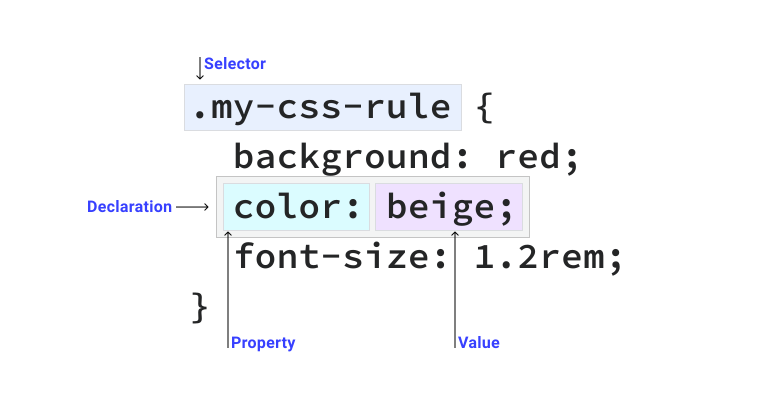
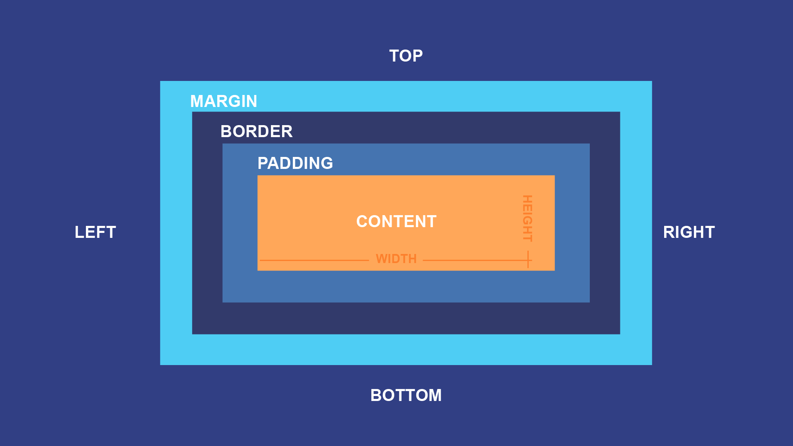

# CSS

## Что такое css

CSS, сокращение от «Каскадные таблицы стилей», — это язык таблиц стилей, используемый для описания визуального представления документа, написанного на HTML (язык гипертекстовой разметки) или XML (расширяемый язык разметки). Он предоставляет веб-разработчикам мощный набор инструментов и свойств для управления макетом, форматированием, цветами, шрифтами и другими визуальными аспектами веб-страницы.

## Селекторы



### Простые селекторы

#### Универсальный селектор

Соответствует любому элементу

=== "CSS"

    ```css
    * {
        color: hotpink;
    }
    ```

#### Селектор типа

Соответствует элементу HTML

=== "CSS"

    ```css
    section {
        padding: 2em;
    }
    ```

#### Селектор класса

Атрибут в HTML теге

=== "HTML&CSS"

    ```html
    <div class="my-class"></div>
        <button class="my-class"></button>
    <p class="my-class"></p>
    ```

    ```css
    .mt-class {
        padding: 2em;
    }
    ```

#### Селектор идентификатора

Элемент HTML с атрибутом `id` должен быть единственным элементом на странице с нужным значением идентификатора.

=== "HTML&CSS"

    ```html
    <div id="rad"></div>
    ```

    ```css
    #rad {
        border: 1px solid blue;
    }
    ```

#### Селектор атрибута

Элементы HTML с указанным атрибутом.

=== "HTML&CSS"

    ```html
    <div data-type="primary"></div>
    ```

    ```css
    [data-type='primary'] {
        color: red;
    }
    ```

### Комбинаторы

Комбинатор — это то, что находится между двумя селекторами.

#### Комбинатор потомков

Элемент находящийся в другом элементе.

=== "HTML&CSS"

    ```html
    <p>Абзац текста, часть которого <strong>выделена полужирным шрифтом</strong>.</p>
    ```

    ```css
    p strong {
        color: blue;
    }
    ```

#### Комбинатор следующего элемента одного уровня

С помощью символа `+` в селекторе можно выполнить поиск элемента, который следует непосредственно за другим элементом.

=== "HTML&CSS"

    ```html
    <article>
        <h1>A heading</h1>
        <p>Veggies es bonus vobis, proinde vos postulo essum magis kohlrabi welsh onion daikon amaranth tatsoi tomatillo melon azuki bean garlic.</p>

        <p>Gumbo beet greens corn soko endive gumbo gourd. Parsley shallot courgette tatsoi pea sprouts fava bean collard greens dandelion okra wakame tomato. Dandelion cucumber earthnut pea peanut soko zucchini.</p>
    </article>
    ```

    ```css
    h1 + p {
        font-weight: bold;
        background-color: #333;
        color: #fff;
        padding: .5em;
    }
    ```

#### Дочерний комбинатор

Будут выбраны только те элементы, соответствующие второму селектору, которые являются прямыми потомками элементов, соответствующих первому селектору.

=== "HTML&CSS"

    ```html
    <ul>
    <li>Unordered item</li>
        <li>Unordered item
            <ol>
                <li>Item 1</li>
                <li>Item 2</li>
            </ol>
        </li>
    </ul>
    ```

    ```css
    ul > li {
    border-top: 5px solid red;
    }
    ```

#### Общий родственный комбинатор

Выберет родственные элементы, даже если они не являются непосредственными соседями.

=== "HTML&CSS"

    ```html
    <article>
        <h1>A heading</h1>
        <p>I am a paragraph.</p>
        <div>I am a div</div>
        <p>I am another paragraph.</p>
    </article>
    ```

    ```css
    h1 ~ p {
        font-weight: bold;
        background-color: #333;
        color: #fff;
        padding: .5em;
    }
    ```

### Группирование селекторов

Можно сгруппировать несколько селекторов, разделив их запятыми.

=== "CSS"

    ```css
    strong,
    em,
    .my-class,
    [lang] {
        color: red;
    }
    ```

### Составные селекторы

Можно сочетать селекторы, чтобы повысить уровень конкретности и удобочитаемость.

=== "CSS"

    ```css
    a.my-class {
    color: red;
    }
    ```

## Псевдоклассы

Псевдокласс — это селектор, который выбирает элементы, находящиеся в специфическом состоянии, например, они являются первым элементом своего типа, или на них наведён указатель мыши. Они обычно действуют так, как если бы вы применили класс к какой-то части вашего документа, что часто помогает сократить избыточные классы в разметке и даёт более гибкий, удобный в поддержке код.

Пример:

=== "HTML&CSS"

    ```html
    <article>
        <p>Veggies es bonus vobis, proinde vos postulo essum magis kohlrabi welsh onion daikon amaranth tatsoi tomatillo melon azuki bean garlic.</p>
        <p>Gumbo beet greens corn soko endive gumbo gourd. Parsley shallot courgette tatsoi pea sprouts fava bean collard greens dandelion okra wakame tomato. Dandelion cucumber earthnut pea peanut soko zucchini.</p>
    </article>
    ```

    ```css
    article p:first-child {
        font-size: 120%;
        font-weight: bold;
    }
    ```

## Псевдоэлементы

Псевдоэлементы ведут себя сходным образом, однако они действуют так, как если бы вы добавили в разметку целый новый HTML-элемент, а не применили класс к существующим элементам. Псевдоэлементы начинаются с двойного двоеточия ::.

=== "HTML&CSS"

    ```html
    <article>
        <p>Veggies es bonus vobis, proinde vos postulo essum magis kohlrabi welsh onion daikon amaranth tatsoi tomatillo melon azuki bean garlic.</p>
        <p>Gumbo beet greens corn soko endive gumbo gourd. Parsley shallot courgette tatsoi pea sprouts fava bean collard greens dandelion okra wakame tomato. Dandelion cucumber earthnut pea peanut soko zucchini.</p>
    </article>
    ```

    ```css
    article p::first-line {
        font-size: 120%;
        font-weight: bold;
    }
    ```

## Блочная модель

При написании CSS: все, что отображается с помощью CSS, представляет собой блок. Блок может вести себя по-разному в зависимости от его `display` значения, заданного значения и содержимого.

Размеры блока можно контролировать с помощью внешнего (extrinsic sizing) и внутреннего размера (intrinsic sizing). Внешний размер означает использование фиксированного размера, а внутренний позволяет браузеру самому выбирать оптимальный размер для блока.

??? Note "Пример внешнего и внутреннего размера"

    Пример внешнего размера:

    ```html
    <p style="border: 2px solid red; width: 10px">CSS прекрасен</p>
    ```

    <p style="border: 2px solid red; width: 10px">CSS прекрасен</p>

    Пример внутреннего размера:

    ```html
    <p style="border: 2px solid red; width: 10px">CSS прекрасен</p>
    ```

    <p style="border: 2px solid red; width: min-content">CSS прекрасен</p>

    min-content - представляет внутреннюю минимальную ширину контента

!!! Info "Переполнение"

    Переполнение - когда содержимое велико для своего блока. Обработка переполнения выполняется с помощью свойства `overflow`

Блоки состоят из отдельных областей блочной модели, каждая из которых выполняет определенную работу.



### Свойство display

Свойство `display` позволяет управлять моделью блока. Атрибуты свойства (некоторые):

#### none

Элемент не показывается

=== "HTML"

    ```html
    <div style="border:1px solid black">
        Невидимый div (
        <div style="display: none">Я - невидим!</div>
        ) Стоит внутри скобок
    </div>
    ```

    <div style="border:1px solid black">
    Невидимый div (
    <div style="display: none">Я - невидим!</div>
    ) Стоит внутри скобок
    </div>

#### block

Располагаются вертикально друг над другом, при этом стремятся занять всю доступную ширину

=== "HTML"

    ```html
    <div style="border:1px solid black">
        <div style="border:1px solid blue; width: 50%">Первый</div>
        <div style="border:1px solid red">Второй</div>
    </div>
    ```

    <div style="border:1px solid black">
        <div style="border:1px solid blue; width: 50%">Первый</div>
        <div style="border:1px solid red">Второй</div>
    </div>

#### inline

Блоки располагаются друг за другом, ширина и высота определяются по содержимому

=== "HTML"

    ```html
    <span style="border:1px solid black">
        <span style="border:1px solid blue; width:50%">Ширина</span>
        <a style="border:1px solid red">Игнорируется</a>
    </span>
    ```

    <span style="border:1px solid black">
        <span style="border:1px solid blue; width:50%">Ширина</span>
        <a style="border:1px solid red">Игнорируется</a>
    </span>

#### inline_block

Это значение - означает элемент, который продолжает находиться в строке (inline), но при этом может иметь важные свойства блока.

Как и инлайн-элемент:

-   Располагается в строке.
-   Размер устанавливается по содержимому.

Во всём остальном - это блок, то есть:

-   Элемент всегда прямоугольный.
-   Работают свойства width/height.

=== "HTML"

    ```html
    <style>
        li {
            display: inline-block;
            list-style: none;
            border: 1px solid red;
        }
    </style>

    <ul style="border:1px solid black; padding:0">
        <li>Инлайн Блок<br />3 строки<br />высота/ширина явно не заданы</li>
        <li style="width:100px;height:100px">Инлайн<br />Блок 100x100</li>
        <li style="width:60px;height:60px">Инлайн<br />Блок 60x60</li>
        <li style="width:100px;height:60px">Инлайн<br />Блок 100x60</li>
        <li style="width:60px;height:100px">Инлайн<br />Блок 60x100</li>
    </ul>
    ```

<style>
.test_display {
    border:1px solid black;
    padding:0
}

.test_display li {
display: inline-block;
list-style: none;
border: 1px solid red;
}
</style>

<ul class="test_display">
<li>Инлайн Блок<br>3 строки<br>высота/ширина явно не заданы</li>
<li style="width:100px;height:100px">Инлайн<br>Блок 100x100</li>
<li style="width:60px;height:60px">Инлайн<br>Блок 60x60</li>
<li style="width:100px;height:60px">Инлайн<br>Блок 100x60</li>
<li style="width:60px;height:100px">Инлайн<br>Блок 60x100</li>
</ul>

### Свойство box-sizing

Сообщает блоку, как рассчитывать его размер.

#### content-box

Когда устанавливаются размеры, такие как width и height, они будут применены к блоку контента. Если затем задать padding и border, эти значения будут добавлены к размеру блока контента.

=== "CSS"

    ```css
    .my-box {
        box-sizing: content-box;
        width: 200px;
        border: 10px solid;
        padding: 20px;
    }
    ```

В этом примере размер блока будет 260px, content+padding\*2+border\*2

#### border-box

Альтернативная блочная модель сообщает CSS применить значение width к блоку границ, а не к блоку контента. Это означает, что наши параметры border и padding будут вписаны внутрь. Тем самым размер блока будет равен 200px.

=== "CSS"

    ```css
    .my-box {
        box-sizing: border-box;
        width: 200px;
        border: 10px solid;
        padding: 20px;
    }
    ```

## Единицы измерения

### Пиксели

Пиксель px - это самая базовая, абсолютная и окончательная единица измерения.

Достоинства:

-   Главное достоинство пикселя - чёткость и понятность

Недостатки:

-   Другие единицы измерения - в некотором смысле «мощнее», они являются относительными и позволяют устанавливать соотношения между различными размерами

### Относительно шрифта: em

1em - текущий размер шрифта. Можно брать любые пропорции от текущего шрифта: 2em, 0.5em и т.п.

Размеры в em - относительные, они определяются по текущему контексту.

### Проценты %

Проценты %, как и em - относительные единицы. Как правило, процент будет от значения свойства родителя с тем же названием, но не всегда.

Примеры-исключения, в которых % берётся не так:

-   _margin-left_. При установке свойства margin-left в %, процент берётся от ширины родительского блока, а вовсе не от его margin-left.
-   _line-height_. При установке свойства line-height в %, процент берётся от текущего размера шрифта, а вовсе не от line-height родителя. Детали по line-height и размеру шрифта вы также можете найти в статье Свойства font-size и line-height.
-   _width/height_. Для width/height обычно процент от ширины/высоты родителя, но при position:fixed, процент берётся от ширины/высоты окна (а не родителя и не документа).

### Единица rem

Единица rem задаёт размер относительно размера шрифта элемента `<html>`.

### Относительно экрана: vw, vh, vmin, vmax

vw - 1% ширины окна
vh - 1% высоты окна
vmin - наименьшее из (vw, vh), в IE9 обозначается vm
vmax - наибольшее из (vw, vh)

Эти значения были созданы, в первую очередь, для поддержки мобильных устройств.

Их основное преимущество - в том, что любые размеры, которые в них заданы, автоматически масштабируются при изменении размеров окна.

## Переходы

Используя переходы CSS, мы можем интерполировать между начальным и целевым состоянием элемента. Переход между ними улучшает взаимодействие с пользователем, предоставляя визуальное направление, поддержку и подсказки о причине и следствии взаимодействия.

!!! Note "Термин"

    Интерполяция — это процесс создания «промежуточных» шагов, которые плавно переходят из одного состояния в другое.

Свойства перехода:

-   `transition-property` указывает CSS-свойство, для которого будет применяться переход;
-   `transition-duration` - продолжительность анимации, задаётся в секундах s или ms;
-   `transition-timing-function` - функция, изменяющая скорость перехода CSS в течение _transition-duration_;
-   `transition-delay` - задержка до анимации;
-   `transition` - сокращение.

=== "CSS"

    ```css
    .longhand {
        transition-property: transform;
        transition-duration: 300ms;
        transition-timing-function: ease-in-out;
        transition-delay: 0s;
    }

    .shorthand {
        transition: transform 300ms ease-in-out 0s;
    }
    ```

!!! Warning

    Переход возможен только для тех элементов, которые могут иметь «среднее состояние» между их начальным и конечным состояниями. Например, невозможно добавить переходы для font-family , потому что неясно, как должно выглядеть «среднее состояние» между serif и monospace .

## Трансформирование

Свойство CSS transform обычно подвергается переходу, поскольку это свойство с ускорением графического процессора, которое приводит к более плавной анимации и меньшему расходу заряда батареи. Это свойство позволяет произвольно масштабировать, вращать, перемещать или наклонять элемент.

Функции перемещения:

-   `translate(X, Y)` - используется для смещения элемента вверх-вниз или влево-вправо;
-   `translateX(X), translateY(Y), translateZ(Z)` - смещение вдоль конкретной оси;
-   `translate3d(X, Y, Z)` - смещение по всем трём осям;

Функции масштабирования:

-   `scale(X, Y)` - функция для масштабирования элемента.;
-   `scaleX(X), scaleY(Y), scaleZ(Z)` - масштабирование вдоль определенной оси;
-   `scale3d(X, Y, Z)` - масштабирование по трём осям;

Функции наклона:

-   `skewX(X), skewY(Y)` - функции выполняют сдвиг одной стороны элемента относительно противолежащей.;

Функции поворота:

-   `rotateX(X), rotateY(Y), rotateZ(Z)` - поворот элемента вдоль определенной оси;
-   `rotate3d(X, Y, Z)` - поворот по всем трём осям;

Прочие функции:

-   `matrix(a, b, c, d, tx, ty)` - это функция, которой можно описать любую трансформацию в плоскости экрана;
-   `matrix3d(a1, b1, c1, d1, a2, b2, c2, d2, a3, b3, c3, d3, a4, b4, c4, d4)` - трансформации в трёхмерном пространстве, а не в плоскости экрана, то нужно использовать эту функцию. ;
-   `perspective(Z)` - свойство необходимо применять при любых трансформациях, выходящих из плоскости экрана.

## Анимации

Анимация — отличный способ выделить интерактивные элементы. В CSS вы можете создать анимацию этого типа, используя анимацию CSS, которая позволяет вам устанавливать последовательность анимации с использованием ключевых кадров.


Ключевые кадры задаются с помощью `@keyframes`. Внутри правила ключевых кадров `from` и `to` — это ключевые слова, обозначающие 0% и 100%, которые являются началом и концом анимации.

=== "CSS"

    ```css
    @keyframes my-animation {
        from {
            transform: translateY(20px);
        }
        to {
            transform: translateY(0px);
        }
    }
    ```

Чтобы использовать `@keyframes` в правиле CSS, определите различные свойства анимации или используйте сокращенное свойство `animation`.

-   `animation-duration` - определяет, какой длины должна быть временная шкала `@keyframes`;
-   `animation-timing-function` - указывает функции синхронизации, которые вычисляют скорость анимации в каждой точке;
-   ` animation-iteration-count` - определяет, сколько раз должна запускаться временная шкала `@keyframes`;
-   `animation-direction` - устанавливает, в каком направлении временная шкала будет проходить по вашим ключевым кадрам, с помощью анимации-направления:

    -   _normal_ - значение по умолчанию, то есть вперед;
    -   _reverse_ - работает в обратном направлении по временной шкале;
    -   _alternate_ - для каждой итерации анимации временная шкала будет последовательно перемещаться вперед или назад;
    -   _alternate-reverse_ - обратный alternate .

-   `animation-delay` - определяет, задержку перед запуском анимации;
-   `animation-play-state` - позволяет воспроизводить и приостанавливать анимацию;
-   `animation-fill-mode` - определяет, какие значения на временной шкале `@keyframes` сохраняются до начала анимации или после ее окончания:

    -   _forwards_ - последний ключевой кадр сохранится в зависимости от направления анимации;
    -   _backwards_ - первый ключевой кадр сохранится в зависимости от направления анимации;
    -   _both_ - следует правилам как для forwards так и backwards.
