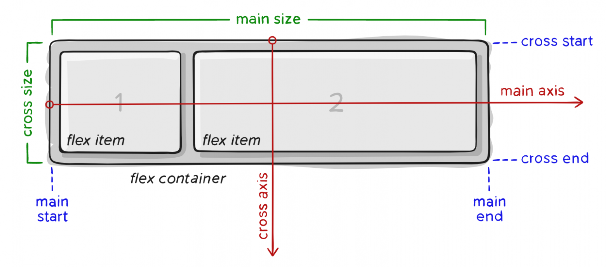
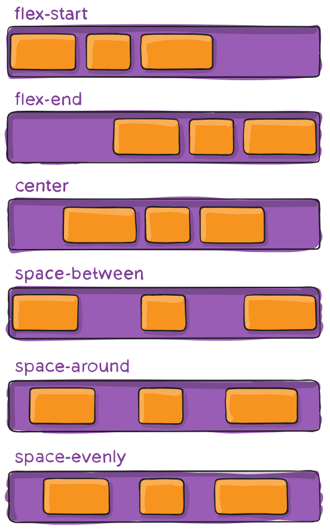
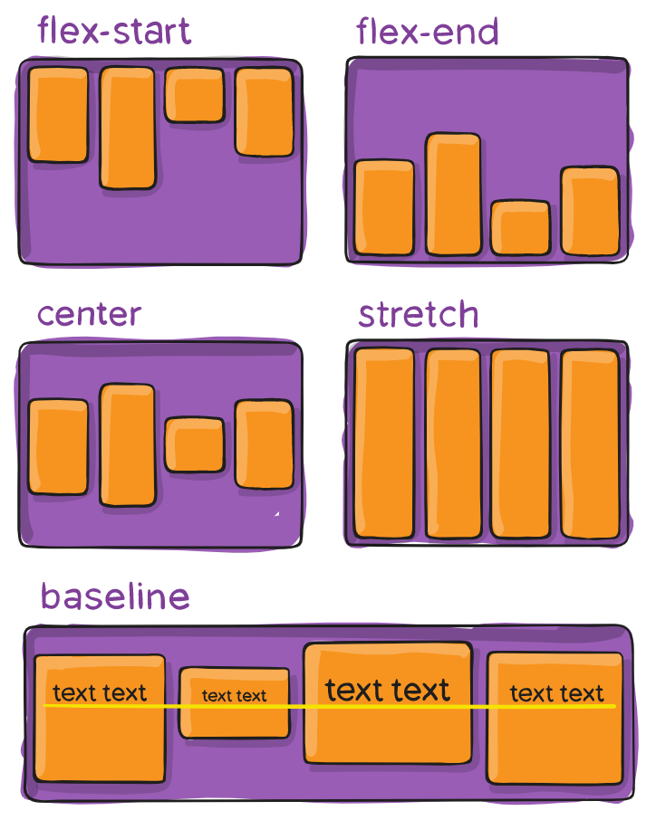
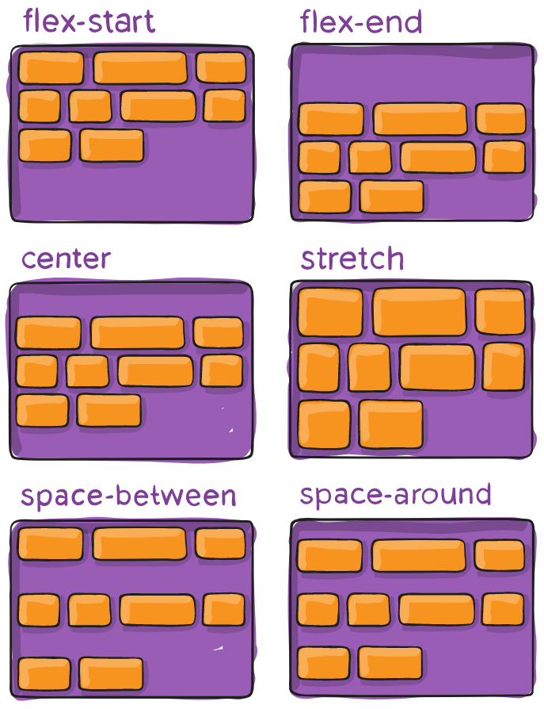

# Flexbox

Модуль Flexbox Layout направлен на обеспечение более эффективного способа размещения, выравнивания и распределения пространства между элементами в контейнере, даже если их размер неизвестен и/или динамичен (Flex значит «гибкий»). Flex контейнер расширяет элементы, чтобы заполнить доступное свободное пространство, или сжимает их, чтобы предотвратить переполнение.

Поскольку flexbox — это целый модуль, а не одно свойство, он включает в себя множество элементов с набором свойств. Некоторые из них предназначены для установки в контейнере (родительский элемент принято называть «flex контейнер»), в то время как другие предназначены для установки в дочерних элементах (так называемые «flex элементы»).



-   _main axis_ — главная ось flex контейнера — это основная ось, вдоль которой располагаются flex элементы.
-   _main-start|main-end_ — flex элементы помещаются в контейнер, начиная с main-start и заканчивая main-end.
-   _main size_ — ширина или высота flex элемента, в зависимости от того, что находится в основном измерении.
-   _cross axis_ — ось перпендикулярная главной оси, называется поперечной осью. Её направление зависит от направления главной оси.
-   _cross-start|cross-end_ — flex строки заполняются элементами и помещаются в контейнер, начиная от cross-start flex контейнера по направлению к cross-end.
-   _cross size_ — ширина или высота flex элемента. В зависимости от css свойства flex-direction, это ширина или высота элемента.

## Свойства родителя

### Display

Определяет блок как flex

=== "CSS"

    ```css
    .container {
        display: flex; /* or inline-flex */
    }
    ```

### Flex-direction

Это свойство устанавливает главную ось, тем самым определяя направление размещения flex элементов во flex контейнере.Flex элементы располагаются либо в горизонтальных строках, либо в вертикальных столбцах.

=== "CSS"

    ```css
    .container {
        flex-direction: row | row-reverse | column | column-reverse;
    }
    ```

### Flex-wrap

По умолчанию все flex элементы пытаются уместиться в одну строку. `Flex-wrap` позволяет элементам переноситься по мере необходимости с помощью этого свойства.

=== "CSS"

    ```css
    .container {
        flex-wrap: nowrap | wrap | wrap-reverse;
    }
    ```

-   _nowrap_ (по умолчанию): все flex элементы будут находиться в одной строке;
-   _wrap_: flex элементы будут переноситься на несколько строк сверху вниз;
-   _wrap-reverse_: flex элементы будут переноситься на несколько строк снизу вверх.

### Flex-flow

Это сокращение свойств `flex-direction` и `flex-wrap`, которые вместе определяют главную и поперечную оси гибкого контейнера.

### Justify-content



Определяет выравнивание по главной оси. Это помогает распределить оставшееся дополнительное свободное пространство.

=== "CSS"

    ```css
    .container {
        justify-content: flex-start | flex-end | center | space-between | space-around | space-evenly | start | end | left | right ... + safe | unsafe;
    }
    ```

-   _flex-start_ (по умолчанию): элементы упаковываются к началу flex-направления;
-   _flex-end_: элементы упаковываются ближе к концу flex-направления;
-   _start_: элементы упаковываются к началу направления режима записи;
-   _end_: элементы упаковываются ближе к концу направления режима записи;
-   _left_: элементы упаковываются к левому краю контейнера, если только это не имеет смысла с `flex-direction`, тогда это ведет себя как start;
-   _right_: элементы упаковываются к правому краю контейнера, если только это не имеет смысла с `flex-direction`, тогда оно ведет себя как end;
-   _center_: элементы центрируются вдоль линии;
-   _space-between_: предметы равномерно распределены в строке; первый элемент находится в начальной строке, последний элемент в конечной строке;
-   _space-around_: предметы равномерно распределены в строке с равным пространством вокруг них;
-   _space-evenly_: элементы распределяются так, чтобы расстояние между любыми двумя элементами (и пространство до краев) было одинаковым.

### Align-items



Определяет поведение того, как flex элементы располагаются вдоль поперечной оси на текущей линии.

=== "CSS"

    ```css
    .container {
        align-items: stretch | flex-start | flex-end | center | baseline | first baseline | last baseline | start | end | self-start | self-end + ... safe | unsafe;
    }
    ```


- *stretch* (по умолчанию): растягивать, чтобы заполнить контейнер (все еще соблюдаются min-width / max-width);
- *flex-start / start / self-start*: элементы размещаются в начале поперечной оси. Разница между ними невелика и заключается в соблюдении `flex-direction` правил или `writing-mode` правил;
- *flex-end / end / self-end*: элементы располагаются в конце поперечной оси. Разница опять-таки тонкая и заключается в соблюдении `flex-direction` или `writing-mode` правил;
- *center*: элементы центрированы по поперечной оси;
- *baseline*: элементы выровнены, по их базовой линии.

### Align-content



Это свойство выравнивает линии в пределах flex контейнера, когда есть дополнительное пространство на поперечной оси, подобно тому, как justify-content выравнивает отдельные элементы в пределах главной оси.

!!! Info

    Это свойство не действует, когда есть только одна строка flex элементов.

=== "CSS"

    ```css
    .container {
        align-content: flex-start | flex-end | center | space-between | space-around | space-evenly | stretch | start | end | baseline | first baseline | last baseline + ... safe | unsafe;
    }
    ```


- *stretch* (по умолчанию): линии растягиваются, чтобы занять оставшееся пространство;
- *flex-start / start*: элементы, сдвинуты в начало контейнера. Более поддерживаемый flex-start использует, flex-direction в то время как start использует writing-mode направление;
- *flex-end / end*: элементы, сдвинуты в конец контейнера. Более поддерживаемый flex-end использует flex-direction в то время как end использует writing-mode направление;
- *center*: элементы выровнены по центру в контейнере;
- *space-between*: элементы равномерно распределены;
- *space-around*: элементы равномерно распределены с равным пространством вокруг каждой строки;
- *space-evenly*: элементы распределены равномерно, вокруг них одинаковое пространство.

### Gap, row-gap, column-gap


Свойство Gap явно управляет пространством между flex элементами. Это расстояние применяется только между элементами, а не на внешних краях

=== "CSS"

    ```css
    .container {
        display: flex;
        ...
        gap: 10px;
        gap: 10px 20px; /* row-gap column gap */
        row-gap: 10px;
        column-gap: 20px;
    }
    ```

## Свойства элемента

### Flex-grow


Это определяет способность flex элемента увеличиваться при необходимости. Он принимает безразмерное значение, которое служит пропорцией. Он определяет, какой объем доступного пространства внутри гибкого контейнера должен занимать элемент.

=== "CSS"

    ```css
    .item {
        flex-grow: 4; /* default 0 */
    }
    ```

### Flex-shrink

Определяет способность гибкого элемента сжиматься при необходимости.

=== "CSS"

    ```css
    .item {
        flex-shrink: 3; /* default 1 */
    }
    ```

### Flex-basis

Это определяет размер flex элемента по умолчанию перед распределением оставшегося пространства. Это может быть длина (например, 20%, 5rem и т. д.) или ключевое слово.

=== "CSS"

    ```css
    .item {
        flex-basis:  | auto; /* default auto */
    }
    ```

### Flex

Общее свойство для `flex-grow`, `flex-shrink` и `flex-basis`.

=== "CSS"

    ```css
    .item {
        flex: none | [ <'flex-grow'> <'flex-shrink'>? || <'flex-basis'> ]
    }
    ```

### Align-self

Это позволяет переопределить выравнивание по умолчанию (или то, которое указано в align-items) для отдельных flex элементов.

=== "CSS"

    ```css
    .item {
        align-self: auto | flex-start | flex-end | center | baseline | stretch;
    }
    ```
