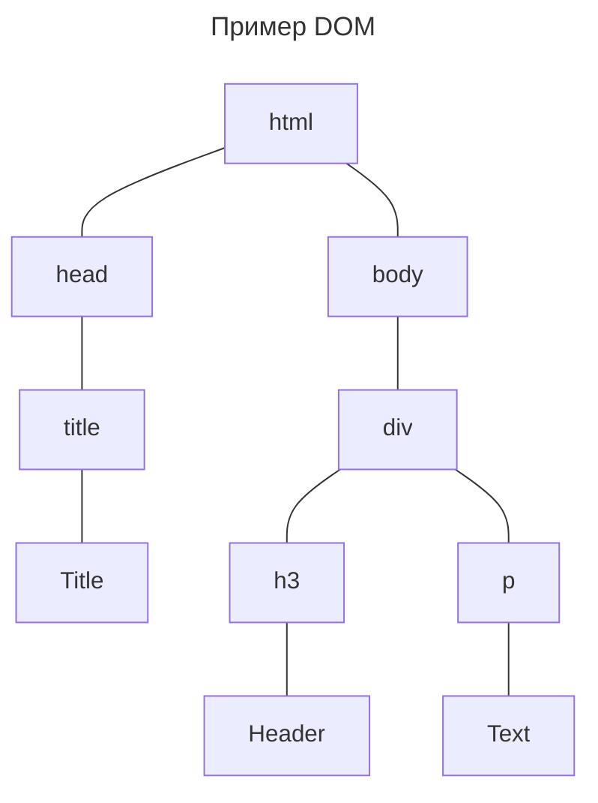
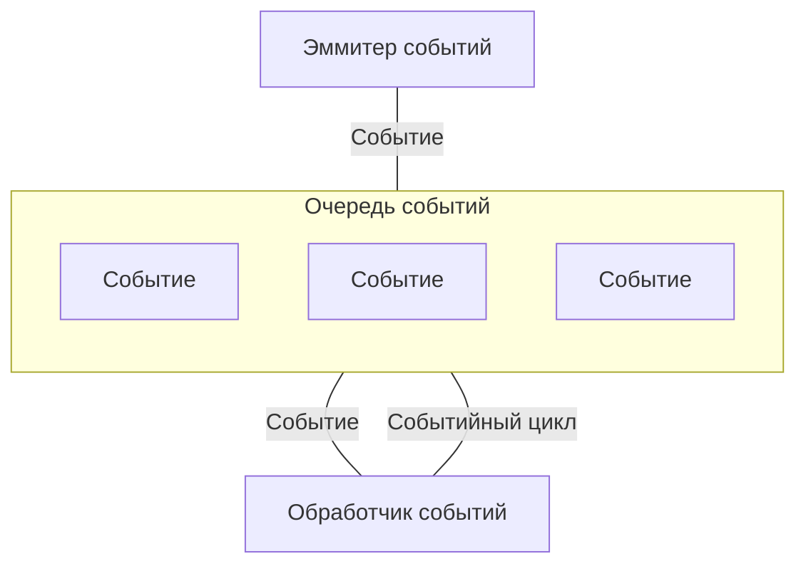

# Основы JS

## Именование

Переменные могут начинаться букв, знака подчеркивания (\_) или знака доллара ($), причем названия не должны начинаться с цифровых символов

## Комментарии

Однострочный комментарий создается с помощью `//`.

Многострочный создается с помощью `/* */`.

## Типы данных и операции над ними

Типы данных делятся на элементарные и объектные.

### Числа

Основной числовой тип JavaScript, Number, служит для представления целых и вещественных чисел.

-   Целые числа: 120, 0x34A, 0b111, 0o777;
-   Числа с плавающей точкой: 120.54, 6e23;

Числа поддерживают стандартный набор арифметических операций:

-   Сложение (+);
-   Вычитание (-);
-   Умножение (\*);
-   Деление (/);
-   Деление по модулю (%);
-   Возведение в степень (\*\*).

!!! Warning

    При делении на 0 и переполнении JS не генерирует ошибку

В таких случаях результатом выполнения операции будет специальное значение _Infinity_, _-Infinity_, _NaN_.

Специальное значение _NaN_ не равно никакому другому значению.

### Строка

Строка - неизменяемая упорядоченная последовательность 16-битных значений, представляемых в символах Unicode. Длина строки количество 16-битных значений.

Строковые литералы:

=== "JavaScript"

```javascript
"Тестовая строка";
"Тестовая строка"`Тестовая строка ${name}`; // Позволяет использовать шаблоны
```

### Булевское значение, null и undefined

Булевское значение представляет истинность или ложность. Булевские значения обычно являются результатом сравнений, которые дела­ются в программах JavaScript.

-   && - Булевское _И_;
-   || - Булевское _ИЛИ_;
-   ! - Булевское _НЕ_;

`null` — это ключевое слово языка, оцениваемое в особое значение, кото­рое обычно применяется для указания на отсутствие значения.

`undefined` - зна­чение переменной, которая не была инициализирована.

### Преобразование типов

|   Значение    | Преобразование в строку | Преобразование в число | Преобразование в булевское значение |
| :-----------: | :---------------------: | :--------------------: | :---------------------------------: |
|   undefined   |       "undefined"       |          NaN           |                false                |
|     null      |         "null"          |           0            |                false                |
|     true      |         "true"          |           1            |                                     |
|     false     |         "false"         |           0            |                                     |
|      ""       |                         |           0            |                false                |
|     "1.2"     |                         |          1.2           |                true                 |
|     "one"     |                         |          NaN           |                true                 |
|       0       |           "0"           |                        |                false                |
|      -0       |          "-0"           |                        |                false                |
|       1       |           "1"           |                        |                true                 |
|   Infinity    |       "Infinity"        |                        |                true                 |
|   -Infinity   |       "-Infinity"       |                        |                true                 |
|      NaN      |          "NaN"          |                        |                false                |
|      {}       |                         |                        |                true                 |
|      []       |           ""            |           0            |                true                 |
|      [9]      |           "9"           |           9            |                true                 |
|     ['a']     |                         |          NaN           |                true                 |
| function() {} |                         |          NaN           |                true                 |

### Объявляет и присваивание

Ключевое слово `let` объявляет переменную.

=== "JavaScript"

```javascript
let a;

let b, c;

let d = 4,
    x = 5;
```

Ключевое слово `const` объявляет константу, которую мы обязаны инициализировать.

Переменные объявленные с помощью `let` и `const` видны только в том блоке, в котором они объявлены.

JS поддерживает деструктурирующее присваивание `let [x, y] = [4, 3]`

### Операции

|   Операция   | Действие                             |       Ожидаемый типы        |   Результат   |
| :----------: | :----------------------------------- | :-------------------------: | :-----------: |
|      ++      | Префиксный и постфиксный плюс        |     Тип левого значения     |   Числовой    |
|      --      | Префиксный и постфиксный минус       |     Тип левого значения     |   Числовой    |
|      -       | Отрицание                            |          Числовой           |   Числовой    |
|      +       | Преобразование в число               |            Любой            |   Числовой    |
|      ~       | Инвертирование битов                 |        Целочисленный        | Целочисленный |
|      !       | Инвертирование булевского значения   |          Булевский          |   Булевский   |
|    delete    | Удаление свойства                    |     Тип левого значения     |   Булевский   |
|    typeof    | Установление типа операнда           |            Любой            |   Строковый   |
|     void     | Возращение значения undefined        |            Любой            |   undefined   |
|     \*\*     | Возведение в степень                 |     Числовой, числовой      |   числовой    |
|   \*, /, %   | Умножение, деление, остаток          |     Числовой, числовой      |   числовой    |
|     +, -     | Сложение, вычитание                  |     Числовой, числовой      |   числовой    |
|      <<      | Сдвиг влево                          | Целочисленный,Целочисленный | Целочисленный |
|      >>      | Сдвиг вправо с расширением знака     | Целочисленный,Целочисленный | Целочисленный |
|     >>>      | Сдвиг вправо с дополнением нулями    | Целочисленный,Целочисленный | Целочисленный |
| <, <=, >, >= | Сравнение в числовом порядке         |     Числовой, числовой      |   Булевский   |
| <, <=, >, >= | Сравнение в алфавитном порядке       |    Строковый, строковый     |   Булевский   |
|  instanceof  | Проверка класса объекта              |  Объектный, функциональный  |   Булевский   |
|      in      | Проверка на существование            |      Любой, объектный       |   Булевский   |
|      ==      | Нестрогое равенство                  |        Любой, любой         |   Булевский   |
|      !=      | Нестрогое неравенство                |        Любой, любой         |   Булевский   |
|     ===      | Строгое равенство                    |        Любой, любой         |   Булевский   |
|     !==      | Строгое неравенство                  |        Любой, любой         |   Булевский   |
|      &       | Побитовое И                          | Целочисленный,Целочисленный | Целочисленный |
|      ^       | Побитовое исключающее ИЛИ            | Целочисленный,Целочисленный | Целочисленный |
|      \|      | Побитовое ИЛИ                        | Целочисленный,Целочисленный | Целочисленный |
|      &&      | Логическое И                         |        Любой, любой         |     Любой     |
|     \|\|     | Логическое ИЛИ                       |        Любой, любой         |     Любой     |
|      ??      | Выбор первого определенного операнда |        Любой, любой         |     Любой     |
|      ?:      | Выбор второго или третьего операнда  |   Булевский, любой, любой   |     любой     |

## Операторы

### Условный оператор

=== "JavaScript"

```javascript
if () {

} else if () {

} else {

}
```

=== "JavaScript"

```javascript
switch () {
    case n:
        break
    case n2:
        break
    default:
        break;
}
```

### Циклы

=== "JavaScript"

```javascript
while () {

}
```

=== "JavaScript"

```javascript
do { // Выполняется минимум один раз

}
while ()
```

=== "JavaScript"

```javascript
for (init; check; inc) {}
```

=== "JavaScript"

```javascript
for (elem of sequence) {
}
```

=== "JavaScript"

```javascript
for (elem in object) {
}
```

`break` позволяет прервать ближайший цикл.
`break` позволяет перейти к следующей итерации ближайшего цикла.

## Исключения

Исключение генерируется с помощью `throw`, а перехватывается с помощью конструкции `try/catch/finally`.

## Объекты

Объект - неупорядоченная коллекция свойств, каждое из которых имеет значение и имя.

Именем свойства может быть любая строка или любое значение `Symbol`.

### Создание объекта

Объект можно создавать с помощью:

-   Объектного литерала:

    Объектный литерал представляет собой набор пар _имя: значение_ разделенных запятой и заключенных в фигурные скобки. Объектный литерал создает и инициализирует отдельный объект каждый раз, когда вычисляется.

    === "JavaScript"

    ```javascript
    let obj = { x: 1 };
    ```

-   Ключевого слова new:

    Операция `new` создает новый объект используя конструктор.

    === "JavaScript"

    ```javascript
    let obj = new Object();
    ```

-   Функции `Object.create()` - создает новый объект, используя в качестве прототипа переданный объект.

!!! Info "Прототип"

    С каждым объектом ассоциирован второй объект, называемый прототипом. Первый объект наследует все свойства прототипа.

### Получение и установка свойств

Чтобы получить значение свойства, применяем выражение точки или квадратных скобок.

=== "JavaScript"

```javascript
let obj = { x: 1 };
console.log(obj.x);
```

Также доступен условный выбор свойства:

=== "JavaScript"

```javascript
let obj = { x: 1 };
console.log(obj?.x);
```

Сокращенная запись свойств:

=== "JavaScript"

```javascript
let x = 1,
    y = 2;
let obj = { x: x, y: y };
let obj2 = { x, y };
```

C помощью "операции распространения" можно копировать свойства

=== "JavaScript"

```javascript
let obj = { x: 2, y: 1 };
let obj2 = { ...obj };
```

### Методы получения и установки

Объекты поддерживают свойства с методами доступа. Т.е. методы получения и/или установки.

=== "JavaScript"

```javascript
let obj = {
    // x и y обыкновенное свойство с данными
    x: 2,
    y: 1,

    // z свойство с методами
    get z() {
        return this._z;
    },
    set z(value) {
        this._z = value;
    },
    get z() {
        return this._z;
    },
    set z(value) {
        this._z = value;
    },
};
```

## Массивы

Массив - упорядоченная коллекция значений. Массивы в JS являются:

-   нетипизированными - могут содержать значения разных типов;
-   динамическими - увеличиваются и уменьшаются по мере надобности;
-   разреженными - могут не иметь смежных индексов.

Массивы являются специализированной формой объекта.

### Создание массива

Создать массив можно следующими способами:

-   Литерал массива `[]`:

    === "JavaScript"

    ```javascript
    let a = [1, 2, 3, 4, 5];

    let b = [1, , , 3]; // Разряженный массив
    ```

-   Операция распространения `...` на итерируемом объекте:

    === "JavaScript"

    ```javascript
    let a = [1, 2, 3];

    let b = [1, ...a, 3]; // [ 1, 1, 2, 3, 3 ]
    ```

-   Конструктор `Array`:

    === "JavaScript"

    ```javascript
    let a = new Array(); // []
    let a = new Array(3); // Массив длиной 3 без определенных значений
    let a = new Array(3, 1, 2); // [ 3, 1, 2 ]
    ```

    Вызов конструктора с одним аргументом, создаст пустой массив с указанной длиной. Передача более двух элементов, создаем массив со всеми указанными элементами.

-   Фабричный метод `Array.of()`:

    Создает массив с указанными значениями

    === "JavaScript"

    ```javascript
    let a = Array.of(10); // [ 10 ]
    ```

-   Фабричный метод `Array.from()`:

    Создает массив из итерируемого объекта, вторым аргументом принимает функцию, которая выполнится для каждого элемента итерируемой последовательности.

    === "JavaScript"

    ```javascript
    let a = Array.from(iterable);
    ```

### Доступ к элементам массива

Доступ осуществляется с помощью операции `[]`.

=== "JavaScript"

```javascript
let a = [1, 2, 3, 4, 5];

a[1];
```

Т.к. массивы являются специализированными объектами, доступ с помощью `[]`, работает также как и для объектов.

```javascript
let a = [1, 2, 3, 4, 5];

a[1]; // 2
a["1"]; // 2
```

Важно четко понимать разницу между индексами и свойствами. Индекс представляет целое число между 0 и $2^{32} - 2$. Массив можно индексировать с помощью отрицательных и нецелых чисел. В таком случае отрицательный индекс будет преобразован в строку, применяемая в качестве свойства. Если строка при преобразовании дает целое неотрицательное число, то она интерпретируется как индекс.

### Добавление и удаление элементов в массив

Чтобы добавить элемент в конец массива используется метод `push`, а метод `unshift` добавляет элемент в начало массива.

Метод `pop` удаляет последний элемент из массива, `shift` - удаляет первый элемент массива.

!!! Note "Ссылка на сторонний сервис"

    [Методы массивов](https://developer.mozilla.org/ru/docs/Web/JavaScript/Reference/Global_Objects/Array#%D1%81%D1%82%D0%B0%D1%82%D0%B8%D1%87%D0%B5%D1%81%D0%BA%D0%B8%D0%B5_%D1%81%D0%B2%D0%BE%D0%B9%D1%81%D1%82%D0%B2%D0%B0)

## Функции

Функция - блок кода, который может вызываться в нескольких местах приложения.

### Определение функций

!!! Warning

    В строгом режиме стрелочные функции наследует значение `this` из среды в которой они определены

    === "JavaScript"

    ```javascript
    "use strict";

    function test() { console.log(`Function name: ${this}`) }
    const temp = function() { console.log(`Function: ${this}`) }
    const strict = () => { console.log(`Arrow: ${this}`) }

    test() // Function name: undefined
    temp() // Function: undefined
    strict() // Arrow: [object Object]
    ```

#### Объявление функции

Первый способ определения функции, использовать ключевое слово `function`.

=== "JavaScript"

```javascript
function hello(name) {
    console.log(`Hello, ${name}`);
}
```

Где:

-   _hello_ - идентификатор функции (имя). Имя функции становится именем переменной для обращения к этой функции;
-   _()_ - параметры функции;
-   _{}_ - тело функции.

Для возврата значения из функции используется оператор `return`.

#### Выражение функции

Выражения функций выглядят так же как и объявление функции, но встречаются внутри контекста более крупного выражения. Для таких функции имя необязательно.

=== "JavaScript"

```javascript
hello = function (name) {
    console.log(`Hello, ${name}`);
};
```

!!! Warning

    Функции созданные с помощью выражений, не существует до тех пора пока не будут явно вычислены

#### Стрелочные функции

Стрелочные функции являются выражением более компактного вида

=== "JavaScript"

```javascript
hello = (name) => {
    console.log(`Hello, ${name}`);
};
hello = (name, age) => {
    return { name, age };
};
hello = () => {
    console.log(`Hello`);
};
```

!!! Warning

    Стрелочные функции не имеют свойства prototype

### Аргументы и параметры функции

Когда функция вызывается с меньшим количеством аргументов, чем объявлено в параметрах, то не переданные параметры принимают свои стандартные значения.

=== "JavaScript"

```javascript
function hello(name) {
    console.log(name);
} // name = undefined
```

Для параметра можно задать стандартное значение.

=== "JavaScript"

```javascript
function hello(name = "тест") {
    console.log(name);
} // name = undefined
```

!!! Info

    Если в качестве значения по умолчанию используется массив или объект, то для каждого вызова функции будет создан свой массив или объект.

Также функции в JS могут принимать больше аргументов, чем определено параметров. Для этого используется `...`. Данный параметр должен быть последним в списке.

=== "JavaScript"

```javascript
function hello(...name) {
    for (i of name) {
        console.log(i);
    }
}

hello(1, 2, 3, 4);
```

Если же не используется оператор `...`, то параметры будут записаны в `arguments`.

=== "JavaScript"

```javascript
function hello() {
    for (i of arguments) {
        console.log(i);
    }
}

hello(1, 2, 3, 4);
```

Параметры функции поддерживают деструктурирующее присваивание. С помощью такой реализации можно добиться похожего эффекта _kwargs_ и передачи параметров по значению из Python:

=== "JavaScript"

```javascript
function hello({ name, age }) {
    console.log(name, age);
}

function hello({ name, age = 10 }) {
    console.log(name, age);
}

function hello({ name: name1, age: age1 }) {
    console.log(name1, age1);
}

function hello({ name: name1, ...props }) {
    console.log(name1, age1);
}

function hello([x1, y1], [x2, y2]) {
    console.log(x1, x2, y1, y2);
}
```

### Замыкания

В JavaScript используется лексическая область видимости. Т.е. функции выполняются с той областью видимости, которая действовала, когда функция была определена.

=== "JavaScript"

```javascript
function hello() {
    let test = "Test";
    return function () {
        return test;
    };
}

let r = hello();
console.log(r());
```

Если нам нужно применять `this` в функции, то используем стрелочные функции, вызвать `bind()` на замыкании перед его возвращением или присвоить `this` новой переменной.

## Классы

### Классы с использованием функций

Класс в JS представляет собой набор объектов, которые наследуют свойства от того же самого объекта прототипа. Функция `Object.create()` создает объект унаследованный от указанного прототипа. Следующий пример демонстрирует инициализацию нового объекта с использование функции `Object.create()`.

=== "JavaScript"

```javascript
// Функция возвращает новый объект
function range(from, to) {
    let obj = Object.create(range.methods); // Создание объекта, унаследованного от прототипа

    obj.from = from;
    obj.to = to;

    return obj;
}

// Объект прототипа
range.methods = {
    include(x) {
        return this.from <= x && this.to >= x;
    },
};

let r = range(10, 23);
console.log(r.include(15));
```

Пример выше не идиоматический способ, т.к. не был определен конструктор. Конструктор нужен для инициализации создаваемых объектов.

Т.к. свойство `prototype` имеется у объектов функций, т.е. все объекты, созданные с помощью одного и того же конструктора функции, унаследованы от одного объекта. Вызов конструктора приводит к автоматическому использованию `Range.prototype` в качестве прототипа нового объекта.

=== "JavaScript"

```javascript
function Range(from, to) {
    // Функцию конструктор
    this.from = from;
    this.to = to;
}

Range.prototype = {
    include: function (x) {
        return this.from <= x && this.to >= x;
    },
};

let r = new Range(10, 23);
console.log(r.include(15));
```

!!! Warning "Стрелочные функции"

    Стрелочные функции не используются в качестве конструктора или метода, т.к. не имеют свойства `prototype` и наследуют `this` от контекста, где они определены.

### Классы с ключевым словом class

=== "JavaScript"

```javascript
class Range {
    constructor(from, to) {
        this.from = from;
        this.to = to;
    }

    includes(x) {
        return this.from <= x && this.to >= x;
    }
}

let r = new Range(10, 25);
console.log(r.includes(15));
```

`class` является всего лишь синтаксическим сахаром. Результирующем объектом будет конструктор, как и в предыдущем примере.

Для определения конструктора класса используется `constructor`, но на самом деле оператор `class` определяет новую переменную из имени класса и присваивает ей значение функции `constructor`.

Префикс `static` перед методом или переменной делает его статическим. Статические методы определяются как свойства конструктора, а не свойства объекта прототипа. Статистические переменные хранят состояния класса в целом, а не отдельного объекта. В не статистических методах мы не можем обращаться к статистическим переменным через `this`.

=== "JavaScript"

```javascript
class Range {
    static name = "Tome";

    constructor(age) {
        this.age = age;
    }

    static hello() {
        console.log(`Hello ${this.name}. You are ${this.age}`);
    }
    hello2() {
        console.log(`Hello ${this.name}. You are ${this.age}`);
    }
}

let r = new Range(10);
console.log(Range.name); // Tome
console.log(r.name); // undefined
Range.hello(); // Hello Tome. You are undefined
r.hello2(); // Hello undefined. You are 10
```

Если перед именем метода или переменной поставить `#`, то они станут приватными

### Подклассы

В ООП классы могут наследовать свойства и методы родительского класса.

Для реализации наследования используется ключевое слово `extend`.

Ключевое слово `super` позволяет обращаться к полям и методам родительского класса. Если дочерний класс имеет свой конструктор, то он обязан вызвать родительский конструктор через `super`.

=== "JavaScript"

```javascript
class Range {
    static test = "Tome";

    constructor(age) {
        this.age = age;
    }

    static hello() {
        console.log(`Hello ${this.test}. You are ${this.age}`);
    }
    hello2() {
        console.log(`Hello ${this.test}. You are ${this.age}`);
    }
}

class RangeExt extends Range {
    constructor(name, age) {
        super(age);
        this.name = name;
    }

    destroy() {
        console.log("destroy");
    }
}

let r = new RangeExt("test", 10);
console.log(RangeExt.test);
console.log(r.test);
RangeExt.hello();
r.hello2();
r.destroy();
```

## Модули

Модульность в JS обеспечивают два ключевых слова `import` и `export`. Каждый файл является модулем, все переменные, константы, функции и т.д. закрыты для других модулей, если явно не экспортируются. Код внутри модулей находится в строгом режиме.

Ключевое слово `as` позволяет задавать отличающееся имя для объекта. (Может использовать и в импорте, и экспорте)

### Export

Чтобы объект считался экспортируемым перед ним используют ключевое слово `export`.

=== "JavaScript"

```javascript
export const PI = 3.14;
export function test() {}
export class Test {}
```

Также можно определить единственный оператор `export` со всеми экспортируемыми объектами.

=== "JavaScript"

```javascript
const PI = 3.14;
function test() {}
class Test {}

export { PI, test, Test };
```

Если экспортируется только одно значение, то используют `export default`, которое применимо к выражениям.

### Import

Чтобы импортировать объект из модуля используется `import`.

=== "JavaScript"

```javascript
import { PI, test, Test } from "file_name";
```

!!! Note "Export default"

    Если для обозначения экспортируемого объекта использовался export default, то он импортируется без фигурных скобок и может иметь любое имя.

`*` позволяет импортировать все доступные для экспорта объекты.

Можно одновременно экспортировать объекты с `export` и `export default`.

=== "JavaScript"

```javascript
import sayHello, { welcome, Messenger } from "./message.js";
```

## Итераторы и генераторы

### Итератор

Итераторы позволяют проходится по содержимому объекта с помощью циклов, операцией `...`.

Три типа итерации в JS:

-   Итерируемые объекты - любой объект со специальным итераторным методом;
-   Итераторы - выполняют итераторы (метод `next`);
-   Результат итерации - хранит результат каждого шага итерации (value, done).

Работает следующим образом. Сначала вызывается итераторный метод, затем многократно вызывается метод `next()` пока результат `done` не будет _true_.

Любой итерируемый объект имеет функцию `Symbol.iterator`, которая возвращает связанный с объектом итератор.

=== "JavaScript"

```javascript
let a = [1, 2, 3];
const iterator = a[Symbol.iterator]();
console.log(iterator);

console.log(iterator.next()); // { value: 1, done: false}
console.log(iterator.next()); // { value: 2, done: false}
console.log(iterator.next()); // { value: 3, done: false}
console.log(iterator.next()); // { value: undefined, done: false}
```

Пример объекта итератора:

=== "JavaScript"

```javascript
class Range {
    constructor(start, end) {
        this.start = start;
        this.end = end;
    }

    has(x) {
        return this.start <= x && x <= this.end;
    }

    toString() {
        return `Range(start=${this.start};end=${this.end})`;
    }

    [Symbol.iterator]() {
        // Сохраняем состояние, чтобы каждый итератор работал независимо от другого
        let next = this.start;
        let last = this.end;

        return {
            next() {
                return next <= last ? { value: next++ } : { done: true };
            },
            return() {
                return { value: "test" };
            },
        };
    }
}

let r = new Range(1, 3);

let iter = r[Symbol.iterator]();

for (let i of r) {
    if (i === 2) break;
    console.log(i);
}
```

Метод `return` выполняется для очистки ресурсов, когда выполнена преждевременная остановка.

### Генератор

Генератор - своего рода итератор, который удобен при итерации не по элементам структуры данных, а по результатам вычислений.

Для создания генератора нужно определить генераторную функцию с помощью `*`.

=== "JavaScript"

```javascript
function* test() {
    yield 2;
    yield 3;
    yield 4;
    yield 5;
}

let r = test();

console.log(r.next());
console.log(r.next());
console.log(r.next());
console.log(r.next());
console.log(r.next());
```

Оператор `yield` возвращает указанное значение и возобновляет выполнения с того же места.

Оператор `yield*` проходится по итерируемому объекту и выводит результирующее значение.

Если в метод `next` передать значение, то оно станет значением выражения `yield`.

=== "JavaScript"

```javascript
class Range {
    constructor(start, end) {
        this.start = start;
        this.end = end;
    }

    has(x) {
        return this.start <= x && x <= this.end;
    }

    toString() {
        return `Range(start=${this.start};end=${this.end})`;
    }

    *[Symbol.iterator]() {
        // Сохраняем состояние, чтобы каждый итератор работал независимо от другого
        let next = this.start;
        let last = this.end;

        while (next <= last) {
            let print = yield next++;

            if (print) {
                console.log(print);
            }
        }
    }
}

let r = new Range(1, 3);

let iter = r[Symbol.iterator]();

console.log(iter.next());
console.log(iter.next(true));

console.log(iter.return(1));
```

## Асинхронный JS

Асинхронное программирование на JS производится с помощью обратных вызовов. Обратный вызов - функция, которая передается другой функции, а другая функция вызывает нашу, когда происходит определенное условие или происходит некоторое событие.

Первый пример асинхронности, запуск кода по истечению времени.

=== JavaScript

```javascript
function main() {
    console.log("main");
}

setTimeout(main, 60000);
main();
```

Здесь функция `main` является функцией обратного вызова

Следующий способ создание асинхронности - управление событиями. Когда пользователь выполняет нажатие клавиши, движение указателя мыши и т.д. браузер генерирует событие. Такие события называются обработчиком события и регистрируются с помощью `addEventListener`.

### Promise

_Promise_ - средство языка, предназначенное для упрощения асинхронного программирования. Объект представляет результат асинхронного вычисления.

Promise может находиться в трех состояниях:

-   _pending_ - состояние ожидания;
-   _fulfilled_ - успешное завершение;
-   _rejected_ - завершено с ошибкой.

Пример создания _Promise_

=== JavaScript

```javascript
const myPromise = new Promise(() => console.log("Promise"));
```

Функция, передаваемая в промис, может принимать два параметра:

-   _resolve_ - вызывается в случае успешного выполнения;
-   _reject_ - вызывается если возникла ошибка.

Для получения значения из _Promise_ используется функция `then()`. Ошибки обрабатываются с помощью функции `catch()`.

=== JavaScript

    ```javascript
    const myPromise = new Promise((resolve, rejected) => {
        let data = {
            test: 10,
            error: true,
        };

        if (data.error) {
            rejected(new Error("Error"));
        }

        resolve(data);
    });

    myPromise
        .then((data) => console.log("Then", data))
        .catch((e) => console.log(e.toString()))
        .finally(() => console.log("Finally"));
    ```

Также есть дополнительные функции:

-   `Promise.all()` - возвращает единый объект _Promise_;
-   `Promise.allSettled()` - также выполняет промисы как единое целое, но возвращает объект со статусом и результатом;
-   `Promise.race()` - возвращает первый завершенный промис;
-   `Promise.any()` - возвращает первый завершенный промис;

### Async и await

`async` определяет асинхронной функции

`await` приостанавливает выполнение пока не вернется результат

!!! Warning

    Оператор `await` может использоваться только в функциях определенных с помощью оператора `async`

=== "JavaScript"

    ```js
    async function name() {
        await async_func()
    }
    ```

=== "JavaScript"

    ```js
    function test(is_error = true) {
        return new Promise((resolve, rejected) => {
            let data = {
                test: 10,
            };

            if (is_error) {
                // rejected(new Error("Error"));
                throw "Error"
            }

            resolve(data);
        });

    }

    async function test2() {
    let r = await test(false)
    console.log(r)
    }

    test2()
    ```

Для асинхронных функции, созданных с помощью `async`, неявно создается `Promise`.

## JS в веб-браузере

### Работа с DOM

**DOM** - _объектная модель документа (document object model)_ - описывает структуру веб-страницы в виде древовидного представления и предоставляет доступ к отдельным элементам веб-страницы.

=== "HTML"

    ```html
    <!DOCTYPE html>
    <html>
        <head>
            <title>Page Title</title>
        </head>
        <body>
            <div>
                <h3>Header</h3>
                <p>Text</p>
            </div>
        </body>
    </html>
    ```



!!! Note

    Посмотреть свойства можно [здесь](https://metanit.com/web/javascript/8.1.php)

### События

События позволяют взаимодействовать с пользователем. Механизм событий работает следующим образом.



!!! Note

    Посмотреть события можно [здесь](https://metanit.com/web/javascript/9.1.php)
